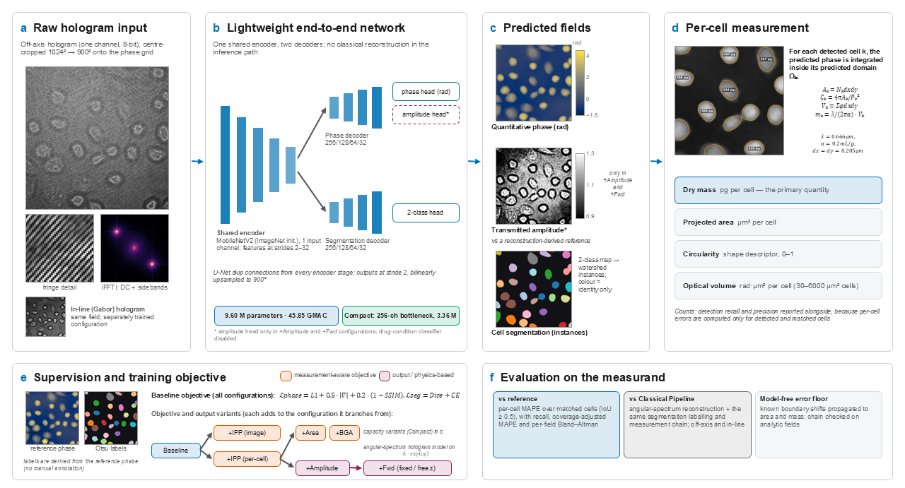
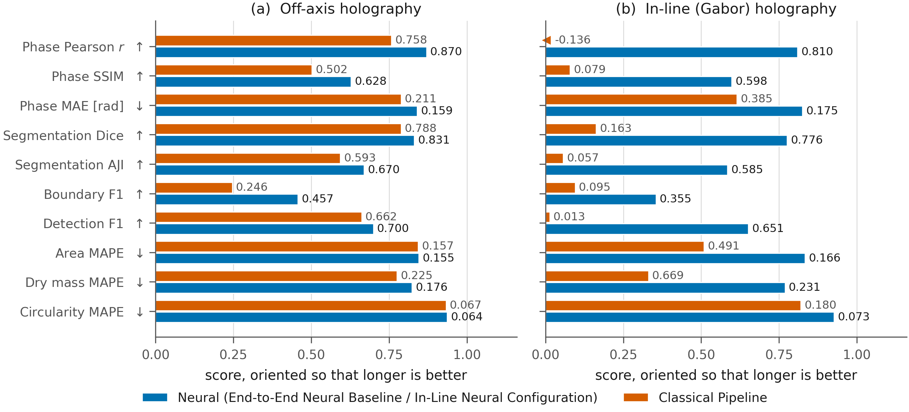
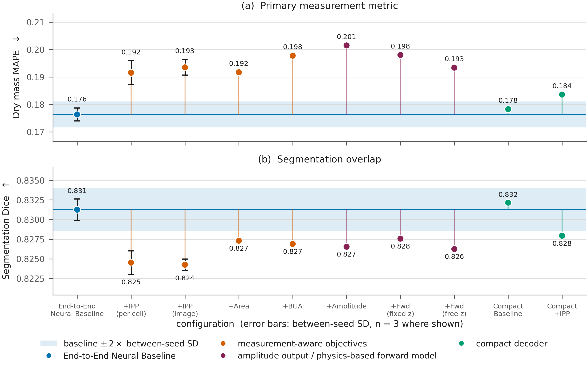

# HoloQPI — Measurement-Oriented End-to-End Holographic Quantitative Phase Analysis

One lightweight network takes a **raw digital hologram** (off-axis or in-line
Gabor) and returns the **quantitative phase**, the **cell segmentation** and,
optionally, the **transmitted amplitude**. Per-cell **projected area,
circularity, optical volume and dry mass** are computed from those outputs, with
no classical reconstruction step in the inference path. The framework is
evaluated on the measurand: the primary metric is the per-cell dry-mass error,
always reported with detection recall.



*(a) A raw hologram, off-axis or in-line, is the only input. (b) A shared
MobileNetV2 encoder feeds a phase decoder and a segmentation decoder. (c) The
network predicts quantitative phase, the cell segmentation and, optionally,
transmitted amplitude. (d) Dry mass and the other per-cell quantities are
computed from the predicted fields. (e) Measurement-aware and physics-based
objectives are tested as variants of the baseline. (f) Evaluation is on the
per-cell measurement.*

> **Status.** The code, configurations and collected results in this
> repository are the ones behind the manuscript *"Measurement-Oriented
> End-to-End Holographic Quantitative Phase Analysis: Joint Reconstruction,
> Segmentation and Per-Cell Measurement from a Single Raw Hologram"* (in
> preparation). Model weights, checkpoints and the dataset are not distributed
> here.

---

## Contents

- [What is implemented, and what is not](#what-is-implemented-and-what-is-not)
- [Results](#results)
- [Experimental configurations](#experimental-configurations)
- [Install](#install)
- [Data](#data)
- [Reproduce the study](#reproduce-the-study)
- [Regenerate the manuscript tables and figures](#regenerate-the-manuscript-tables-and-figures)
- [Repository layout](#repository-layout)
- [Limitations](#limitations)
- [Further documentation](#further-documentation)

---

## What is implemented, and what is not

| | Status |
|---|---|
| Raw hologram → phase + segmentation (+ amplitude) network | implemented, trained, reported |
| Per-cell area, circularity, optical volume, dry mass | implemented, reported |
| Measurement-aware objective terms (per-cell and image-level integrated-phase preservation, per-cell area, boundary–gradient alignment) | implemented, trained, reported |
| Physics-based forward-model term (angular-spectrum hologram formation, fixed or learnable z) | implemented, trained, reported as a diagnostic |
| Classical Pipeline (angular-spectrum reconstruction + the same measurement chain) | implemented, reported |
| ONNX export, GPU latency / memory profiling | implemented, reported (workstation GPU only) |
| Angular-spectrum demodulation front end | implemented, **not enabled** in any reported configuration |
| LoRA adaptation of the encoder | implemented and tested, **never trained**; no LoRA result is claimed |
| Shared backbone with swappable per-geometry adapters | **not implemented** |
| Embedded-hardware deployment | **not demonstrated** |

Every experiment-level constant (wavelength, refraction increment, pixel pitch,
loss weights, thresholds, schedules) lives in `config/*.yaml`. Current values:
λ = 0.666 µm, α = 0.2 mL/g, isotropic pixel pitch 0.284871 µm, supplied
propagation distance z = 33.77 µm.

---

## Results

Test split: 113 fields, 3186 reference cells. The End-to-End Neural Baseline,
+IPP (per-cell) and +IPP (image) are mean ± SD over three training seeds (42,
1337, 2024); every other configuration is one run at seed 42. Per-cell errors
are over IoU-matched cells (IoU ≥ 0.5). Source of every number:
`runs/benchmark_results/`.

### Neural against classical, in both geometries



| Quantity | Classical, off-axis | **End-to-End Neural Baseline** (off-axis, n = 3) | Classical, in-line | **In-Line Neural Configuration** (n = 1) |
|---|---:|---:|---:|---:|
| Phase MAE [rad] ↓ | 0.2114 | **0.1593 ± 0.0008** | 0.3855 | **0.1752** |
| Phase MAE inside cells [rad] ↓ | 0.3655 | **0.2756 ± 0.0068** | 1.0168 | **0.3587** |
| Phase Pearson r ↑ | 0.7580 | **0.8701 ± 0.0011** | −0.1359 | **0.8098** |
| Dice ↑ | 0.7885 | **0.8312 ± 0.0014** | 0.1627 | **0.7758** |
| Boundary F1 ↑ | 0.2463 | **0.4574 ± 0.0018** | 0.0952 | **0.3545** |
| Detection recall ↑ | 0.5763 | **0.5920 ± 0.0011** | 0.0364 | **0.5508** |
| Projected-area MAPE ↓ | 0.1567 | **0.1546 ± 0.0010** | 0.4906 | **0.1661** |
| **Dry-mass MAPE** ↓ | 0.2245 | **0.1763 ± 0.0024** | 0.6695 | **0.2308** |
| Cells matched (of 3186) | 1836 | 1886 ± 4 | 116 | 1755 |

At the supplied distance and with the algorithm tested (angular-spectrum
back-propagation + 20 Gerchberg–Saxton iterations), the classical in-line
reconstruction has a negative in-cell phase contrast (−0.067 rad), so its
downstream numbers are scored on a phase map that does not carry the specimen.

### Objective ablations and model capacity



| Configuration | n | Dry-mass MAPE (matched) ↓ | cov.-adjusted ↓ | Area MAPE ↓ | Recall ↑ | Precision ↑ | Dice ↑ | Phase MAE [rad] ↓ |
|---|:-:|---:|---:|---:|---:|---:|---:|---:|
| **End-to-End Neural Baseline** | 3 | **0.1763** | **0.5124** | 0.1546 | 0.5920 | 0.8550 | 0.8312 | 0.1593 |
| +IPP (per-cell) | 3 | 0.1915 | 0.5179 | 0.1630 | 0.5964 | 0.7995 | 0.8245 | 0.1697 |
| +IPP (image) | 3 | 0.1935 | 0.5291 | 0.1643 | 0.5839 | 0.8526 | 0.8242 | 0.1666 |
| +Area | 1 | 0.1917 | 0.5124 | 0.1852 | 0.6033 | 0.7995 | 0.8273 | 0.1682 |
| +BGA | 1 | 0.1978 | 0.5211 | 0.1648 | 0.5970 | 0.8015 | 0.8269 | 0.1677 |
| +IPP (per-cell), w = 0.1 | 1 | 0.1853 | 0.5136 | 0.1596 | 0.5970 | 0.8514 | 0.8322 | 0.1583 |
| +IPP (per-cell), w = 0.3 | 1 | 0.1828 | 0.5152 | 0.1575 | 0.5932 | 0.8396 | 0.8319 | 0.1610 |
| +IPP (per-cell), w = 3.0 | 1 | 0.2102 | 0.5329 | 0.1927 | 0.5913 | 0.7252 | 0.8101 | 0.1851 |
| +Amplitude | 1 | 0.2015 | 0.5258 | 0.1644 | 0.5938 | 0.8237 | 0.8265 | 0.1708 |
| +Fwd (fixed z) | 1 | 0.1980 | 0.5182 | 0.1699 | 0.6008 | 0.8073 | 0.8276 | 0.1677 |
| +Fwd (free z) | 1 | 0.1934 | 0.5220 | 0.1625 | 0.5926 | 0.8252 | 0.8262 | 0.1679 |
| Compact Baseline | 1 | 0.1783 | 0.5136 | 0.1533 | 0.5920 | 0.8577 | 0.8321 | 0.1599 |
| Compact +IPP | 1 | 0.1836 | 0.5129 | 0.1685 | 0.5967 | 0.8062 | 0.8279 | 0.1702 |

A difference is called **resolved** only when it exceeds twice the pooled
between-seed SD of the same metric: a resolution criterion, not a significance
test. +IPP (per-cell) vs the baseline is +0.0152 (2×SD 0.0070) and +IPP (image)
vs the baseline is +0.0172 (2×SD 0.0052): both resolved, both worse. Every other
comparison has one run per configuration and is not resolvable.

**Main findings**

- The End-to-End Neural Baseline improves every reconstruction, segmentation and
  measurement metric over the Classical Pipeline off-axis, and the In-Line
  Neural Configuration recovers usable phase where the tested classical in-line
  reconstruction does not.
- No measurement-aware objective, no weight between 0.1 and 3.0, and neither the
  amplitude output nor the forward-model term brought the dry-mass error below
  the baseline.
- The amplitude output agrees with a reconstruction-derived reference better than
  the thin-phase assumption A = 1 (MAE 0.0637 against 0.1469, +Fwd (fixed z)).
- The forward-model residual is below the reference-phase residual for 12 of 13
  configurations, including ones that never optimised it, and barely
  distinguishes the reference phase from a 10 % rescaled one: it is reported as
  a diagnostic, not a useful loss. The propagation distance is not identifiable
  from an off-axis hologram (per-field IQR 156.4 µm) but is from an in-line one
  (IQR 6.0 µm, minimum near 50.5 µm on four validation fields).
- Detection recall (0.5920) is the weakest number (see [Limitations](#limitations)).

### Error budget without a trained model

| | Area error | Dry-mass error | Dice |
|---|---:|---:|---:|
| Reference boundary moved outwards by 1 px (0.285 µm) | +6.9 % | +4.8 % | 0.974 |
| Reference boundary moved outwards by 5 px | +32.6 % | +14.2 % | 0.881 |

Median ratio of mass error to area error: 0.710 (dry mass is 1.41× more robust
to a boundary error than area). The measurement chain's own floor on analytic
fields is 0.036 ± 0.004 % per cell for dry mass and 0.224 ± 0.018 % for area
(three synthetic seeds).

### Inference cost (NVIDIA RTX A5000, 900 × 900, batch 1)

| Configuration | Parameters | GMAC | PyTorch FP32 [ms] | ONNX FP16 [ms] | ONNX FP16 FPS | Weights FP32 → FP16 [MB] |
|---|---:|---:|---:|---:|---:|---:|
| End-to-End Neural Baseline (n = 3) | 9 598 099 | 45.85 | 12.32 ± 0.11 | 8.42 ± 0.06 | 118.8 ± 0.9 | 36.77 → 18.38 |
| +Amplitude | 9 607 412 | 47.87 | 12.94 | 9.20 | 108.6 | 36.81 → 18.40 |
| Compact Baseline | 3 360 403 | 24.03 | 11.73 | 7.98 | 125.3 | 12.97 → 6.48 |

The compact decoder removes 65 % of the parameters and changes the dry-mass
MAPE by +0.0019, within the baseline's between-seed spread. These are
workstation-GPU figures, not an edge-deployment claim.

---

## Experimental configurations

Each configuration is one file in `config/v2/` and differs from its comparator by
exactly one objective term, one output or one capacity choice. Code and result
files use the short arm codes.

| Manuscript name | Config file | Arm code | Run directory (seed 42) | Comparator | Seeds |
|---|---|:-:|---|---|:-:|
| End-to-End Neural Baseline | `a_baseline.yaml` | A | `v2_baseline_off_axis` | — | 3 |
| In-Line Neural Configuration | `g_baseline_gabor.yaml` | G | `v2_baseline_gabor` | baseline, other geometry | 1 |
| +IPP (per-cell) | `b_cell_ipp.yaml` | B | `v2_cell_ipp_off_axis` | baseline | 3 |
| +IPP (image) | `b1_image_volume.yaml` | B1 (B′) | `v2_image_volume_off_axis` | baseline | 3 |
| +Area | `b2_cell_area.yaml` | B2 (B″) | `v2_cell_ipp_area_off_axis` | +IPP (per-cell) | 1 |
| +BGA | `c_cell_ipp_bga.yaml` | C | `v2_cell_ipp_bga_off_axis` | +IPP (per-cell) | 1 |
| +IPP (per-cell), w = 0.1 / 0.3 / 3.0 | `w_ipp_01/03/30.yaml` | W01 / W03 / W30 | `v2_ipp_w01/w03/w30_off_axis` | baseline | 1 |
| +Amplitude | `d0_amplitude.yaml` | D0 | `v2_amplitude_off_axis` | +IPP (per-cell) | 1 |
| +Fwd (fixed z) | `d_forward_amplitude.yaml` | D1 | `v2_forward_amplitude_off_axis` | +Amplitude | 1 |
| +Fwd (free z) | `d2_learned_z.yaml` | D2 | `v2_learned_z_off_axis` | +Fwd (fixed z) | 1 |
| Compact Baseline | `k_compact_a.yaml` | KA | `v2_compact_baseline_off_axis` | baseline | 1 |
| Compact +IPP | `k_compact_b.yaml` | KB | `v2_compact_cell_ipp_off_axis` | +IPP (per-cell) | 1 |
| Classical Pipeline | `scripts/conventional_baseline.py` | — | `conventional_off_axis`, `conventional_gabor` | — | deterministic |
| LoRA (not trained) | `l_lora.yaml` | L | — | — | 0 |

`w_ipp_10.yaml` is +IPP (per-cell) itself (same objective, same seed) and is
reported once. Other seeds live in `runs/v2_<ARM>_seed<N>_off_axis/`.
`config/v2/_shared.md` explains the question each configuration answers.

---

## Install

**Python ≥ 3.10** (the sources use PEP 604 annotations).

```bash
conda env create -f environment.yml
conda activate qpi_extended
```

or, in an existing environment:

```bash
pip install -r requirements.txt
python -c "import torch; print(torch.__version__, torch.cuda.is_available())"
```

If pip resolves a CUDA build your driver cannot run, install PyTorch first from
<https://pytorch.org/get-started/locally/>. The encoder is initialised from the
ImageNet MobileNetV2 weights (`mobilenet_v2-b0353104.pth`): they are downloaded
automatically, or can be placed in `weights/` for an offline machine.

---

## Data

The dataset is **not distributed with this repository**. It consists of 800
matched fields — one off-axis hologram, one in-line Gabor hologram and one
reconstructed quantitative phase map per field — of three cancer cell lines
(NCI, SNU, T24) under a control and four drug conditions (blebbistatin, FCCP,
staurosporine, rotenone). Expected layout:

```
data/
├── off_axis_hologram/      <stem>_holo.tif     1024 x 1024, 8-bit, LZW
├── in_line_gabor_hologram/ <stem>_gabor.tif    1024 x 1024, 8-bit, LZW
├── phase/                  <stem>_phase.bin    900 x 900 float32 + 23-byte header
├── membrane/               <stem>_membrane.tif fluorescence, independent check only
├── splits.json             included: the train / val / test split used for every run
└── manifest.csv            included: every stem with its cell line, condition and split
```

Stems encode the labels (`NCI_01`, `NCI_Blebbistatin_5uM_07`,
`SNU_staurosporine_23`, `T24_rotenone_500nM_50`). Holograms are **centre-cropped**
1024 → 900 to the phase grid and never resampled.

`data/splits.json` (560 / 127 / 113 fields, stratified by cell line × condition,
seed 42) is included so the split is identical to the study's. Its SHA-256,
`11d124828ce9c48fed26d540bf2f0c3adc3f34a1befc02899e1216f33e4120bf`, is recorded
in every evaluation's provenance file; `python main.py prepare` regenerates the
same split deterministically.

**Segmentation labels.** No manual annotations exist for this dataset. `prepare`
derives *silver-standard* masks from the reference phase (Gaussian σ = 4 px,
Otsu threshold, closing 2 px, hole filling, edge-object removal, 30–6000 µm² area
filter; watershed instances with minimum peak distance 15 px). Set
`paths.manual_mask_dir` to use manual annotations instead; nothing else changes.

---

## Reproduce the study

All commands run from the repository root. The study used two GPUs; set
`CUDA_VISIBLE_DEVICES` to the ones you have.

```bash
# 1. masks, split, manifest, calibration report
python main.py prepare --config config/base.yaml

# 2. self-test: 143 checks of the measurement chain, the loss terms and the
#    metrics; must end with "All checks passed."
python scripts/selftest.py --config config/base.yaml

# 3. the whole study in dependency order (logs in logs/v2_<timestamp>_gpu<N>/)
nohup bash run_v2.sh > v2.out 2>&1 &
```

`run_v2.sh` stages: 0 self-test · 1 prepare · 2 aberration surfaces · 3 amplitude
reference · 4 pre-flight diagnostics (gradient ratio, forward-model sensitivity,
z scan) · 5 label-free analyses (boundary-error propagation, synthetic floor) ·
6 train every configuration · 7 Classical Pipeline · 8 ONNX export and benchmark ·
9 diagnostic figures · 10 collect results · 11 extra seeds (train if missing,
evaluate) · 12 repeated hardware benchmark · 13 repeated synthetic floor ·
14 collect benchmark results. Useful switches:

```bash
bash run_v2.sh --stage 6                      # one stage
ARMS="A B B1" bash run_v2.sh --stage 6        # only these configurations
CUDA_VISIBLE_DEVICES=2 ARMS="A B B1 B2 C D0 D1 D2" bash run_v2.sh --stage 11
CUDA_VISIBLE_DEVICES=3 ARMS="G W01 W03 W30 KA KB"  bash run_v2.sh --stage 11
CUDA_VISIBLE_DEVICES=2 bash run_v2.sh --stage 12   # only when the GPU is otherwise idle
bash run_v2.sh --stage 13 && bash run_v2.sh --stage 14
QUICK=1 bash run_v2.sh                        # tiny settings, plumbing check only
```

One configuration by hand:

```bash
python main.py train     --config config/v2/a_baseline.yaml                 # seed 42
python main.py evaluate  --config config/v2/a_baseline.yaml
python main.py train     --config config/v2/a_baseline.yaml --seed 1337 --set experiment_name=v2_A_seed1337
python main.py benchmark --config config/v2/a_baseline.yaml --modalities off_axis
python main.py export    --config config/v2/k_compact_a.yaml --precision fp16
```

Any key can be overridden inline with `--set section.key=value`.

**What to expect.** Evaluation uses `cudnn.benchmark`, so re-evaluating a
checkpoint can move a metric by up to about 0.002. Retraining at the same seed
reproduces a result closely but not bit-for-bit; the three seeds are replicates
of the training procedure. `scripts/collect_benchmark_results.py` (stage 14)
refuses any metrics file whose checkpoint hash, seed, measurement settings or
split hash do not match, so stale results cannot enter the tables. The
procedure, seeds and statistics are in [`BENCHMARKING.md`](BENCHMARKING.md).

### Outputs

```
runs/<experiment>_<modality>/
├── best_model.pt                    checkpoint selected on the validation composite
├── resolved_config.yaml             the exact configuration of the run
├── history.json                     per-epoch losses, validation metrics, learned z
├── metrics_test.json                every metric family
├── metrics_test.provenance.json     checkpoint SHA-256, seed, config digest, split hash
├── metrics_test_membrane.json       the same checkpoint scored against membrane labels
├── per_cell_test.csv                one row per matched cell
└── unmatched_test.csv               missed reference cells and false positives

runs/benchmark_results/              every benchmark pooled over seeds (included here)
runs/RESULTS.md                      per-run tables, assembled by scripts/collect_results.py
```

---

## Where the manuscript numbers come from

`runs/benchmark_results/` (included) is the single source of every manuscript
table and of Figures 2 and 4–9. `BENCHMARKING.md` §5–7 explain each file and §12 shows
how to read a number from it.

---

## Repository layout

```
holoqpi/        the package: data, models, losses, metrics, physics, engine, deploy
scripts/        self-test, data preparation, diagnostics, baselines, collectors
config/         base.yaml and one YAML per configuration (config/v2/)
main.py         prepare | train | evaluate | compare | benchmark | export
run_v2.sh       the whole study, staged
test/           evaluation notebook for trained checkpoints and new holograms
docs/           documentation.md: formulation, parameters, protocol
runs/benchmark_results/   collected results (JSON / CSV) behind every table
data/splits.json, data/manifest.csv   the split used by every run
assets/         figures used in this README
```

---

## Limitations

- **Segmentation labels are derived from the reconstruction target.** Every
  reference mask is a threshold of the smoothed reference phase, so segmentation
  scores measure agreement with that procedure, not with a human annotator, and
  the two supervised heads are not independent. Against provisional masks from an
  independent membrane-stain channel, the baseline's Dice falls from 0.831 to
  0.496.
- **Objects at the field edge remain in the reference labels.** The binary closing
  leaves a 2-px empty rim, so the edge-object removal step removes nothing, and
  about 46 % of test reference instances lie within 4 px of the field edge. Most
  cells the network misses are among these; see `docs/documentation.md` §4.2.
- **Detection recall is 0.59.** Every per-cell error is conditional on detection
  and matching; read it with the coverage-adjusted column.
- **The amplitude reference is the modulus of a classical reconstruction**, not a
  measured transmittance.
- **One dataset, one instrument.** Absolute picograms depend on α and λ; every
  relative result is invariant to both.
- **Timings are from a workstation GPU**; no embedded deployment is shown.

---

## Further documentation

- [`docs/documentation.md`](docs/documentation.md) — mathematical formulation,
  labels, architecture, objective, metrics, protocol, configuration reference.
- [`BENCHMARKING.md`](BENCHMARKING.md) — seeds, repeated runs, statistics, result files.
- [`config/v2/_shared.md`](config/v2/_shared.md) — the configuration matrix.
- [`test/README.md`](test/README.md) — the evaluation notebook.
