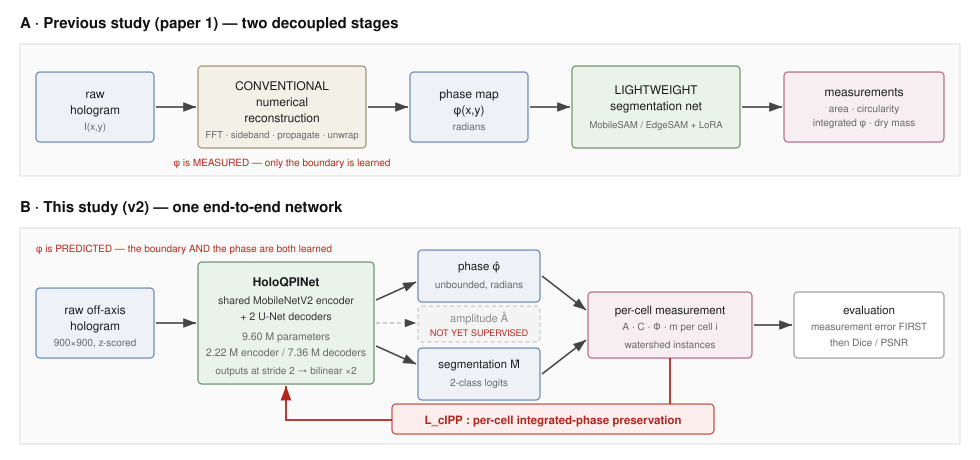
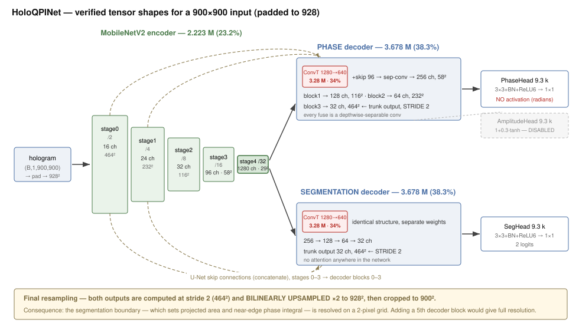
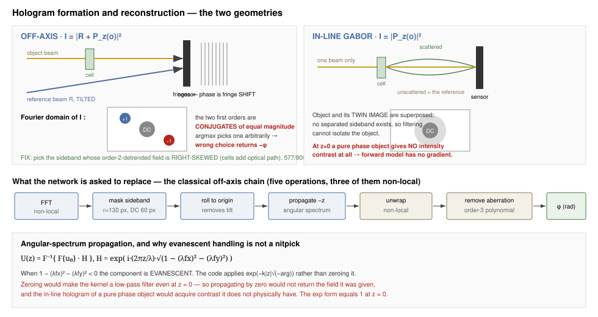
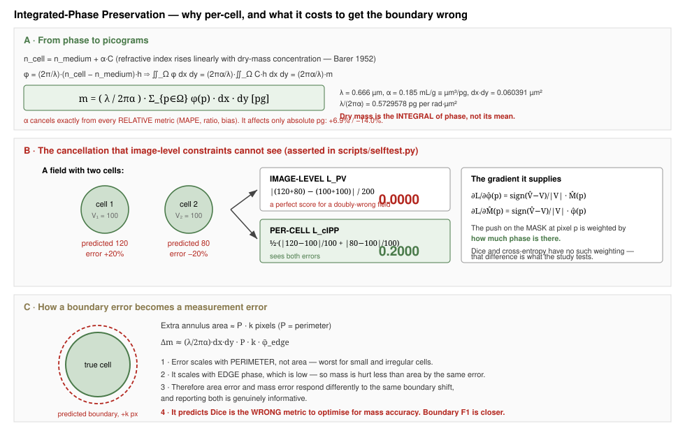
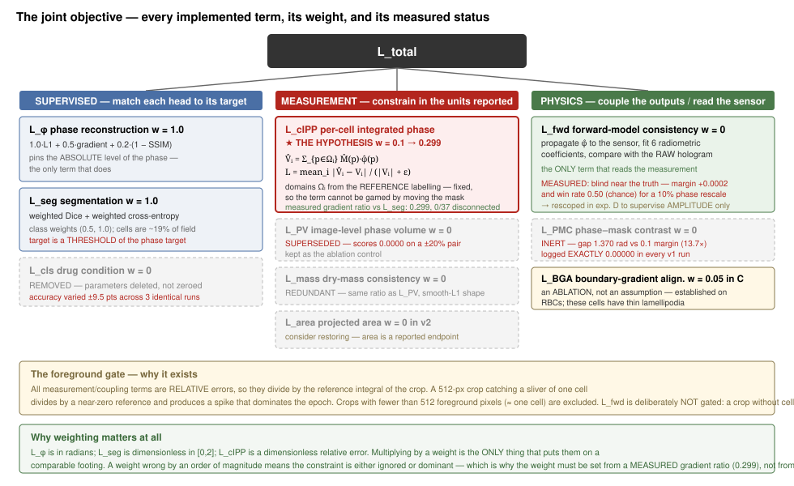

> **HISTORICAL DOCUMENT — superseded by the 17 September 2026 final study.**
>
> This file records the project as it stood on 9 September 2026 and is kept for provenance:
> it shows what was known, planned or open at that point. **Do not read it as the
> current state of the system.** Recommendations in it may already be
> implemented, and any constant, result or gap it names may have changed.
>
> Current truth, in order: `runs/RESULTS.md` for results, `README.md` for how to
> run it, `docs/documentation.md` for the method and the physical constants,
> `docs/RUNBOOK.md` for operations. Change records:
> `docs/code_audit_2026-09-16.md`, then `docs/gap_closure_2026-09-17.md`.
> 
> Specifically: this describes a stage at which the amplitude head was unused, the
> study was off-axis only, and most run artefacts were smoke tests. All three have
> changed — the amplitude output is now trained and scored (Table 3c), arm G covers
> in-line Gabor, and every reported number comes from the full 800-field run.

---

---
title: "HoloQPI — Complete Project Documentation"
subtitle: "A physics-aware lightweight end-to-end framework for quantitative holographic cell reconstruction and analysis"
author: "Prepared for Usama · reconstructed from the codebase, configuration files and run logs"
date: "9 September 2026"
---

# How to read this document

This is a **complete project understanding document**, not a research plan and not a
manuscript. It is written so that you can read it from the first page to the last and
come away understanding what the project is, what the code actually does, what has and
has not been established, and what has to happen next.

Every technically demanding idea is introduced in the same five-step order:

1. **Simple explanation** — what it means in ordinary words.
2. **Technical explanation** — what it means in the language of the field.
3. **Mathematical formulation** — the equation, with every symbol defined.
4. **Connection to our code** — the exact file, class or function that implements it.
5. **Why it matters scientifically** — what would go wrong without it.

## The evidence key — read this before anything else

The single largest risk in a document like this is that a *proposal* gets read as a
*result*. Every non-obvious claim below therefore carries one of these tags:

| Tag | Meaning |
|---|---|
| **[Implemented]** | The code exists in the repository. I have read it. It does what the text says. |
| **[Observed]** | A number that appeared in a run log or a results file. Quoted, not derived. |
| **[Verified]** | Observed **and** cross-checked — either by an assertion in `scripts/selftest.py`, or by a second independent measurement, or by tracing the mechanism in code. |
| **[Interpretation]** | My reading of what an observation means. Could be wrong; the observation stands regardless. |
| **[Assumption]** | Something the framework takes for granted that has not been tested. |
| **[Proposed]** | Does not exist. A suggestion for future work. |
| **[Needs validation]** | Implemented but never checked at full scale, or checked only in a way that cannot settle the question. |
| **[Not established]** | Cannot be determined from the current evidence. Requires verification. |

Where a number could not be confirmed, the text says
**"Not established from the current evidence; requires verification."** rather than
supplying a plausible value.

## A warning about the numbers in this document — read this too

**[Verified]** The `runs/` directory in the working copy of the repository contains
**smoke-test artefacts, not study results.** Every metrics file there was produced by a
`QUICK=1` run: 2 epochs, 192-pixel crops, **2 test images and 4 reference cells**. The
file `runs/no_measurement_off_axis/metrics_test.json` reports `phase_n_images: 2` and
`cells_reference: 4`; `runs/v2_cell_ipp_off_axis/history.json` contains exactly **one
epoch**; `runs/seed_aggregate.json` reports `"runs": 1` and `"sd": NaN` for every metric.

Those numbers are **not results and must never be quoted in a manuscript.** They exist
to prove the pipeline executes end to end.

The genuine full-scale numbers in this document come from **server terminal output** that
was pasted into the working session — the gradient-path probe, the null-input probe, the
mask regeneration, and the v1 study metrics. Those are tagged **[Observed, server]**.
This distinction is maintained throughout, and §21 lists every place the two disagree.

## Where to find each requested topic

| You asked for | Section |
|---|---|
| 1 · The professor's research direction | §1 |
| 2 · What is being done now — question, solution, pipeline | §2 |
| 3 · The full project history | §3 |
| 4 · The latest run in extreme detail | §4 |
| 5 · The model architecture | §5 (+ Figure 2) |
| 6 · Every loss function | §6 (+ Figure 5) |
| 7 · Integrated-Phase Preservation | §7 (+ Figure 4) |
| 8 · The mathematics from first principles | §8 (+ Figure 3) |
| 9 · The quantitative cellular measurements | §9 |
| 10 · Every result | §10 |
| 11 · Figures and visuals | §11 |
| 12 · Literature review | §12 |
| 13 · Dataset requirements | §13 |
| 14 · Proposed future architecture | §14 |
| 15 · Experimental design | §15 |
| 16 · Research question and hypotheses | §16 |
| 17 · Expected scientific contribution | §17 |
| 18 · Current status table | §18 |
| 19 · What should happen next | §19 |
| 20 · Manuscript plan | §20 |
| 21 · Easy language first | the five-step order above, used throughout |
| 22 · Facts vs interpretation vs proposal | the evidence key above, used throughout |
| 23 · Critical review | §23 (with §21, the consistency check, immediately before it) |
| 24 · Final summary | §24 |

\newpage
# 1. The professor's research direction, and what it actually asks for

The instruction is reproduced in full at the end of this section. Stripped to its
operative content, it asks for **seven** things:

| # | The instruction | Status in the current code |
|---|---|---|
| 1 | Raw hologram → lightweight network → phase **+ amplitude + segmentation**, in one model | Phase + segmentation **[Implemented]**. Amplitude head exists but is **off by default and has no supervision** **[Implemented, unused]** |
| 2 | From those, compute projected area, circularity, integrated phase, dry mass | **[Implemented]** — `holoqpi/analysis/cells.py` |
| 3 | Do **not** optimise only for PSNR/SSIM/Dice | **[Implemented]** — the objective carries measurement terms; the evaluator reports measurement error |
| 4 | Investigate physics-aware constraints that **preserve the integrated phase within individual cellular regions** | **[Implemented]** — `CellIntegratedPhase` in `holoqpi/losses/terms.py`. **[Needs validation]** — never run at full scale |
| 5 | Initial study: **off-axis only** | **[Implemented]** — all four `config/v2/*.yaml` set `modality: off_axis` |
| 6 | Later study: off-axis **and** in-line Gabor with a shared backbone + LoRA/adapters | LoRA machinery exists (`holoqpi/models/lora.py`) but is **disabled and unused** **[Implemented, unused]** |
| 7 | Literature review on lightweight holographic reconstruction, joint reconstruction+segmentation, physics-informed holographic imaging | **Done** — §12 |

Two points in the instruction deserve emphasis because they define the study.

**"The network should not be optimized only for conventional reconstruction metrics such
as PSNR/SSIM or segmentation metrics such as Dice/IoU."** This is not a stylistic
preference. It is a statement that the *endpoint of the study is a physical measurement*,
and that image-quality metrics are known to be a poor proxy for measurement accuracy.
There is a rigorous literature behind exactly this claim (§12.B) — most sharply
Bhadra *et al.*, *IEEE TMI* 2021, which shows a learned reconstruction can insert
structure into the **null space of the forward operator**, invisible to any data-fidelity
term and to any pixel metric. A phase map can look perfect and still have a
systematically wrong per-cell phase integral. That is the whole reason the professor's
constraint exists.

**"Physics-aware constraints that preserve the integrated quantitative phase within
individual cellular regions."** Read the words *individual cellular regions* literally.
An image-level constraint on total phase is not the same thing, and the difference is not
cosmetic — §7.5 shows a field where one cell is over-measured by 20% and another
under-measured by 20% scores a **perfect zero** under the image-level version and
**0.2000** under the per-cell version. That single sentence in the professor's email is
what the v2 code change was built around.

> ## The instruction, verbatim
>
> For the next study, I would like you to focus on developing a physics-aware lightweight
> end-to-end framework for quantitative holographic cell reconstruction and analysis.
>
> In our current work, quantitative phase images are first reconstructed from holograms
> using conventional numerical reconstruction, and the reconstructed phase images are then
> used as inputs to the lightweight segmentation network.
>
> In the new study, I would like to integrate these processes into a single end-to-end
> framework. The basic framework should be:
> **Raw hologram → Lightweight neural network → Quantitative phase + Amplitude + Cell segmentation**
>
> The network should directly take a raw hologram as input and simultaneously reconstruct
> the quantitative phase and amplitude images and generate the corresponding cell
> segmentation map. The reconstructed phase and segmentation results should then be used to
> calculate quantitative cellular measurements such as projected area, circularity,
> integrated phase, and dry mass.
>
> An important point is that this study should extend the measurement-oriented and
> physics-aware concept developed in our current paper. Therefore, the network should not be
> optimized only for conventional reconstruction metrics such as PSNR/SSIM or segmentation
> metrics such as Dice/IoU. We should also investigate physics-aware constraints that
> preserve the integrated quantitative phase within individual cellular regions, so that the
> reconstructed phase and predicted segmentation boundaries remain reliable for quantitative
> cellular measurements.
>
> For the initial study, I suggest focusing primarily on raw off-axis holograms and
> establishing a reliable end-to-end reconstruction and analysis framework. We can then
> extend this framework in the subsequent study to multiple holographic acquisition modes,
> particularly off-axis and in-line Gabor holography, using a shared lightweight backbone
> with modality-specific adaptation such as LoRA or lightweight adapters.
>
> Please start by reviewing relevant studies on: lightweight deep-learning-based holographic
> reconstruction; joint phase reconstruction and segmentation; physics-informed holographic
> imaging. Based on this review, please propose an initial network architecture, loss
> functions, required datasets, and experimental design.
>
> In particular, consider how the Integrated-Phase Preservation concept from our current
> work can be extended from segmentation alone to the entire hologram-to-quantitative-analysis
> pipeline. […] If possible, I would like you to prepare and send me the first draft of the
> manuscript for this new study by the middle of October.
>
> Seonghwan, please provide Usama with appropriate cancer cell hologram datasets for this
> study, specifically the off-axis and in-line Gabor hologram datasets used in our recent
> papers published in Engineering Applications of Artificial Intelligence and Microsystems
> & Nanoengineering.

\newpage

# 2. What is being done right now

## 2.1 The current research question

Stated as precisely as the current evidence permits:

> **Does constraining a lightweight end-to-end network to preserve the phase integral
> within each individual cell — rather than only matching phase pixel-wise and matching
> the segmentation mask — improve the accuracy of per-cell quantitative measurements
> (projected area, integrated phase, dry mass) obtained directly from a raw off-axis
> hologram?**

Note carefully what this question is **not**. It is not "can a network reconstruct phase
from a hologram" (answered, repeatedly, since Rivenson *et al.* 2018). It is not "can a
network segment cells" (answered). It is not even "does joint reconstruction+segmentation
help" (answered in MRI, in 2018–2019). It is specifically about **whether adding a
region-integral measurement constraint to the objective changes the measurement you get
out** — and that is the part with no established answer in this literature (§12.F).

**[Interpretation]** This framing is deliberately narrow, and I think it is the right
narrowness. Your own instruction on this project has been consistent: *"the objective of
this project is a study, I am not looking to find ways to make the result perfect, I just
wanna study it and report it in a paper."* A narrow question with a clean negative answer
is publishable. A broad question with a muddy answer is not.

## 2.2 The proposed solution

### In plain language

Today, getting a number like "this cell weighs 43 picograms" out of a holographic
microscope takes three separate steps. First a physicist's algorithm turns the raw
interference pattern (the hologram) into a phase image. Then a neural network draws
outlines around the cells in that phase image. Then you add up the phase inside each
outline and multiply by a constant to get the mass.

We are proposing to collapse the first two steps into **one** neural network: feed it the
raw hologram, and it gives you the phase image and the cell outlines at the same time.

But there is a catch, and the catch is the actual point of the research. If you train
that network the usual way — "make the phase look like the correct phase, make the
outlines match the correct outlines" — you get a network that is good at looking right
without necessarily being good at *measuring* right. The phase can be off by a small
constant amount inside cells and still score well on every standard image metric, because
cells occupy about a fifth of the image and the background dominates the average. Meanwhile
that small constant, multiplied by the cell area, is a direct error in the mass.

So we add a third instruction to the training: *for each individual cell, the total phase
you compute inside that cell must match the total phase that is really there.* That is
the "Integrated-Phase Preservation" constraint, and asking whether it helps is the study.

### In research language

> We formulate holographic quantitative cell analysis as a single multi-task inference
> problem in which a shared lightweight encoder maps a raw off-axis hologram to a
> quantitative phase field and a cell segmentation map through two decoders, with the
> per-cell biophysical measurements (projected area, circularity, integrated phase, dry
> mass) obtained analytically from those two outputs. Beyond conventional pixel-wise
> reconstruction and region-overlap segmentation objectives, we introduce a
> **region-integral measurement constraint** that penalises the relative discrepancy
> between the predicted and reference phase integrals evaluated over each reference cell
> domain independently, thereby regularising the network in the units of the reported
> measurement rather than in image or label space. We evaluate the framework primarily on
> per-cell measurement error and agreement statistics, and only secondarily on PSNR/SSIM
> and Dice/IoU.

**[Proposed]** The amplitude output required by the professor's brief is part of the
target formulation but is not yet a working component; see §2.4.

## 2.3 The current pipeline, stage by stage

```
   INPUT              PROCESSING            MODEL              OUTPUTS          MEASUREMENTS        EVALUATION
   ─────              ──────────            ─────              ───────          ────────────        ──────────
 raw off-axis   →  centre-crop 1024→900  →  MobileNetV2   →  phase φ̂ (rad)  →  projected area  →  phase MAE/PSNR/SSIM
 hologram          z-score normalise        encoder           ┌──────────┐      circularity        Dice / IoU / AJI
 (.tif)            (raw copy kept)          + 2 U-Net         │ two heads│      integrated φ       boundary F1
                   train: 512² crop         decoders          └──────────┘      dry mass (pg)      dry-mass MAPE
 reference       flips / 90° rotations      + 2 heads       →  cell logits M̂                       Bland–Altman
 phase (.bin)      instance labels                                                                  detection P/R/F1
```

Every stage below is tagged for what exists and what does not.

### Stage 1 — Input **[Implemented]**

- **Raw off-axis hologram**, `<stem>_holo.tif`. **[Observed]** 1024×1024 in the current
  dataset. This is the network's *only* input.
- **Reference quantitative phase**, `<stem>_phase.bin` — a float32 binary with a 23-byte
  header carrying width, height and the two pixel pitches
  (`config/base.yaml → formats.phase_binary`). **[Observed]** 900×900. This is the
  *supervision target*, not an input.
- **[Verified — important]** The delivered phase maps have **already had aberration
  correction, background subtraction and phase unwrapping applied**
  (`config/base.yaml`, `optics.aberration` comment block). They are *not* raw
  reconstructions. This has a large consequence for the forward-model term (§4.6).

### Stage 2 — Processing **[Implemented]**

- **Alignment `center_crop`** (`data.align: center_crop`): the 1024-pixel hologram is
  centre-cropped to 900 to match the phase grid. **This was your explicit instruction** and
  it is the right one — a `resize` would resample the fringe pattern and change its
  spatial frequency, corrupting the very carrier the phase is encoded in.
- **Normalisation `zscore`** (`data.hologram_normalisation`). **[Verified]** The dataset
  carries **both** `hologram` (normalised, for the network) and `hologram_raw` (untouched,
  for the physics term). This separation was a bug fix, described in §3.
- **Segmentation labels** are **derived from the reference phase** by Gaussian smoothing
  (σ = 4 px) → Otsu threshold → binary closing (2 px) → hole filling → border-touching
  object removal → area filter [30, 6000] µm² (`holoqpi/data/masks.py`).
  **[Verified]** The code itself calls these "silver-standard labels and must be described
  as such in any write-up." **This is the single most important limitation in the entire
  project** and §23.2 treats it at length.
- **Instance labels** (`data.provide_instances: true`) travel with each sample so the
  per-cell loss has fixed integration domains, surviving cropping and augmentation via
  `_relabel_dense()`.
- **Augmentation** is geometric only — horizontal flip 0.5, vertical flip 0.5, rot90 0.75.
  **[Implemented]** Intensity augmentation is *deliberately absent*, with the reason
  written into the config: it would break the quantitative relationship between fringe
  contrast and optical path length. This is correct and worth stating in the paper.

### Stage 3 — Model **[Implemented]** — see §5 for the full architecture

`HoloQPINet`: one MobileNetV2 encoder → two independent U-Net decoders → a phase head and
a segmentation head. An optional drug-condition classifier and an optional amplitude head
exist. **[Observed]** 9.76 M parameters with the classifier, 9.60 M without.

### Stage 4 — Outputs **[Implemented]**

| Output | Shape | Units | Activation | Supervised by |
|---|---|---|---|---|
| `phase` | (B, 1, H, W) | radians | **none** (deliberately unbounded) | L1 + gradient + SSIM against reference phase |
| `segmentation` | (B, 2, H, W) | logits | softmax at use | Dice + weighted cross-entropy against phase-derived mask |
| `condition` | (B, 5) | logits | softmax at use | cross-entropy. **Disabled in all v2 configs** |
| `amplitude` | (B, 1, H, W) | transmittance, bounded 1 ± 0.3 | tanh | **nothing, unless the forward-model term is on** |

### Stage 5 — Measurements **[Implemented]** — `holoqpi/analysis/cells.py`, see §9

Per connected cell region: projected area, circularity, mean/max phase, optical volume,
dry mass, centroid. Instances split by watershed on the distance transform.

### Stage 6 — Evaluation **[Implemented]** — see §10 and §15

Phase, segmentation, measurement, detection and (optionally) forward-model-residual
metrics, plus greedy IoU matching of predicted to reference cells at threshold 0.5.

## 2.4 What exists versus what is proposed — the honest table

This is the table to check before writing any sentence about this project.

| Component | Exists in code | Has been run at full scale | Has a validated result |
|---|:--:|:--:|:--:|
| Hologram → phase decoder | **Yes** | Yes (v1 study; v2 60-epoch pretrain) | Partially — see §10 |
| Hologram → segmentation decoder | **Yes** | Yes | Partially |
| Per-cell measurement chain (area, circularity, Φ, mass) | **Yes** | Yes | Yes, against phase-derived labels only |
| `CellIntegratedPhase` (per-cell IPP loss) | **Yes** | **No** | **No** |
| `ForwardModelConsistency` (hologram data fidelity) | **Yes** | As a *diagnostic* only | Measured as **blind near the truth** — §10.6 |
| `PhaseMaskContrast`, `PhaseVolume`, `DryMassConsistency` | **Yes** | Yes (v1) | Measured as **inert** — §10.5 |
| `BoundaryGradientAlignment` | **Yes** | Not as an isolated ablation | No |
| **Amplitude output as a real, supervised head** | Head exists; **no target, no loss on by default** | **No** | **No** |
| **Independent (non-phase-derived) segmentation labels** | **No** | — | — |
| LoRA / modality adapters | Machinery exists, disabled | **No** | **No** |
| In-line Gabor arm | Code supports it | Yes (v1) | Mechanism **unexplained**; see §10.7 |
| ONNX export / edge benchmarking | **Yes** | CPU only | Not on edge hardware |

**Three things in the professor's brief do not yet exist in any meaningful sense:**

1. **Amplitude.** There is an `AmplitudeHead`, zero-initialised so it outputs exactly 1.0
   on the first forward pass, and it is trained *only* by the forward-model residual —
   which is itself off by default. With `model.amplitude.enabled: false` the specimen is
   treated as purely refractive (A ≡ 1), the standard thin-phase-object assumption.
   **There is no amplitude target in the dataset.** The plan (§14.3) is to precompute a
   classical-reconstruction amplitude as a *pseudo-target* — this is your decision from
   earlier in the project — and it must be labelled `amplitude_reference`, never
   "ground truth", because it is itself a reconstruction carrying its own errors.
2. **The in-line/LoRA extension.** Deferred by the professor to a follow-up study, and
   correctly deferred in the code.
3. **Independent labels.** Discussed next, because it is the critical path.

## 2.5 The one thing that blocks everything else

**[Verified]** The segmentation ground truth is a threshold of the phase ground truth:
$M_{GT} = \mathrm{Otsu}(G_\sigma * \varphi_{GT})$. The network is trained to predict
$\hat\varphi$ from the hologram, and separately to predict $\hat M$ from the same
hologram. But since $M_{GT}$ is a deterministic function of $\varphi_{GT}$, a network that
predicts phase well can obtain the mask almost for free by internally thresholding its own
phase estimate.

**[Observed, server]** The label audit measured exactly this redundancy:
$\mathrm{Dice}(\hat M,\ \mathrm{threshold}(\hat\varphi)) = 0.93$.

**[Interpretation]** At 0.93 the two heads are very nearly reporting the same decision.
That has three consequences, and they are severe:

- The segmentation task is **not independent evidence**. A high Dice does not demonstrate
  that the network learned to find cells; it may only demonstrate that it learned to
  reproduce a threshold.
- The physics coupling terms that relate the mask to the phase (§6.5–6.7) have **almost
  nothing left to enforce**, because the coupled quantity is already determined by
  construction. This is the measured explanation for why they were inert.
- Any measurement accuracy reported against these labels is **partly circular**: the
  reference dry mass is computed by integrating the reference phase inside a mask which is
  a threshold of that same reference phase.

**The critical path is therefore independent, non-phase-derived segmentation labels.**
Not more GPU time, not a better architecture, not more loss terms. Until $\hat M$ can be
scored against labels that were not manufactured from $\varphi_{GT}$, the central claim of
the study cannot be evaluated. §19 Phase 1 is entirely about this.

\newpage
# 3. Chronological development history

This section reconstructs how the project got to its current state. Each entry uses the
same six-part structure: **Problem → Observation → Decision → Modification → Reason →
Result.** Entries are grouped into three eras.

Two of the entries below are corrections to **my own** earlier mistakes. They are included
because a development history that hides its own errors is useless as a reference, and
because in two cases the wrong answer was more instructive than the right one.

---

## Era 0 — The baseline study (paper 1), inherited

**What it was.** Red blood cell segmentation from **already-reconstructed** QPI phase
maps, using MobileSAM, EdgeSAM and MobileNet-UNet adapted with LoRA, a physics-aware loss,
rank sweeps, and quantitative morphological profiling of 1,974 RBCs across 47-day storage
milestones, with ONNX export and hardware profiling.

**What carried forward into this project.** The measurement-oriented philosophy, the
dry-mass calibration chain, the physics-aware loss family, and the lightweight/edge
framing. **[Verified]** What did *not* carry forward is the biology: this dataset is
**adherent cancer lines (NCI, SNU, T24) under drug perturbation**, not the RBC storage
lesion. The link between the two studies is methodological, and any writeup must say so.

---

## Era 1 — Building the end-to-end framework

### 1.1 The framework itself

**Problem.** The professor asked for a single model replacing "numerical reconstruction
then segmentation."

**Decision → Modification.** Build `HoloQPINet` — a shared lightweight encoder with
separate phase and segmentation decoders, plus a joint objective assembling reconstruction,
segmentation, classification and a family of physics-aware terms
(`holoqpi/losses/composite.py`).

**Reason.** Sharing the encoder is the design claim, not an economy: the same latent
description of the fringe field must support both reconstruction and delineation, which is
what ties the segmentation boundary to the optical signal it will later be used to
integrate.

**Result.** **[Implemented]** Working end-to-end pipeline. **[Interpretation]** The
architecture is a reasonable but *unoriginal* choice — Y-Net (Opt. Lett. 2019) established
one-encoder/two-decoder holography, and SegNetMRI (IPMI 2019) established shared-encoder
joint reconstruction+segmentation. §12 is explicit that the novelty cannot rest here.

### 1.2 Hard-coded constants removed

**Problem.** Physical parameters were scattered through the Python sources.

**Decision → Modification.** **Your explicit instruction.** Every physical constant, model
hyper-parameter and loss weight moved into `config/base.yaml`; the Python sources now
define **no numeric defaults of their own**; documentation moved to `README.md` and
`docs/documentation.md`.

**Result.** **[Verified]** `config/base.yaml` is 467 lines and carries wavelength
(0.666 µm), α (0.185 mL/g), pitches (dx = 0.284871 µm, dy = 0.211994 µm), every loss
weight, and — unusually and valuably — **the measurement justifying each choice, written
into the comments.**

**[Interpretation]** This turns out to matter more than housekeeping. When a term was
later found to be inert, the *measurement* proving it inert is in the config beside the
zero weight. That is how a study stays defensible six months later.

### 1.3 Alignment: centre crop, not resize

**Problem.** Hologram 1024², phase 900². They must be registered.

**Decision.** **Your instruction:** centre crop.

**Reason.** **[Interpretation]** This is physically correct and worth defending in the
paper. Resizing rescales spatial frequency; in off-axis holography the phase is carried in
the *fringe frequency*, so resampling the hologram changes the carrier and therefore
changes the encoded quantity. A crop preserves it exactly.

---

## Era 2 — The debugging campaign

This is where most of the project's real intellectual work happened. Almost none of it is
"tuning"; nearly all of it is finding places where a number looked fine and was not.

### 2.1 The conjugate sideband — the biggest single fix

**Problem.** The off-axis forward model was **anti-discriminative**: a *degraded* phase map
sometimes scored *better* than the true one. That is worse than uninformative — it means
the term would actively push training in the wrong direction.

**Observation.** **[Verified]** The two first-order sidebands of an off-axis hologram are
**complex conjugates of equal magnitude**. A spectral `argmax` picks between them
arbitrarily, and the choice **flips between fields of the same acquisition**. The wrong one
returns the **negated phase**. Measured: the wrong sideband was selected on **11 of 13**
local fields and **577 of 800** server fields.

**Decision.** Resolve the ambiguity by a *physical prior* rather than a convention, so it
also works at inference time when no reference exists.

**Modification.** New module `holoqpi/physics/surface.py`: `polynomial_basis`,
`fit_polynomial_surface`, `detrend_polynomial`, `phase_skewness`, `resolve_conjugate`.
Cells **add** optical path, so a detrended field containing cells is **right-skewed**;
pick the sideband whose detrended field has positive skewness.

**Reason.** The prior is physical, needs no ground truth, and is checkable.

**Result.** **[Verified]** Forward-model floor **0.871 → 0.498**. Polynomial fit quality
R² minimum rose to 0.981. `detrend_order` must be ≥ 2 and this is *enforced in code with
an exception*: measured on this dataset, order 0 picks the wrong sideband on 13/13 fields
and order 1 on 13/13, while order 2 is correct on 13/13 — because the objective's
curvature is a quadratic bowl of tens of radians whose own skewness swamps the cells' few
radians.

### 2.2 The unmeasurable piston phase — the second big fix

**Problem.** Even after 2.1, the off-axis residual was unstable in $z$.

**Observation.** **[Verified]** The residual swung between **0.133 and 0.991** — nearly its
entire range — over a **0.33 µm** change in propagation distance. Any reported value was a
lottery.

**Diagnosis.** Propagation multiplies the field by $\exp(i 2\pi z/\lambda)$: a **global
piston phase** that no camera can measure and that cycles completely every $\lambda/2$ of
$z$. Carrying only the *real* parts of the interference cross-terms, the radiometric fit
could not absorb it, so the residual became a function of where $z$ happened to fall
modulo $\lambda/2$.

**Modification.** In `ForwardModelConsistency`, carry **both conjugate cross-terms and
both quadratures of each** as separate fitted components:

```python
parts.append( 2.0 * (reference.conj() * propagated).real)
parts.append( 2.0 * (reference      * propagated).real)
parts.append(-2.0 * (reference.conj() * propagated).imag)
parts.append(-2.0 * (reference      * propagated).imag)
```

**Reason.** $\mathrm{Re}(R^*U e^{i\theta}) = \cos\theta\,\mathrm{Re}(R^*U) - \sin\theta\,\mathrm{Im}(R^*U)$,
so the four components **span** $\mathrm{Re}(R^*Ue^{i\theta})$ for *every* $\theta$. The
least-squares fit then removes the piston instead of being defeated by it.

**Result.** **[Verified]** Off-axis residual floor **0.748 → 0.306**. The in-line arm needs
none of this because $|U|^2$ cancels any global phase already — **and that contrast is the
control that proves the diagnosis**, since the in-line residual was smooth in $z$
throughout.

**[Interpretation]** This is the most physically satisfying fix in the project and is
worth a paragraph in the methods section of the paper. It is a real, general
identifiability result about off-axis forward-model losses, not a code bug.

### 2.3 The z-scan scored a different window at every z

**Problem.** The propagation-distance calibration gave inconsistent answers.

**Observation.** **[Verified]** The residual's border-exclusion width was derived from the
padding, which was derived from $z$. So the scan compared **different pixel windows at
different distances** — 29% of the field at 66 µm versus 58% at 34 µm.

**Modification.** `fixed_border_px()` — one window for the whole scan.

**Result.** Scans became comparable across $z$. **[Interpretation]** A textbook example of
a confound that produces a smooth, plausible, entirely meaningless curve.

### 2.4 The classical baseline was fed the wrong hologram

**Problem.** The conventional-reconstruction baseline produced nonsense.

**Observation.** **[Verified]** `reconstruct_gabor` computes
$\sqrt{\mathrm{clamp}(I, \min=0)}$ — but was being handed the **z-scored** hologram. On
zero-mean data the clamp destroys the DC term. Measured: a **173 radian** unwrap span and a
cell–background contrast of **−5.95 rad** (i.e. cells appeared *negative*).

**Modification.** Feed `hologram_raw`.

**Result.** **[Verified]** Unwrap span **173 rad → 1.6 rad**.

**Reason this matters beyond the bug.** The baseline is what establishes whether learning
buys anything at all. A broken baseline would have made the network look good for free —
the most dangerous kind of error in a comparison paper.

### 2.5 Where `audit_labels` ran

**Problem.** The head-redundancy section of the label audit was silently empty.

**Observation.** It ran *before* training, when there was no trained model to audit.

**Modification.** Moved after the training stages.

**Result.** **[Observed, server]** The 0.93 head-redundancy Dice — the finding that now
defines the critical path (§2.5) — only became visible because of this one-line
reordering.

### 2.6 The α claim — my error, and a useful one

**Problem.** The v1 study showed a **−9.2%** dry-mass relative bias. I suggested a sweep
over the specific refraction increment α might reassign it.

**Observation.** **[Verified]** That is **wrong, and provably so.** Dry mass is
$m = \frac{\lambda}{2\pi\alpha}\sum\varphi\,dx\,dy$. The *same* α multiplies the predicted
and the reference mass, so it **cancels exactly** from MAPE, from the mass ratio, and from
every relative bias.

**Modification.** Replaced the sweep with `scripts/mass_uncertainty.py`, which propagates
the literature α range onto **absolute** picograms only, plus **three assertions in
`scripts/selftest.py`** that enforce the invariance so the mistake cannot recur.

**Result.** **[Verified, `runs/mass_uncertainty.json`]** With α = 0.185 mL/g and a
literature range [0.173, 0.215], the systematic band on absolute mass is
**+6.9% / −14.0%**. The −9.2% relative bias is **untouched by α** and is a real property of
the reconstruction.

**[Interpretation]** This is the most important single correction in the project's
statistics, because it closes off a tempting and completely invalid escape route from an
inconvenient result.

### 2.7 The border-artefact story — two wrong mechanisms before the right one

**Problem.** A joint Claude/GPT/Gemini operating brief claimed the segmentation masks were
contaminated by border artefacts, and proposed a fix.

**Observation 1 (brief's claim).** "`binary_closing` is extensive and cannot erode."
**[Verified] Wrong for this implementation.** Measured: a 12-px blob touching the top edge
becomes **4 px** after closing; $A \subseteq A \bullet B$ is **False**; a 1-px rim goes to
**0 px**. `scipy.ndimage.binary_closing` applies `border_value=0` to its erosion step, so
at an array edge it is **not** extensive.

**Observation 2 (brief's alternative).** "The area filter runs before closing."
**[Verified] Wrong.** Execution order in `masks.py` is threshold → closing → fill_holes →
border → **area filter last**.

**Observation 3 (the truth).** Stage-by-stage over 5 fields: 4–11 border components at
threshold, **zero immediately after closing**, before the area filter runs at all.

**Observation 4 (cost of the proposed fix).** The brief said to set the border buffer from
the measured vignetting width. **[Verified]** Background phase deviates from its plateau out
to ~34 px (−0.50 rad at 2 px against a −0.167 rad plateau, median over 13 fields). Cost:

| buffer | cells kept | % lost | foreground |
|---:|---:|---:|---:|
| none | 315 | 0.0% | 19.13% |
| **0** | **315** | **0.0%** | **19.13%** |
| 4 | 236 | 25.1% | 14.16% |
| 34 (brief's rule) | 204 | **35.2%** | 12.20% |

**Decision.** Implement `clear_border` with `border_buffer_px: 0`, and **reject** the
34-px rule.

**Reason.** A 34-px buffer discards a third of every cell in the dataset to suppress an
artefact that provably never reaches the masks. Buffer 0 costs nothing today, is
independently justified as **truncated-object exclusion** (a cell crossing the sensor has a
physically incomplete area and integrated phase), and becomes load-bearing the moment
`binary_closing_px` changes or an external annotator produces labels.

**Result.** **[Verified]** Masks byte-identical after the change.

**Standing correction:** the border artefact **never contaminated the ground-truth masks**.
Do not write that it did.

### 2.8 The null-input probe — three iterations of my own bugs

The question: does the in-line arm's plausible-looking output come from the hologram, or is
it a memorised prior?

**Bug 1.** The probe's "flat" tier was destroyed by `standardise()` — z-scoring a flat
field produces output identical to the zero tier to three decimals. **Not fixable by
tuning**; the tier was replaced with a **pixel-shuffled real hologram**, which has the real
image's histogram and no spatial structure.

**Bug 2.** The probe counted cells with **Otsu**, which is *adaptive* and therefore can
never report "no structure." It manufactured **57 "cells" from pure noise** against 26.6
real, and produced 68/87 connected components from an output with standard deviation
0.0002. Replaced with a **fixed +0.406 rad threshold**, with Otsu printed alongside for
reference.

**Bug 3.** The verdict was binary and too crude. Made **graded** —
`unconditional_prior` / `invents` / `ood_hallucination` / `clean` — keyed on
above-threshold **area fraction** rather than component count.

**[Interpretation]** Each of these bugs made the model look *worse* than it is. That is the
benign direction, but the lesson is general: **a diagnostic whose null case cannot return
"nothing" is not a diagnostic.** Otsu can never say "no structure here."

### 2.9 The mask-count check used the wrong labeller — also my error

**Problem.** After adding `clear_border` I asked you to confirm no cells were lost.

**Observation.** I told you to expect ~27 cells/field and had you count **connected
components**, which returned 18.3/field — an apparent 32% loss. But the evaluator uses
**watershed**, which splits touching cells and returns **1.59× more instances** (measured:
315 CC vs 500 WS on 13 fields).

**Modification.** Recount with `split_instances(..., 'watershed', ...)`.

**Result.** **[Observed, server]** `24446 watershed instances, 30.6 per field` against
~26.9/field implied by v1 (3045 cells / 113 test fields). **14% higher, in the safe
direction.** No cells lost.

---

## Era 3 — The v2 redesign, in response to the professor's new brief

### 3.1 Scope narrowed to off-axis

Professor's instruction. All four `config/v2/*.yaml` set `modality: off_axis`. In-line and
LoRA deferred to study 2.

### 3.2 Three physics terms switched off, each for a measured reason

This is the redesign's most defensible move, and the reasons are written into the config.

| Term | Measurement that retired it |
|---|---|
| `phase_mask_contrast` | **[Verified]** The measured cell−background phase gap is **1.370 rad** (range 0.748–2.000 over 13 fields) against a **0.1 rad** hinge margin — **13.7×**. The hinge is satisfied in 13/13 fields *from the first epoch*. Its logged value was **exactly 0.00000 throughout every v1 run.** Inert at any defensible margin; not a tuning problem. |
| `dry_mass_consistency` | Acts on the *same* per-image ratio as `phase_volume` — dry mass is a fixed multiple of the phase integral — differing only in penalty shape (smooth-L1 vs absolute). Keeping both double-weights one constraint. |
| `phase_volume` | Superseded by `cell_integrated_phase`, which is the same constraint **without the image-level cancellation**. |

### 3.3 The central new term: `CellIntegratedPhase`

**Problem.** The professor asked for preservation of integrated phase **within individual
cellular regions**. The existing `PhaseVolumePreservation` compared **one number per
image**.

**Observation.** **[Verified, `scripts/selftest.py`]** On a field with one cell
over-measured by +20% and another under-measured by −20%, the image-level term scores
**0.0000** and the per-cell term scores **0.2000**. Dry mass is reported *per cell*, so
that cancellation is exactly the error the study cares about.

**Modification.** New `CellIntegratedPhase` term using a scatter-add over **reference**
instance bins (full derivation in §6.8).

**Reason for reference rather than predicted domains.** If the integration domains moved
while the loss was being minimised, the term could be satisfied by **redrawing the
boundaries** rather than by correcting the measurement. Fixing the domains makes that
impossible: for any pixel $q \notin \Omega_i^{GT}$, $\partial L_i/\partial \hat M(q) = 0$
exactly.

**Result.** **[Verified]** Self-test green on five properties: vanishes on an exact
prediction; scales linearly with error (10% → 0.1000); catches the cancellation; skips
sub-floor cells without dividing by zero; is differentiable.

### 3.4 The classifier head removed, not just zeroed

**Observation.** **[Observed]** Across three runs of the same configuration the
drug-condition accuracy varied by **±9.5 points** on the off-axis arm — wider than every
difference it was ever used to claim.

**Modification.** `classifier_enabled: false` **removes the head's parameters entirely**,
not merely its loss weight. **[Verified]** 9.76 M → 9.60 M.

**Reason.** The parameter count and the exported ONNX graph should describe the model
actually being studied.

### 3.5 Shared-checkpoint fine-tuning

`--init-from` added to both `train` and `compare`; each run writes
`initialised_from.txt`. Every experimental condition starts from the *same* pretrained
checkpoint, so a difference between conditions is attributable to the objective and not to
independent pretraining runs.

### 3.6 Seed-replication discipline

`evaluation.seed_replication` with seeds [1337, 2024] in addition to 42, and
`scripts/aggregate_seeds.py`. **The rule: a difference counts only if it exceeds
`resolve_factor: 2.0` × the pooled between-seed standard deviation.**

**[Observed, v1]** Under this rule, **0 of 54** seed comparisons in the v1 study resolved.

**[Interpretation]** That is the single most sobering number in the project. It means the
v1 study, taken at face value, demonstrated **no** difference between any of its
conditions that survives run-to-run noise. It is also the reason the v2 design starts from
a shared checkpoint and runs three seeds per condition.

---

## 3.7 What is the latest approach, and what was abandoned

**Abandoned:**

- The image-level phase-volume constraint (superseded, not deleted — it remains as the
  ablation control).
- `phase_mask_contrast` and `dry_mass_consistency` (measured inert / redundant).
- The drug-condition classification objective (unstable, outside the question).
- Optimising phase with the forward-model term (measured blind near the truth).
- The in-line arm and LoRA, for this study (deferred by the professor).
- The 34-px border buffer (rejected on cost).

**Current approach:** off-axis only; shared MobileNetV2 encoder, two decoders, phase +
segmentation heads; classifier removed; pretrain once on the **train split** (not on all
800 fields — `main.py:127` builds only the train and val loaders, so the test split is
never reachable; the earlier "all 800 fields" wording contradicted the code); fine-tune four
conditions from that one checkpoint — A (baseline), B (+ per-cell IPP), C (+ boundary
gradient alignment), D (+ forward model, scoped to amplitude only); three seeds each; a
difference counts only if it clears 2× the seed spread; evaluation led by per-cell
measurement error.

**Current recommended direction:** **stop adding compute and get independent labels.**
Everything else is downstream of that.

\newpage
# 4. The latest run, in extreme detail

The most recent work was **not** a training experiment. It was a **three-part verification
round** designed to answer three questions that, if answered wrongly, would have made
every downstream experiment meaningless. This section analyses each check and the code
that produced it.

The three questions were:

- **A.** Does the new per-cell measurement term actually reach the segmentation decoder, or
  is it silently disconnected from the graph?
- **B.** Does the network invent cells when given input containing no cells?
- **C.** Did adding the `clear_border` step to mask generation destroy any cells?

---

## 4.1 Check A — the gradient path

### What the code does

`scripts/check_gradient_path.py`. It builds one real batch, runs a forward pass, and then
takes the gradient of **the measurement term alone** with respect to the **segmentation
decoder and head parameters only**:

```python
named = [(n, p) for n, p in model.named_parameters()
         if ("segmentation_decoder" in n or "segmentation_head" in n) and p.requires_grad]
measurement_grads = torch.autograd.grad(
    measurement, parameters, retain_graph=True, allow_unused=True)
```

### Why it does it this way — three deliberate choices

1. **fp32, not the production mixed-precision setting.** Under AMP an unscaled gradient can
   underflow to exactly zero and be misread as "disconnected."
2. **`torch.autograd.grad(..., allow_unused=True)` rather than `.backward()` then reading
   `.grad`.** A parameter genuinely absent from the graph returns `None` *explicitly*,
   which is a far stronger statement than a zero. `.backward()` on the summed objective
   would be useless here, because Dice and cross-entropy produce a large segmentation
   gradient on their own — the decoder's `.grad` is non-zero whether or not the measurement
   term contributed anything.
3. **It reports the segmentation loss's gradient on the same parameters and the same
   batch.** "Non-zero" means nothing without a reference scale.

### The mathematical operation

For each segmentation parameter $\theta_j$ it computes
$\partial L_{\text{cell-IPP}} / \partial \theta_j$ and reports
$\sum_j \left| \partial L / \partial \theta_j \right|$ and $\max_j |\cdot|$, plus the count
of parameters returning `None`.

### The result

**[Observed, server]**

```
probing 37 segmentation parameters
  cell_integrated_phase alone   sum |grad| 9.887612e+01   disconnected 0/37
  segmentation (Dice+CE) alone  sum |grad| 3.311716e+02
  phase decoder                 sum |grad| 6.603336e+02
  ratio measurement/segmentation                2.986e-01
```

**[Verified]** Locally the same probe returned `1.158e+02 / 4.976e+02`, ratio
**0.233** — the two agree within expected batch-to-batch spread, on different hardware and
a different batch. That agreement is what makes this a *verified* rather than merely
*observed* result.

### What it means

- **ML meaning.** The term is in the computational graph and supplies gradient to the
  segmentation decoder at roughly **30% of the magnitude** the segmentation loss supplies
  on the same batch. It is neither disconnected nor negligible.
- **Why it is connected at all**, traced in code: `composite.py:157` computes
  `foreground = 1.0 - torch.softmax(seg_logits, dim=1)[:, 0:1]`. That is a **soft class
  probability**, not a hard threshold — so it is differentiable, and gradient flows back
  through the softmax into the decoder. Had this been `argmax` the term would have been
  disconnected and every experiment B and C would have measured nothing.
- **Physical meaning.** The mask is being pushed by an *optical-path* criterion, not only
  by a label-overlap criterion.

### Is it correct? Is it gameable?

**[Verified] It is not gameable by mask expansion, by construction.** The integration
domain is `instances`, the **reference** instance labelling. For any pixel
$q \notin \Omega_i^{GT}$, that pixel is never summed into any bin, so
$\partial L_i / \partial \hat M(q) = 0$ exactly. A mask cannot grow outside the reference
region to capture more phase, because doing so cannot change the loss.

**Accepted limitation, stated plainly.** The term also **cannot correct a genuinely wrong
predicted boundary**, since it never sees outside the reference region. It answers *"given
roughly correct localisation, does the measurement constraint improve per-cell
measurement?"* — **not** *"can it fix bad segmentation?"* That is the intended scope of
Experiment B and must be stated as such in the paper.

### The consequence for the weight

**[Needs validation → now resolved]** The configured weight is `cell_integrated_phase: 0.1`,
a placeholder. At weight 1.0 the term contributes 0.299 of the segmentation gradient; at
0.1 it contributes ~3%. **The weight should now be set from the measured ratio 0.299
rather than from a round number.** Setting it to 1.0 gives roughly equal footing; setting
it to 0.3 gives the segmentation loss a ~3:1 advantage. This is a decision to record
explicitly in the methods, not to leave implicit.

---

## 4.2 Check B — the null-input probe

### What the code does

`scripts/null_input_probe.py` runs the **existing trained checkpoints** on synthetic inputs
that contain no cells, and counts how much cell-like structure appears in the output phase.

Three tiers:

| Tier | What it is | What it tests |
|---|---|---|
| `zero` | all-zeros input | Is there an **unconditional prior** — does the decoder emit cells regardless of input? |
| `noise` | Gaussian noise | Does out-of-distribution input trigger hallucination? |
| `shuffled_real` | a real hologram with its pixels **randomly permuted** | Same histogram, same intensity statistics, **no spatial structure**. The strictest tier. |

### The two design decisions that make it valid

1. **Fixed threshold, not Otsu.** Counting is done at a **fixed +0.406 rad** threshold
   (Otsu is printed alongside for reference but not used for the verdict). This is
   essential: Otsu is *adaptive*, so it always finds a split, and can therefore **never
   report "no structure."** In an earlier version it manufactured 57 "cells" from pure
   noise against 26.6 real, and 68 of 87 connected components from an output whose standard
   deviation was 0.0002.
2. **The verdict is keyed on above-threshold *area fraction*, not component count**, and is
   graded rather than binary: `unconditional_prior` / `invents` / `ood_hallucination` /
   `clean`.

### The result

**[Observed, server]**

| Tier | Gabor cells/field | Gabor area | Off-axis cells/field | Off-axis area |
|---|---:|---:|---:|---:|
| real hologram | 27.0 | ~13.5% | 26.6 | ~13.5% |
| **zero** | **0** | **0%** | **0** | **0%** |
| gaussian noise | 3 | 0.36% | 11 | 1.58% |
| shuffled real | 2 | 0.23% | 5 | 0.79% |
| **worst case / real area** | **2.7%** | → `clean` | **11.7%** | → `ood_hallucination` |

### What it demonstrates, and what it does not

**Demonstrates:**

- **[Verified] There is no unconditional segmentation prior.** Zero input produces
  **exactly zero cells in both arms**. The decoder is not emitting a memorised cell layout
  regardless of what it is shown. This was the specific fear, and it is excluded.
- **[Observed] The in-line (Gabor) arm is ~4× *cleaner* than off-axis** on out-of-
  distribution input.

**Does not demonstrate:**

- It does **not** show the network is using the *phase-bearing* content of the hologram
  rather than some easier correlate. Shuffling destroys all spatial structure, so passing
  that tier only proves the network needs *some* spatial structure — not that it needs the
  *right* one. **[Not established]** A stronger test would preserve the fringe carrier and
  destroy only the object modulation.
- It says nothing about accuracy on real data.

### Why the result matters for the write-up

**[Interpretation]** The memorisation hypothesis predicted the *in-line* arm — the one
whose plausible output was suspicious, because in-line reconstruction is physically much
harder — would be the one manufacturing structure. It is the **cleaner** of the two. The
hypothesis is contradicted *in the direction of the effect*, which is stronger evidence
than a null. Off-axis at 11.7% is out-of-distribution hallucination (structure on inputs it
has never seen), not memorisation — a memorised prior would have fired on the zero input,
and both arms gave exactly zero there.

---

## 4.3 Check C — label integrity

**What was checked.** Whether adding `clear_border(labels, buffer_size=0)` to `masks.py`
removed cells.

**Method (after one false start — see §3.9).** Regenerate all 800 masks with
`mask_generation.overwrite_existing=true`, then count instances with **the same labeller
the evaluator uses**: `split_instances(binary, 'watershed', 15)`.

**Result.** **[Observed, server]** `24446 watershed instances, 30.6 per field`.

**Reference point.** v1 reported 3045 cells over 113 test fields ⇒ **~26.9 per field**.

**Interpretation.** 30.6 vs 26.9 is **14% higher, in the safe direction.** The feared ~32%
loss is excluded. The gap is consistent with v1's test split being a **stratified 113-field
subset** that is not density-representative of all 800 fields. **[Assumption]** That
explanation has not been directly tested by recounting the v1 test split specifically; it
is the natural reading, not a measurement.

**Conclusion.** Labels remain comparable with v1; the v2 pretrain checkpoint stands;
nothing needs retraining on this account.

---

## 4.4 The mask-generation pipeline as it now stands

`holoqpi/data/masks.py :: build_mask`, in execution order:

```
φ_GT  →  Gaussian blur σ=4 px
      →  Otsu threshold (× otsu_scale = 1.0)
      →  binary_closing, 2 iterations
      →  binary_fill_holes
      →  clear_border(buffer_size=0)          ← added in v2
      →  area filter [30, 6000] µm²           ← runs LAST
      →  uint8 mask
```

**Assumptions this makes, stated plainly:**

- **[Assumption]** Cells are the connected regions whose optical path rises measurably
  above the medium. True for these adherent lines in these fields; would fail for a cell
  with near-medium refractive index, or a confluent sheet.
- **[Assumption]** A single global Otsu level per field is appropriate. Otsu assumes a
  bimodal histogram; a field with a strong illumination gradient or very few cells violates
  it. **[Not established]** Per-field threshold stability across the 800 fields has not
  been characterised. The v1 study included a "threshold drift" audit; its full-scale output
  is not available in the current working copy.
- **[Assumption]** σ = 4 px smoothing does not bias the boundary outward or inward. A
  Gaussian blur followed by a threshold shifts a boundary where the phase profile is
  asymmetric. **[Needs validation]** This has not been quantified, and it matters because
  boundary position directly sets projected area and near-edge phase integral.

---

## 4.5 The `cell_integrated_phase` implementation, line by line

```python
bins      = predicted_map.new_zeros(count + 1)
predicted = bins.scatter_add(0, labels, predicted_map[item].reshape(-1))
reference = bins.scatter_add(0, labels, reference_map[item].reshape(-1))
predicted, reference = predicted[1:], reference[1:]

usable = reference.abs() >= self.min_reference
error  = (predicted[usable] - reference[usable]).abs() / (reference[usable].abs() + self.epsilon)
error  = error.clamp(max=self.max_relative_error)
losses.append(error.mean())
```

| Line | What it does | Why |
|---|---|---|
| `new_zeros(count + 1)` | one bin per cell, **plus bin 0** | bin 0 collects background and is discarded; it exists only so label values index directly without an offset arithmetic step |
| `scatter_add` | sums $\hat M \cdot \hat\varphi$ and $M_{GT}\cdot\varphi_{GT}$ into per-cell bins | this is the region integral, computed in one vectorised pass and fully differentiable |
| `predicted[1:]` | drops background | background is not a measurement domain |
| `usable = reference.abs() >= min_reference` (50.0 rad) | skips near-empty cells | the relative error of a near-zero denominator is meaningless and would dominate the batch |
| `clamp(max=10.0)` | caps a single cell's contribution | a second line of defence; sits far above the values a converging model produces, so it should never bind |
| `error.mean()` | averages over **cells**, not pixels | so a field of many small cells is not outweighed by one large one |

**Potential weaknesses I want on the record:**

1. **[Needs validation]** `cell_min_reference_rad: 50.0` has never been tuned, and *how
   many cells it excludes per batch has never been reported*. If it excludes many, the term
   is quietly training on a biased subsample of large cells. **This should be logged in the
   first real run.**
2. **[Verified but consequential]** The loss's integration domains use **connected
   components**, while evaluation uses **watershed**. Touching cells are therefore
   integrated as one region by the loss but scored separately by the evaluator. This makes
   the constraint *coarser* but never *wrong* — a merged region is still a legitimate
   integration domain. Given the measured 1.59× ratio between the two labellers, a
   substantial fraction of domains are merged pairs. **[Proposed]** If independent labels
   separate touching cells well, revisit whether the loss should use watershed domains too.
3. The `dx·dy` factor is omitted from both numerator and denominator. **[Verified]** This
   cancels identically in a relative error and is therefore harmless — but it means the
   term's value is *not* in physical units and should not be reported as if it were.
4. **[Interpretation]** The `for item in range(batch)` Python loop over batch elements is
   inelegant and will not vectorise, but with `batch_size: 4` it is not a bottleneck.

---

## 4.6 The forward-model term as it now stands, and why it is only a diagnostic

This is the term that reads the raw hologram, and the only one that introduces information
the supervised losses have not already consumed. Its current status is the most nuanced
result in the project.

### The radiometric model

A sensor does not record $|U|^2$. It records
$I_{\text{measured}} = g\cdot(\text{physical intensity}) + b + \text{noise}$,
with gain $g$ set by illumination power, exposure and camera response, and offset $b$ by
black level and stray light. Neither is known, and neither carries phase information.

The code removes them **honestly, by fitting them** in closed form per image, as part of
the observation model. Writing the off-axis intensity in its physical components,

$$
I \;=\; |R|^2 + |U|^2 + 2\,\mathrm{Re}(R^*U)
\;=\; c_0\cdot\mathbf{1} \;+\; c_1|U|^2 \;+\; c_2\,\mathrm{Re}(R^*U)
$$

the unknown reference power, object gain and reference-to-object ratio **are** the
coefficients $c_0, c_1, c_2$. A ridge-regularised least-squares solve marginalises all of
them out at once, and what remains in the residual is structure the phase must explain.

The off-axis model actually carries **six** components — the constant, the object
intensity, and **both quadratures of both conjugate cross-terms** — for the piston-phase
reason in §3/2.2. In-line is two-parameter: $I = c_0 + c_1|U|^2$.

**[Interpretation]** This is better than the z-scoring it replaced. Standardising is the
same two-parameter fit written *implicitly*: it hides the calibration in a preprocessing
step, cannot absorb the off-axis reference ratio at all, and leaves no way to check whether
the fitted gain is physically sensible. The current code **returns the coefficients so they
can be logged** — a gain that drifts or changes sign is a modelling error announcing
itself.

### The aberration restoration

**[Verified — and this is a subtle, important point]** The delivered phase maps were
aberration-corrected and background-subtracted *before delivery*, but the recorded hologram
**still contains that removed surface**. Propagating the delivered phase alone therefore
cannot reproduce the measurement **at any distance**. Worse: a quadratic aberration is
**degenerate with defocus**, so a distance search tries to absorb a fixed optical term into
$z$, and no single distance fits. `scripts/estimate_aberration.py` recovers the surface
(order 5 explains 99.6% of it; order 2 explains 98.6%) and it is added back before
propagation. Fields whose surface could not be recovered are **excluded** from the term,
not down-weighted — without the surface the model is not approximately wrong, it is wrong
by more than the signal.

### The measured verdict

**[Verified]** From `runs/z_calibration.json` and the discrimination test:

| Probe | Residual | Margin vs reference | Win rate |
|---|---:|---:|---:|
| reference phase | 0.1815 | — | — |
| phase × 0.9 | 0.1817 | **+0.00018** | **0.50** |
| phase × 0.5 | 0.2177 | +0.0362 | 1.00 |
| + 30% noise | 0.2137 | +0.0322 | 1.00 |
| mirrored | 0.4249 | +0.2434 | 1.00 |
| zeroed | 0.3163 | +0.1348 | 1.00 |

**Read this table carefully. It is the key result about the forward model.** Against gross
corruption the residual is correctly signed, with a 100% per-field win rate. Against a
**10% rescaling of the phase** — the size of error a converging network actually makes —
the margin is **+0.0002** against a tolerance of 0.01, and the win rate is **0.50, exactly
chance**.

**[Interpretation]** The forward-model residual is a **valid sanity check and an invalid
optimisation target for phase.** It can tell you the reconstruction is broken. It cannot
tell you whether it is 10% off. Enabling it as a phase loss would add computation and
gradient noise for no information.

**This is why `config/v2/d_forward_amplitude.yaml` explicitly rescopes it**, in its own
header: its role there is to supervise **amplitude**, which has no other supervision in this
dataset at all. The config comment says it plainly — *"Read the result as 'can the hologram
constrain the amplitude head', not as 'does physics consistency improve phase'."*

**[Interpretation]** Rescoping rather than deleting is the right call, and it is a
genuinely interesting negative result worth reporting: *physics-consistency losses, which
dominate the recent holography literature (PhysenNet, GedankenNet, PhaseGAN), are
uninformative for phase refinement in this regime, because the delivered phase is already
close and the residual is flat near the optimum.*

### The propagation distance

`distance_um: 33.77`, **supplied by the acquiring group** (Seonghwan). The config carries a
warning not to replace it with a searched value, "because the search minimises an
approximate operator and will happily prefer a distance that fits the operator's error."

**[Observed]** Three independent estimates: supplied **33.77**; in-line scan **34.377**
(inter-quartile range **0.000** — perfect agreement across fields); off-axis scan **32.945**
with median **33.661**. **[Interpretation]** Three independent routes agreeing to within
~1.3 µm is strong corroboration that 33.77 µm is right.

**[Observed]** `scripts/calibrate_z.py` **failed** in the last full study run with
`KeyError: 'estimators_agree'` at line 361 — a genuine code bug in the `--refine` path, in
which the summary dict does not carry that key on the path taken. **[Needs fixing]** It is
not load-bearing (the distance is known from the acquisition), but it is a crash in a
shipped script and should be repaired before the code is released with the paper.

---

## 4.7 Why the latest implementation is preferable to the earlier one

| Aspect | Earlier | Latest | Preferable? |
|---|---|---|---|
| Sideband selection | spectral `argmax` | physical skewness prior | **Yes** — argmax was wrong on 577/800 fields |
| Off-axis cross-terms | one, real part only | both conjugates, both quadratures | **Yes** — residual floor 0.748 → 0.306 |
| Radiometry | implicit z-score of both sides | explicit 6-parameter least-squares fit, coefficients logged | **Yes** — inspectable, and can absorb the reference ratio |
| Classical baseline input | z-scored hologram | `hologram_raw` | **Yes** — 173 rad → 1.6 rad unwrap span |
| IPP constraint | image-level | per-cell | **Yes** — image-level scores 0.0000 on a ±20% cancelling pair |
| Classifier head | present, weighted | removed entirely | **Yes** — ±9.5 pt instability, outside the question |
| Border handling | incidental (scipy side effect) | explicit `clear_border`, buffer 0 | **Yes** — states the guarantee in code, costs 0 cells |
| Experiment initialisation | independent runs | shared pretrained checkpoint | **Yes** — isolates the objective from pretraining variance |
| Forward model | proposed as a phase loss | rescoped to amplitude only, with the measurement in the header | **Yes** — honest about what was measured |

**One place where the latest version is *not* clearly preferable**, and I want it on the
record: **[Interpretation]** removing `phase_volume` and `dry_mass_consistency` entirely
means the study can no longer *demonstrate* that the per-cell version beats the image-level
version on real data — it can only assert it from the synthetic self-test. If a reviewer
asks "how much does per-cell actually buy over image-level on your data?", there is no
experiment that answers it. **[Proposed]** Add an Experiment B′′ that runs `phase_volume`
at the same weight as `cell_integrated_phase`. It is one config file and one training run,
and it converts an assertion into a measurement.

\newpage
# 5. The model architecture

## 5.1 In simple words

The network has one "reader" and two "writers."

The **reader** (the encoder) looks at the raw hologram and progressively compresses it,
throwing away spatial detail while building up increasingly abstract descriptions of what
is there. By the end it has turned a 900×900 image into a 29×29 grid of 1280-number
descriptors — a very small, very rich summary.

Then two **writers** (the decoders) take that summary and expand it back up to full
resolution, one producing a phase image and one producing a cell map. As they expand, they
are allowed to peek back at the reader's intermediate stages (the "skip connections"), so
the fine detail that compression threw away is available again where it is needed.

The reason there is **one reader and two writers** rather than two separate networks is the
scientific claim of the design: the same internal description of the fringe pattern has to
support *both* jobs. That is what ties the segmentation boundary to the optical signal it
will later be used to integrate.

## 5.2 Technically

`holoqpi/models/holonet.py :: HoloQPINet`. A shared-encoder, dual-decoder U-Net with
task-specific 2-layer heads, plus two optional components.

```
                                     ┌────────────────────────────────────────┐
 hologram (B,1,900,900)              │   optional front end (DISABLED)        │
        │                            │   angular-spectrum sideband demod →     │
        │  [frontend.kind: none]     │   appends |U| and ∠U as 2 extra chans   │
        ▼                            └────────────────────────────────────────┘
 pad_to_multiple(32) → (B,1,928,928)          reflect-pad, right/bottom only
        │
        ▼
 ┌──────────────────────── MobileNetV2 encoder (2.223 M) ──────────────────────┐
 │ stage0  stride 2   (B,  16, 464,464)  ──────────────────────────┐          │
 │ stage1  stride 4   (B,  24, 232,232)  ─────────────────────┐    │          │
 │ stage2  stride 8   (B,  32, 116,116)  ────────────────┐    │    │          │
 │ stage3  stride 16  (B,  96,  58, 58)  ───────────┐    │    │    │          │
 │ stage4  stride 32  (B,1280,  29, 29)  ──┐        │    │    │    │          │
 └─────────────────────────────────────────┼────────┼────┼────┼────┼──────────┘
                                           │ skips  │    │    │    │
              ┌────────────────────────────┴────────┴────┴────┴────┴──────┐
              │                                                            │
   ┌──────────▼───────────┐                              ┌─────────────────▼──┐
   │  PHASE decoder       │                              │  SEGMENTATION dec. │
   │  (3.678 M)           │                              │  (3.678 M)         │
   │  256 → 128 → 64 → 32 │                              │  256 → 128 → 64→32 │
   │  out (B,32,464,464)  │                              │  out (B,32,464,464)│
   └──────────┬───────────┘                              └─────────┬──────────┘
              │                                                     │
      ┌───────┴────────┐                                   ┌────────▼────────┐
      │ PhaseHead      │  (9.3 k)                          │ SegmentationHead│ (9.3 k)
      │ 3×3 → BN →     │                                   │ 3×3 → BN →      │
      │ ReLU6 → 1×1    │                                   │ ReLU6 → 1×1     │
      │ NO activation  │                                   │ 2 logits        │
      └───────┬────────┘                                   └────────┬────────┘
              │            bilinear ×2 to 928², then crop to 900²    │
              ▼                                                      ▼
     phase φ̂ (B,1,900,900) radians                  segmentation (B,2,900,900) logits

  optional, both DISABLED in every v2 config:
    • AmplitudeHead (9.3 k)         from the PHASE trunk → 1 + 0.3·tanh(·)
    • ConditionClassifier (0.165 M) from encoder stage4 → 5 drug-condition logits
```

## 5.3 Verified parameter counts and tensor shapes

**[Verified — measured by instantiating the model in this session]**

| Configuration | Total parameters |
|---|---:|
| `config/base.yaml` (v1, classifier on) | **9.7630 M** |
| `config/v2/b_cell_ipp.yaml` (classifier off) | **9.5981 M** |
| `config/v2/d_forward_amplitude.yaml` (+ amplitude head) | **9.6074 M** |

Breakdown of the 9.5981 M v2 model:

| Module | Parameters | Share |
|---|---:|---:|
| `phase_decoder` | 3.6781 M | 38.3% |
| `segmentation_decoder` | 3.6781 M | 38.3% |
| `encoder` (MobileNetV2) | 2.2233 M | 23.2% |
| `phase_head` | 0.0093 M | 0.1% |
| `segmentation_head` | 0.0093 M | 0.1% |

Verified forward-pass shapes at 900×900 input:

```
encoder stages : (1,16,464,464) (1,24,232,232) (1,32,116,116) (1,96,58,58) (1,1280,29,29)
decoder trunk  : (1,32,464,464)
OUT phase        (1,1,900,900)
OUT segmentation (1,2,900,900)
```

## 5.4 Two architectural findings from this analysis

These were not previously documented and both are actionable.

### Finding 1 — 68% of the network is two copies of one layer

**[Verified]** The first decoder block's upsampler is
`ConvTranspose2d(1280 → 640, kernel 2, stride 2)`, which alone holds **3,277,440
parameters = 34.1% of the entire model.** Because there are two decoders, **68.3% of the
network is two copies of that single layer.**

| `phase_decoder` layer | Params |
|---|---:|
| `blocks.0.up` (ConvTranspose2d 1280→640) | **3,277,440** |
| `blocks.0.fuse` (separable conv 736→256) | 197,024 |
| `blocks.1.up` | 131,200 |
| everything else in the decoder | ~72,000 |

**[Interpretation]** This substantially undercuts the "lightweight" framing as currently
built. The MobileNetV2 backbone — the part chosen for efficiency — is only 23% of the
model; the efficiency is then thrown away by a naive full transposed convolution at the
widest point of the network.

**[Proposed]** Two cheap fixes, either of which should roughly halve the model with no
expected accuracy cost:

- Insert a 1×1 projection `1280 → 256` **before** the first upsample (cost 0.33 M),
  then upsample from 256. Saves ~2.9 M **per decoder**, ~5.9 M total.
- Or replace the transposed convolution with bilinear upsample + separable 3×3 (a standard
  and usually equivalent substitution that also avoids checkerboard artefacts).

This should be run as an explicit efficiency ablation and reported. It is the single
highest-value architectural experiment available, and unlike everything else on the list it
does **not** depend on the independent labels.

### Finding 2 — the outputs are produced at stride 2 and bilinearly upsampled

**[Verified]** There are five encoder stages (strides 2…32) but only **four** decoder
blocks (`decoder_channels: [256,128,64,32]`), each upsampling ×2. Starting from stride 32
the decoder therefore reaches **stride 2**, not stride 1: the trunk is
`(B, 32, 464, 464)` for a 928-pixel padded input. `_to_input_size` then applies a
**bilinear ×2 interpolation** to 928² and crops to 900².

So **both the phase map and the segmentation logits are computed at half resolution and
interpolated up.**

**[Interpretation]** Consequences worth stating:

- The segmentation boundary is resolved on a 2-pixel grid. Projected area and near-edge
  phase integral both depend directly on boundary position, so this is a systematic
  quantisation of the very quantity the study measures.
- Bilinear upsampling of *logits* smooths the decision boundary in a way that is not
  equivalent to predicting at full resolution.
- **[Needs validation]** This is a plausible contributor to the recall behaviour — missed
  cells skew small, median **80.8 µm²** versus **122.7 µm²** for false positives. At the
  configured pitch a pixel is **0.0604 µm²**, so an 80.8 µm² cell is ~1338 px, roughly 36
  px across, i.e. **~18 px at decoder resolution**. That is not obviously too small, so
  resolution is a *candidate* explanation and not a demonstrated one. The recall diagnostic
  in §19 Phase 2 must distinguish "absent from the semantic mask" from "lost in watershed"
  before any architecture change is justified.

**[Proposed]** Add a fifth decoder block (`decoder_channels: [256,128,64,32,16]`) as an
ablation. Combined with Finding 1's bottleneck projection, the model could gain full
resolution *and* lose half its parameters.

## 5.5 Component-by-component

### Encoder — `holoqpi/models/encoders.py`

MobileNetV2, ImageNet-pretrained, split at the five standard downsampling stages;
`out_channels = [16, 24, 32, 96, 1280]`.

**The first-convolution adaptation is worth noting.** A hologram is single-channel;
ImageNet weights are three-channel. `_adapt_first_conv` averages the RGB filters across the
colour axis and divides by `in_channels`:

```python
mean_filter = conv.weight.data.mean(dim=1, keepdim=True)
adapted.weight.data = mean_filter.repeat(1, in_channels, 1, 1) / in_channels
```

**Why:** this preserves the pretrained *spatial-frequency response* rather than discarding
it. **[Interpretation]** Whether ImageNet features transfer usefully to fringe patterns is
genuinely unclear — a hologram's dominant structure is a high-frequency carrier, which is
nothing like natural-image statistics. Dudaie *et al.* (*Sci. Rep.* 2023) did make an
ImageNet-pretrained MobileNetV2 work directly on raw off-axis holograms for classification,
which is supporting evidence. **[Needs validation]** `pretrained_encoder: true` vs `false`
has never been ablated here, and it is a cheap, label-independent experiment.

Alternatives available: `mobilenet_v3_large`, `resnet18` (the latter as a deliberately
heavier reference point for the efficiency comparison).

### Decoder — `holoqpi/models/blocks.py :: UNetDecoder`, `DecoderBlock`

Each block: `ConvTranspose2d(in, in//2, k=2, s=2)` → if shapes mismatch, bilinear resize to
the skip → concatenate the skip → `SeparableConvBNAct(in//2 + skip, out)`.

`SeparableConvBNAct` is a depthwise-separable convolution (depthwise 3×3 → BN → ReLU6 →
pointwise 1×1 → BN → ReLU6) — the edge-friendly workhorse, and the reason everything
*except* the first upsample is cheap.

**No attention anywhere in the network.** **[Verified]** This is a plain U-Net; there is no
self-attention, no squeeze-excitation beyond what MobileNetV3 would bring, and no
transformer block.

### Skip connections

Standard U-Net concatenation from encoder stages 0–3 into decoder blocks 0–3 in reverse
order. Stage 4 is the bottleneck input. The `DecoderBlock` guards against size mismatch
with a bilinear resize, which is what makes the non-power-of-two 900-pixel field work at
all.

### Heads — `holoqpi/models/heads.py`

- **`PhaseHead`** — `ConvBNAct(32→32, k3)` → `Conv2d(32→1, k1)`. **The output is
  deliberately unbounded and unnormalised.** The comment in the source states the reason and
  it is correct: the downstream measurement terms integrate this directly, so *any*
  squashing activation would destroy the quantity being measured. This is a small design
  decision with large consequences and is worth a sentence in the paper.
- **`SegmentationHead`** — same body, `Conv2d(32→2, k1)`. Softmax applied at use.
- **`AmplitudeHead`** — same body, then `1.0 + 0.3·tanh(·)`, with `project.weight` and
  `project.bias` **zero-initialised** so the first forward pass returns exactly 1.0
  everywhere. It therefore *starts* from the pure-phase-object assumption and departs from
  it only where the measurement demands. **[Implemented, but has no supervision unless the
  forward-model term is enabled — and there is no amplitude ground truth in the dataset.]**
- **`ConditionClassifier`** — `AdaptiveAvgPool2d(1)` on encoder stage 4 → Flatten →
  Linear(1280→128) → **LayerNorm** → ReLU6 → Dropout(0.2) → Linear(128→5). LayerNorm rather
  than BatchNorm1d because a trailing batch of one is normal here and BatchNorm1d cannot
  normalise a single sample in training mode. **Disabled in all v2 configs.**

### The optional physics front end — `holoqpi/models/frontend.py`

**[Implemented, disabled: `frontend.kind: none`.]** When enabled it performs classical
off-axis demodulation inside the graph — FFT → mask a disc of radius 130 px around the
sideband peak → roll the carrier to the origin → inverse FFT — and appends $|U|$ and
$\angle U$ as two extra input channels (3 channels total). It can be frozen (`detach:
true`) or trained through, and it applies the conjugate resolution from §3/2.1.

**[Interpretation]** This is the most interesting *unused* component in the codebase, and
it is precisely the hybrid physics/learning design that OAH-Net (*Biomed. Opt. Express*
2025) uses to reach 3.7 M parameters and 2.65 ms/frame. Enabling it would give the network a
physically grounded starting point instead of asking it to learn demodulation from scratch.
**[Proposed]** `frontend.kind: angular_spectrum` is a one-line, label-independent ablation
with a clear prior expectation, and it directly addresses the "physics-aware" framing. It is
meaningful only for off-axis — which is exactly the scope of this study.

### LoRA — `holoqpi/models/lora.py`

**[Implemented, disabled.]** `strategy: encoder_only | attention_blocks | bottleneck`,
rank 8, α 8.0, with `always_trainable_patterns: [decoder, head, classifier, final]` and
`merge_lora_before_export: true` for ONNX. Deferred to study 2 by the professor.

## 5.6 Modality-specific components

**[Implemented]** The only modality-dependent code paths are:

1. `ForwardModelConsistency.forward` branches on `modality` — off-axis adds a tilted
   reference wave and four cross-term components; Gabor uses two components only.
2. `reconstruct_off_axis` vs `reconstruct_gabor` in the classical baseline.
3. The front end is meaningful only for off-axis.

**The network weights themselves are modality-agnostic.** There is no modality embedding,
no adapter, no conditioning. In v1 the two arms were trained as **entirely separate runs**.
**[Not established]** Whether one shared backbone with modality-specific adapters can serve
both is the question of study 2 and has not been touched.

\newpage
# 6. Every loss function

This is the longest section, and deliberately so. Ten loss terms are implemented; three are
active in the v2 baseline, one is the study's central hypothesis, three are permanently
off, and three are ablation controls.

## 6.0 Notation used throughout

Fix these once and everything below reads cleanly.

| Symbol | Meaning | Units | Where it comes from |
|---|---|---|---|
| $I$ | measured hologram intensity, raw | camera counts | `batch["hologram_raw"]` |
| $\tilde I$ | z-scored hologram, the network's input | dimensionless | `batch["hologram"]` |
| $\hat I$ | hologram **synthesised** from the prediction | camera counts (after fit) | forward model |
| $\varphi$ | reference (ground-truth) quantitative phase | radians | `batch["phase"]` |
| $\hat\varphi$ | predicted phase | radians | `outputs["phase"]` |
| $A,\ \hat A$ | amplitude (transmittance) at the sample plane | dimensionless | reference: none; predicted: `AmplitudeHead` |
| $M$ | reference binary cell mask, $M(p)\in\{0,1\}$ | — | `batch["mask"]`, derived from $\varphi$ |
| $\hat M$ | predicted **soft** foreground, $\hat M(p)\in(0,1)$ | — | $1-\mathrm{softmax}(z)_0$ |
| $z$ | segmentation logits | — | `outputs["segmentation"]` |
| $\Omega_i^{GT}$ | pixel set of reference cell $i$ | — | `batch["instances"]` |
| $N_c$ | number of usable cells in a field | — | after the `min_reference` filter |
| $p$ | a pixel index | — | |
| $B$ | batch size | — | `data.batch_size: 4` |
| $H,W$ | field height, width | pixels | 900 (eval), 512 (train crop) |
| $\lambda$ | illumination wavelength | µm | `optics.wavelength_um: 0.666` |
| $\alpha$ | specific refraction increment | mL/g ≡ µm³/pg | `optics.refraction_increment_ml_per_g: 0.185` |
| $dx,\ dy$ | pixel pitch | µm | 0.284871, 0.211994 |
| $z_{\text{prop}}$ | propagation distance | µm | `loss.forward_model.distance_um: 33.77` |
| $\varepsilon$ | numerical floor preventing division by zero | — | `volume_epsilon: 1e-4` |
| $w_\bullet$ | a loss weight from `loss.weights` | — | config |

**A note on $\lambda$.** In this document $\lambda$ is **always** the optical wavelength, a
physical constant. Loss weights are written $w_\bullet$ and never $\lambda_\bullet$, to
avoid a collision that is common in the ML literature and confusing in an optics paper.

---

## 6.1 The total objective

**[Implemented]** `holoqpi/losses/composite.py :: JointPhysicsAwareLoss.forward`

$$
\boxed{
\begin{aligned}
L \;=\;& w_{\varphi}\,L_{\varphi}
\;+\; w_{\mathrm{seg}}\,L_{\mathrm{seg}}
\;+\; w_{\mathrm{cls}}\,L_{\mathrm{cls}}
\;+\; w_{\mathrm{fwd}}\,L_{\mathrm{fwd}} \\[4pt]
&+\; \frac{1}{\sum_b g_b}\sum_b g_b \Big[
   w_{\mathrm{cIPP}} L^{(b)}_{\mathrm{cIPP}}
 + w_{\mathrm{PMC}} L^{(b)}_{\mathrm{PMC}}
 + w_{\mathrm{BGA}} L^{(b)}_{\mathrm{BGA}} \\
&\qquad\qquad\qquad
 + w_{\mathrm{PV}} L^{(b)}_{\mathrm{PV}}
 + w_{\mathrm{mass}} L^{(b)}_{\mathrm{mass}}
 + w_{\mathrm{area}} L^{(b)}_{\mathrm{area}} \Big]
\end{aligned}}
$$

where $g_b \in \{0,1\}$ is the **foreground gate** for sample $b$:

$$
g_b \;=\; \mathbb{1}\!\left[\textstyle\sum_p M^{(b)}(p) \;\ge\; \tau_{\min}\right],
\qquad \tau_{\min} = 512 \text{ pixels}
$$

### Why the gate exists — this is not a detail

**[Implemented]** All six bracketed terms are **relative errors**: they divide by the
reference integral of the crop. A 512-pixel training crop that happens to catch a sliver of
one cell — a field edge, or the gap between two cells — carries no measurable quantity, and
dividing by its near-zero reference produces a loss spike large enough to dominate the
entire epoch. Such crops are excluded on the same footing as empty ones.

$\tau_{\min} = 512$ px is chosen to be roughly one cell at the configured pitch, matching
`mask_generation.min_object_area_um2: 30` µm² ⇒ $30/0.0604 \approx 497$ px.

**[Verified]** The forward-model term is deliberately **not** gated: it constrains the whole
field including background, and a crop without cells still has to be consistent with the
hologram it came from.

### The weights, as configured

| Term | `config/base.yaml` | v2 A | v2 B | v2 C | v2 D |
|---|---:|---:|---:|---:|---:|
| `phase` | 1.0 | 1.0 | 1.0 | 1.0 | 1.0 |
| `segmentation` | 1.0 | 1.0 | 1.0 | 1.0 | 1.0 |
| `classification` | 0.2 | **0** | **0** | **0** | **0** |
| `cell_integrated_phase` | 0.0 | 0.0 | **0.1** | **0.1** | **0.1** |
| `boundary_gradient_alignment` | 0.0 | 0.0 | 0.0 | **0.05** | **0.05** |
| `forward_model` | 0.0 | 0.0 | 0.0 | 0.0 | **0.02** |
| `projected_area_consistency` | 0.05 | **0** | **0** | **0** | **0** |
| `phase_mask_contrast` | **0** | 0 | 0 | 0 | 0 |
| `phase_volume` | **0** | 0 | 0 | 0 | 0 |
| `dry_mass_consistency` | **0** | 0 | 0 | 0 | 0 |

**What each weight does, and why weighting matters at all.** Every term returns a number on
its own scale — $L_\varphi$ is in radians, $L_{\mathrm{seg}}$ is dimensionless in $[0,2]$,
$L_{\mathrm{cIPP}}$ is a dimensionless relative error. Multiplying by a weight is the only
thing that puts them on a comparable footing, and a weight that is wrong by an order of
magnitude means the corresponding constraint is either ignored or dominant. **The correct
way to set a weight is from a measured gradient ratio, not from a round number** — which is
exactly why `scripts/check_gradient_path.py` exists, and why the measured **0.299** should
now replace the placeholder 0.1 (§4.1).

---

## 6.2 $L_\varphi$ — phase reconstruction loss

**Name.** `PhaseReconstructionLoss` (`terms.py`). **Active in every configuration, weight 1.0.**

**Purpose.** Make the predicted phase field numerically match the reference phase field.

**Equation.**

$$
L_\varphi \;=\; w_{L1}\underbrace{\frac{1}{HW}\sum_p \big|\hat\varphi(p)-\varphi(p)\big|}_{\text{pixel accuracy}}
\;+\; w_{g}\underbrace{\frac{1}{HW}\sum_p \Big| \|\nabla\hat\varphi(p)\| - \|\nabla\varphi(p)\| \Big|}_{\text{edge sharpness}}
\;+\; w_{s}\underbrace{\big(1-\mathrm{SSIM}(\hat\varphi,\varphi)\big)}_{\text{structural fidelity}}
$$

with $w_{L1}=1.0$, $w_g=0.5$, $w_s=0.2$ (`loss.phase`).

The gradient magnitude uses forward differences, zero-padded to preserve shape:

$$
\|\nabla x(p)\| = \sqrt{(x_{i,j+1}-x_{i,j})^2 + (x_{i+1,j}-x_{i,j})^2 + 10^{-8}}
$$

and SSIM uses an 11×11 Gaussian window, σ = 1.5, data range **8.0 radians**:

$$
\mathrm{SSIM}(a,b)=\frac{(2\mu_a\mu_b+c_1)(2\sigma_{ab}+c_2)}{(\mu_a^2+\mu_b^2+c_1)(\sigma_a^2+\sigma_b^2+c_2)},
\quad c_1=(0.01\cdot 8)^2,\ c_2=(0.03\cdot 8)^2
$$

**Symbols.** $\hat\varphi,\varphi$ as above; $\mu$ local means; $\sigma^2$ local variances;
$\sigma_{ab}$ local covariance; $c_1,c_2$ stabilisers preventing division by zero in flat
regions; the *data range* 8.0 is the assumed radian span of the phase target and it sets
$c_1,c_2$ — **[Assumption]** it is a configured constant, not measured per dataset.

**Simple explanation.** Three complaints at once: "your number is wrong here" (L1), "your
edges are too soft or too sharp" (gradient), and "the local texture does not look like the
real thing" (SSIM).

**Physical interpretation.** L1 error in radians converts *directly* into dry-mass error:
a bias of $\delta$ radians integrated over a cell of $N$ pixels contributes
$\delta N\,dx\,dy\,\lambda/(2\pi\alpha)$ picograms. This is why the code reports phase error
in **radians** and not as a normalised score — the downstream measurement inherits it in
physical units.

**ML interpretation.** L1 gives a bounded, outlier-robust gradient of constant magnitude
$\pm w_{L1}/HW$ per pixel. The gradient term supplies signal specifically at boundaries,
where L1 alone is weak because a slightly displaced edge produces error over only a thin
band. SSIM contributes a locally normalised, contrast-sensitive signal.

**Why we use it.** It is the only term that pins the *absolute level* of the phase. Without
it the network could produce any affine transform of the truth and satisfy every other term
that is a relative error.

**What happens without it.** The phase output would be unconstrained in scale and offset,
every measurement would be arbitrarily rescaled, and the study would have no meaning.

**Critique.** **[Interpretation]** The SSIM component is the weakest of the three here.
SSIM is a perceptual metric built for natural images; on a quantitative phase field it
mostly rewards local contrast matching, which is not obviously aligned with measurement
accuracy — and the professor's brief explicitly warns against optimising for SSIM. Its
weight is low (0.2) so this is a minor concern, but **[Proposed]** an ablation with
$w_s = 0$ is nearly free and would let you say in the paper that the result does not depend
on a perceptual term.

---

## 6.3 $L_{\mathrm{seg}}$ — segmentation loss

**Name.** `SegmentationLoss`. **Active in every configuration, weight 1.0.**

**Purpose.** Make the predicted cell map match the reference cell map.

**Equation.** Class-weighted cross-entropy plus class-weighted soft Dice:

$$
L_{\mathrm{seg}} \;=\; w_{\mathrm{ce}}\cdot\frac{1}{HW}\sum_{p} \Big[-\,\omega_{y(p)}\log \mathrm{softmax}(z(p))_{y(p)}\Big]
\;+\; w_{\mathrm{dice}}\cdot\frac{\sum_{k}\omega_k\,\mathcal{D}_k}{\sum_k \omega_k}
$$

$$
\mathcal{D}_k \;=\; 1-\frac{2\sum_p \hat q_k(p)\,\mathbb{1}[y(p)=k] \;+\; s}{\sum_p \hat q_k(p) \;+\; \sum_p \mathbb{1}[y(p)=k] \;+\; s}
$$

**Symbols.** $z(p)$ logits; $\hat q_k(p) = \mathrm{softmax}(z(p))_k$ the predicted
probability of class $k$; $y(p)\in\{0,1\}$ the reference class (0 background, 1 cell);
$\omega = (0.5, 1.0)$ the class weights (`class_weights`); $s = 1.0$ the Dice smoothing
constant (`dice_smooth`), which keeps the expression finite when a class is absent from a
crop; $w_{\mathrm{ce}} = w_{\mathrm{dice}} = 1.0$.

**Simple explanation.** Cross-entropy asks "did you get each pixel right?" Dice asks "did
the whole shape overlap?" Cross-entropy is a per-pixel scold; Dice is a region-level scold.

**Why both.** Cells occupy ~19% of the field. Pure cross-entropy on an imbalanced problem
is dominated by background and can be minimised substantially by predicting all-background.
Dice is scale-invariant with respect to region size and therefore resists that collapse.
The class weights $(0.5, 1.0)$ up-weight cells for the same reason.

**Physical interpretation.** The mask defines the integration domain for every downstream
measurement. **[Interpretation]** Note carefully that *neither Dice nor cross-entropy knows
anything about that.* Both treat a pixel gained at a high-phase interior location and a
pixel gained at a low-phase edge as equally important. They are not: the second changes the
dry mass barely at all, and the first changes it a lot. **This mismatch is the entire
motivation for the measurement terms.**

**What happens without it.** No supervision on the mask at all; the segmentation head would
be driven only by the measurement terms, which (by design, §4.1) cannot localise cells.

**Critique.** **[Verified, severe]** Because $M_{GT}=\mathrm{Otsu}(G_\sigma * \varphi_{GT})$,
this loss is training the segmentation head to reproduce a threshold of the phase target —
and the phase head is already being trained to reproduce that phase target. The measured
head redundancy is **Dice 0.93**. The two supervised terms are therefore substantially
**redundant with one another**, which is a structural weakness of the current dataset and
not of the loss.

---

## 6.4 $L_{\mathrm{cls}}$ — drug-condition classification

**[Implemented, disabled in all v2 configs.]** Standard cross-entropy over 5 conditions
with label smoothing 0.05, applied to a single image-level prediction.

$$
L_{\mathrm{cls}} = -\sum_{k} \tilde y_k \log \mathrm{softmax}(u)_k,
\qquad \tilde y_k = (1-\eta)\,\mathbb{1}[k=y] + \eta/K,\ \ \eta=0.05,\ K=5
$$

**Why label smoothing.** It prevents the network from driving logits to infinity on a
5-class problem with few examples per class, which improves calibration.

**Why it is disabled.** **[Observed]** Accuracy varied by ±9.5 points across three runs of
the *same* configuration — wider than any difference it was ever used to claim. It is also
outside the research question. `classifier_enabled: false` removes the parameters entirely.

**[Interpretation]** Correct decision. A head whose run-to-run noise exceeds its effect size
contributes nothing but the appearance of a result.

---

## 6.5 $L_{\mathrm{PMC}}$ — phase–mask contrast

**[Implemented, weight permanently 0. Retired on measurement.]**

**Purpose.** Force the segmented interior to carry more optical path than its surround.

**Equation.** A hinge on the difference of means:

$$
L_{\mathrm{PMC}} = \max\!\left(0,\ \bar\varphi_{\text{bg}} - \bar\varphi_{\text{cell}} + m\right),
\qquad
\bar\varphi_{\text{cell}} = \frac{\sum_p \hat M(p)\hat\varphi(p)}{\sum_p \hat M(p)},\quad
\bar\varphi_{\text{bg}} = \frac{\sum_p (1-\hat M(p))\hat\varphi(p)}{\sum_p (1-\hat M(p))}
$$

with margin $m = 0.1$ rad (`pmc_margin`).

**Why it was retired.** **[Verified]** The measured cell−background phase gap on this data
is **1.370 rad**, range 0.748–2.000 over 13 fields — **13.7× the margin.** The hinge is
therefore satisfied in 13 of 13 fields *from the first epoch*, and its logged value was
**exactly 0.00000 throughout every v1 run.**

**[Interpretation]** This is not a tuning failure that a larger margin would fix. To
activate, the margin would have to exceed the physical contrast of the specimen — at which
point the term is no longer expressing a physical prior, it is inventing one. Reporting it
as an inert term with the measurement behind it is more honest, and more useful to a
reader, than quietly deleting it.

The class also contains a genuinely useful diagnostic: if the predicted foreground fraction
exceeds `pmc_collapse_warn_ratio: 0.85` it prints a warning that the mask may be collapsing
to all-cell.

---

## 6.6 $L_{\mathrm{BGA}}$ — boundary-gradient alignment

**[Implemented, weight 0 in A and B; 0.05 in C and D — it is an ablation, not an assumption.]**

**Purpose.** Drive the mask edge onto the ridge of steepest optical-path change.

**Equation.**

$$
L_{\mathrm{BGA}} = \frac{1}{HW}\sum_p \left| \frac{\|\nabla \hat M(p)\|}{\max_q \|\nabla \hat M(q)\| + \varepsilon} - \frac{\|\nabla \varphi_{\text{ref}}(p)\|}{\max_q \|\nabla \varphi_{\text{ref}}(q)\| + \varepsilon} \right|
$$

with $\varepsilon = 10^{-8}$ (`bga_epsilon`) and $\varphi_{\text{ref}} = \hat\varphi$ when
`bga_reference: pred` (the configured default) or $\varphi$ when `gt`.

**Why the max-normalisation.** A probability map and a phase map in radians are on
incomparable scales; per-sample max normalisation puts both gradient fields in $[0,1]$ so
their difference is meaningful.

**Simple explanation.** "Your outline should be where the phase changes fastest."

**Physical interpretation.** In a thin transparent specimen the cell membrane produces a
step in optical path length, so the phase gradient peaks at the boundary.

**Why it is an ablation and not an assumption — this is the key point.** The prior study
established this behaviour on **red blood cells**, whose membranes give a clean, sharp
phase step. This dataset is **adherent cancer lines with lamellipodia and thin spreading
edges**, where the steepest phase gradient need **not** coincide with the boundary a human
would draw — a lamellipodium is thin (low phase) but is genuinely part of the cell. The
config header says exactly this, and adds: *"a null answer is a real answer."*

**[Interpretation]** I agree with this framing entirely, and it is the kind of
methodological care that distinguishes a study from a demo.

**What happens without it.** Nothing measured. It is off in A and B by design.

---

## 6.7 $L_{\mathrm{PV}}$, $L_{\mathrm{mass}}$, $L_{\mathrm{area}}$ — the image-level measurement terms

Three closely related terms, all comparing an **image-level** aggregate.

### $L_{\mathrm{PV}}$ — phase-volume preservation **[weight 0, superseded]**

$$
L_{\mathrm{PV}} = \frac{\left|\sum_p \hat M(p)\hat\varphi(p) - \sum_p M(p)\varphi(p)\right|}{\left|\sum_p M(p)\varphi(p)\right| + \varepsilon}
$$

**Why relative rather than absolute.** Two reasons, both stated in the source: dry mass
inherits exactly this relative error, and an absolute integral over a full field of view
reaches magnitudes that destabilise mixed-precision (fp16) training.

**Why superseded.** §6.8.

### $L_{\mathrm{mass}}$ — dry-mass consistency **[weight 0, redundant]**

$$
L_{\mathrm{mass}} = \mathrm{SmoothL1}\!\left(\frac{\sum_p \hat M\hat\varphi}{\left|\sum_p M\varphi\right| + \varepsilon},\ 1\right),
\quad
\mathrm{SmoothL1}(x,1)=\begin{cases}\tfrac12 (x-1)^2 & |x-1|<1\\ |x-1|-\tfrac12 & \text{otherwise}\end{cases}
$$

**Why it was retired.** It acts on the *same* per-image ratio as $L_{\mathrm{PV}}$ — dry
mass is a fixed scalar multiple of the phase integral, so the calibration constant cancels
— differing only in penalty **shape** (quadratic near the optimum instead of linear).
Keeping both double-weights one constraint.

**[Interpretation]** The quadratic-near-zero shape is arguably *better* behaved for
optimisation than the absolute value. **[Proposed]** If per-cell IPP proves unstable, the
smooth-L1 shape is the first thing to try inside `CellIntegratedPhase`.

### $L_{\mathrm{area}}$ — projected-area consistency **[weight 0.05 in base, 0 in all v2 configs]**

$$
L_{\mathrm{area}} = \frac{\left|\sum_p \hat M(p) - \sum_p M(p)\right|}{\sum_p M(p) + \varepsilon}
$$

**Purpose.** Keep the segmented footprint calibrated in absolute pixel count. Note this is
*measurement consistency*, not a physics constraint — the config comment says so.

**[Interpretation]** Turning it off in v2 is defensible (it is not part of the hypothesis)
but it removes the only term that directly constrains **projected area**, which is one of
the four measurements the professor named. **[Proposed]** Since area error is a reported
endpoint, consider keeping it at 0.05 in *all* v2 arms so it is a constant of the design
rather than a variable — otherwise a change in area error between A and B could be
attributed to it.

---

## 6.8 $L_{\mathrm{cIPP}}$ — per-cell Integrated-Phase Preservation ★ **the central term**

**Name.** `CellIntegratedPhase`. **This is the term the v2 study exists to test.**

### Purpose

Preserve the integrated quantitative phase **within each individual cellular region**, which
is the literal reading of the professor's instruction.

### Equation

For each reference cell $i$ with domain $\Omega_i^{GT}$:

$$
\hat V_i = \sum_{p\in\Omega_i^{GT}} \hat M(p)\,\hat\varphi(p),
\qquad
V_i = \sum_{p\in\Omega_i^{GT}} M(p)\,\varphi(p)
$$

$$
\boxed{\;
L_{\mathrm{cIPP}} \;=\; \frac{1}{|\mathcal{U}|}\sum_{i\in\mathcal{U}}
\min\!\left(\frac{\big|\hat V_i - V_i\big|}{|V_i| + \varepsilon},\ \ \kappa\right),
\qquad
\mathcal{U} = \{\,i : |V_i| \ge \Phi_{\min}\,\}
\;}
$$

### Every symbol

| Symbol | Meaning | Value in code |
|---|---|---|
| $\Omega_i^{GT}$ | pixel set of **reference** cell $i$ | `batch["instances"] == i` |
| $\hat V_i$ | predicted phase integral over cell $i$ | scatter-add of $\hat M\hat\varphi$ |
| $V_i$ | reference phase integral over cell $i$ | scatter-add of $M\varphi$ |
| $\hat M$ | **soft** predicted foreground probability | $1-\mathrm{softmax}(z)_0$ |
| $\varepsilon$ | division floor | `volume_epsilon: 1e-4` |
| $\Phi_{\min}$ | minimum usable reference integral | `cell_min_reference_rad: 50.0` rad |
| $\kappa$ | per-cell error cap | `max_relative_error: 10.0` |
| $\mathcal{U}$ | the usable cells | — |
| $|\mathcal{U}|$ | count of usable cells — **the average is over CELLS, not pixels** | — |

### Simple explanation

For every cell the reference says is there, add up all the phase your model thinks is
inside it, add up all the phase that is really inside it, and complain in proportion to how
far apart those two totals are — **as a percentage of the true total**. Then average the
complaints over cells, so a field with thirty small cells is not drowned out by one big one.

### The reason it exists — the cancellation

**[Verified, asserted in `scripts/selftest.py`]** Consider a field with two cells, one
over-measured by +20% and one under-measured by −20%.

- **Image-level** $L_{\mathrm{PV}}$: the errors cancel in the sum. Score **0.0000**. Perfect.
- **Per-cell** $L_{\mathrm{cIPP}}$: $\tfrac12(0.20+0.20)$. Score **0.2000**.

Dry mass is reported *per cell*. That cancellation is exactly the error the study cares
about, and exactly the error an image-level sum hides.

### Why the domains come from the reference, not the prediction

**[Verified]** If $\Omega_i$ moved while the loss was being minimised, the term could be
satisfied by **redrawing the boundaries** rather than by correcting the measurement. Fixing
the domains makes this impossible: for any pixel $q\notin\Omega_i^{GT}$, that pixel is never
summed into any bin, so $\partial L_i/\partial \hat M(q)=0$ **exactly**. The mask cannot
expand outside the reference region to capture more phase, because doing so cannot change
the loss.

### Physical interpretation

$\sum_{p\in\Omega} \varphi(p)\,dx\,dy$ is the **optical volume** of a cell, and multiplying
it by $\lambda/(2\pi\alpha)$ gives its **dry mass** in picograms. The term therefore
constrains the network **in the units of the reported measurement**, per cell. It is the
only term in the objective that does so.

### ML interpretation — what gradient it actually supplies

Differentiating, for a pixel $p \in \Omega_i^{GT}$:

$$
\frac{\partial L_i}{\partial \hat\varphi(p)} = \frac{\mathrm{sign}(\hat V_i - V_i)}{|V_i|+\varepsilon}\,\hat M(p),
\qquad
\frac{\partial L_i}{\partial \hat M(p)} = \frac{\mathrm{sign}(\hat V_i - V_i)}{|V_i|+\varepsilon}\,\hat\varphi(p)
$$

Read these two expressions carefully — they say something important:

- The push on the **phase** at pixel $p$ is weighted by how confidently that pixel is
  foreground.
- The push on the **mask** at pixel $p$ is weighted by **how much phase is there**. A pixel
  carrying 2 rad is pushed twenty times harder than a pixel carrying 0.1 rad.

**That second property is precisely what Dice and cross-entropy do not have**, and it is the
substantive difference the study is testing. It makes the mask's error budget align with
the measurement's error budget instead of with pixel count.

**[Observed, server]** Measured magnitude: $\sum|\nabla_\theta L_{\mathrm{cIPP}}| =
9.888\times10^{1}$ against $3.312\times10^{2}$ for the segmentation loss on the same batch
and the same 37 parameters, **ratio 0.299**, 0/37 disconnected.

### Why we use it

It is the professor's instruction, read literally; it is the one part of the objective with
no established precedent in the imaging literature (§12.F); and it is the only term that
regularises the network in measurement units.

### What happens without it

The study reduces to "hologram → phase + mask, jointly," which is Y-Net plus SegNetMRI and
is not a contribution. **[Interpretation]** Without this term there is no paper.

### Honest limitations

1. **It cannot fix bad localisation.** It never looks outside $\Omega_i^{GT}$. It answers
   "given roughly correct localisation, does the constraint improve measurement," not "can
   it find missed cells." **This must be stated in the paper.**
2. **It is evaluated against a reference that is itself derived from the phase.** Until
   independent labels exist, $V_i$ is computed by integrating $\varphi_{GT}$ inside a mask
   that is a threshold of $\varphi_{GT}$. **[Interpretation]** The constraint is still
   meaningful — it is comparing predicted to reference on a fixed domain — but the *claim*
   "this improves measurement accuracy" cannot be cleanly made against a circular reference.
3. **[Needs validation]** $\Phi_{\min}=50$ rad has never been tuned, and the number of cells
   it excludes per batch has never been logged.
4. Domains are connected components while evaluation uses watershed (§4.5).

---

## 6.9 $L_{\mathrm{fwd}}$ — forward-model consistency

**Name.** `ForwardModelConsistency`. **[Implemented; weight 0 everywhere except v2-D, where
it is 0.02 and explicitly rescoped to amplitude.]**

**Purpose.** Ask whether the predicted complex field *could have produced the hologram that
was actually recorded.* It is the **only** term that reads the measurement, and therefore
the only one that introduces information the supervised losses have not already consumed.

### Equation

Build the sample-plane field, restore the aberration surface the delivered phase had
removed, pad, propagate, and unpad:

$$
U_0 = \hat A \exp\!\big(i(\hat\varphi + \varphi_{\mathrm{ab}})\big),
\qquad
U_z = \mathcal{P}_{z}\{U_0\} = \mathcal{F}^{-1}\!\left\{\mathcal{F}\{U_0\}\cdot H_z\right\}
$$

Form the physical components of the recorded intensity. For **off-axis**, with tilted
reference $R=\exp\!\big(i2\pi(f_y y + f_x x)\big)$:

$$
\mathbf{c}^{\mathsf T}\boldsymbol\Psi,\qquad
\boldsymbol\Psi = \Big[\ \mathbf 1,\ |U_z|^2,\ 2\mathrm{Re}(R^*U_z),\ 2\mathrm{Re}(RU_z),\ -2\mathrm{Im}(R^*U_z),\ -2\mathrm{Im}(RU_z)\ \Big]
$$

For **in-line Gabor**, only $\boldsymbol\Psi = [\mathbf 1,\ |U_z|^2]$.

Fit $\mathbf c$ per image by ridge-regularised least squares against the measured intensity,
then score the normalised residual:

$$
\hat{\mathbf c} = \big(\boldsymbol\Psi\boldsymbol\Psi^{\mathsf T} + \rho\,\mathrm{diag}(\boldsymbol\Psi\boldsymbol\Psi^{\mathsf T})\big)^{-1}\boldsymbol\Psi I,
\qquad \rho = 10^{-6}
$$

$$
\boxed{\;L_{\mathrm{fwd}} \;=\; \frac{1}{|\mathcal{B}|}\sum_{p\in\mathcal{B}}\left(\frac{\hat{\mathbf c}^{\mathsf T}\boldsymbol\Psi(p) - I(p)}{\mathrm{std}(I)}\right)^{\!2}\;}
$$

with $\mathcal{B}$ the field minus a border margin of `border_px` (default = the pad width).

### Every symbol

| Symbol | Meaning |
|---|---|
| $\hat A$ | predicted amplitude, or $\mathbf 1$ when the amplitude head is off |
| $\varphi_{\mathrm{ab}}$ | recovered aberration surface (`batch["aberration"]`), order-5 polynomial |
| $H_z$ | angular-spectrum transfer function (§8.5) |
| $R$ | tilted plane reference wave; carrier $(f_y,f_x)$ estimated from the hologram itself |
| $\mathbf c$ | six (off-axis) or two (in-line) radiometric coefficients: offset, object gain, and both quadratures of both conjugate fringe terms |
| $\rho$ | ridge term, keeps the solve stable when components are nearly collinear — which happens exactly at the in-line degenerate case |
| $\mathrm{std}(I)$ | the measurement's own spread, making the residual dimensionless and camera-unit-independent |

### Three implementation details that matter

**Border exclusion.** The FFT treats the array as periodic, so on a training crop light that
should have arrived from outside instead wraps around from the opposite edge. The field is
**reflection-padded** before propagation and a margin of the same width is dropped from the
residual. Reflection rather than zero-padding, because a hard edge would itself diffract and
add ringing to the synthesised hologram.

**Diffraction context.** `required_pad()` computes $\lambda z / \text{feature}$ in pixels —
how far light spreads laterally over $z$. When the crop is too small to supply that context
the shortfall is **warned once**, so the approximation is known rather than silent.

**Geometry asymmetry — a real physical result.** At zero defocus a **pure phase object
produces no in-line intensity contrast at all**, so this term has no gradient for the Gabor
arm unless $z$ is large. Off-axis carries the phase in the fringe modulation and stays
informative at any distance. This asymmetry is physical, not conventional, and it is one of
the more interesting things the framework can demonstrate.

### The measured verdict, restated

**[Verified]** Correctly signed against gross corruption (100% win rate against mirrored,
zeroed, ×0.5, +30% noise). **Blind near the truth**: margin **+0.0002** and win rate
**0.50 — exactly chance** — against a 10% phase rescaling.

**Therefore:** a valid sanity check and an **invalid optimisation target for phase**. In
v2-D its role is to supervise **amplitude**, which has no other supervision at all.

**[Interpretation]** Reporting this is a genuine contribution. The recent holography
literature (PhysenNet 2020, GedankenNet 2023, PhaseGAN 2021, MorpHoloNet 2025) is built
almost entirely on physics-consistency losses. A careful measurement showing that such a
loss is *uninformative for phase refinement in the small-error regime* — with the
discrimination table to prove it — is a result other groups would want.

---

## 6.10 Summary table

| # | Term | Class | Weight (v2-B) | Status | Evidence |
|---|---|---|---:|---|---|
| 1 | $L_\varphi$ | supervised | 1.0 | Active | — |
| 2 | $L_{\mathrm{seg}}$ | supervised | 1.0 | Active | — |
| 3 | $L_{\mathrm{cls}}$ | supervised | 0 | **Removed** | ±9.5 pt run-to-run |
| 4 | $L_{\mathrm{cIPP}}$ | **measurement** | **0.1** → should be **0.299** | **The hypothesis** | grad ratio 0.299, self-test 0.2000 |
| 5 | $L_{\mathrm{PMC}}$ | coupling | 0 | **Inert** | gap 1.370 rad vs 0.1 margin; logged 0.00000 |
| 6 | $L_{\mathrm{BGA}}$ | coupling | 0 (0.05 in C) | Ablation | — |
| 7 | $L_{\mathrm{PV}}$ | measurement | 0 | **Superseded** | cancels on ±20% pair |
| 8 | $L_{\mathrm{mass}}$ | measurement | 0 | **Redundant** | same ratio as #7 |
| 9 | $L_{\mathrm{area}}$ | measurement | 0 | Off in v2 | — |
| 10 | $L_{\mathrm{fwd}}$ | **physics** | 0 (0.02 in D) | **Diagnostic only** | +0.0002 margin, 0.50 win rate |

\newpage
# 7. Integrated-Phase Preservation — the central concept

This is the idea the whole study turns on. It is worth reading slowly.

## 7.1 The physical chain, from light to a number

```
  LASER            SPECIMEN                 CAMERA              COMPUTER              BIOLOGY
    │                  │                       │                    │                     │
  λ=666nm  →  cell delays the light  →  interference  →  numerical or neural  →  "this cell
              by Δn·h at each point      pattern I(x,y)    reconstruction φ(x,y)     weighs 43 pg"
                                          RECORDED           + segmentation M
```

### Step 1 — the cell delays light **(the only physics that matters here)**

A cell is mostly transparent. It does not absorb much light; what it does is **slow light
down**, because its refractive index $n_{\text{cell}}$ is higher than that of the
surrounding medium $n_{\text{medium}}$. A ray passing through a point where the cell is $h$
micrometres thick arrives late, and "late" expressed as an angle is a **phase shift**:

$$
\varphi(x,y) \;=\; \frac{2\pi}{\lambda}\,\big[n_{\text{cell}}(x,y) - n_{\text{medium}}\big]\,h(x,y)
\;=\; \frac{2\pi}{\lambda}\,\mathrm{OPD}(x,y)
$$

$\mathrm{OPD}$ is the **optical path difference** in micrometres. This is *the* quantity of
quantitative phase imaging: it is measured in real physical units, it is reproducible
across instruments, and it is the reason QPI is called *quantitative*.

### Step 2 — a camera cannot see phase, only intensity

A sensor records $|U|^2$. Phase information is destroyed. Holography's entire purpose is to
**encode phase into intensity** so a camera can record it — by interfering the object beam
with a reference beam. §8.4 covers the two ways of doing that.

### Step 3 — reconstruction recovers the phase

Classically: isolate the sideband, remove the carrier, back-propagate, unwrap, remove
aberration. In this project: a neural network does it from the raw hologram in one step.

### Step 4 — the phase becomes biology

Here is the crucial fact, and it is over seventy years old (Barer, *Nature* 1952; Davies &
Wilkins, *Nature* 1952; modernised by Popescu *et al.*, *Am. J. Physiol.* 2008):

> **The refractive index of a cell rises almost linearly with the concentration of
> non-aqueous material — protein, nucleic acid, lipid — dissolved in it.**

$$
n_{\text{cell}} = n_{\text{medium}} + \alpha\,C
$$

where $C$ is the dry-mass concentration (g/mL) and $\alpha$ is the **specific refraction
increment** (mL/g). Substituting into the phase equation and integrating over a cell:

$$
\int\!\!\int_\Omega \varphi\,dx\,dy = \frac{2\pi}{\lambda}\int\!\!\int_\Omega \alpha\,C\,h\,dx\,dy = \frac{2\pi\alpha}{\lambda}\underbrace{\int\!\!\int_\Omega C\,h\,dx\,dy}_{\text{total dry mass } m}
$$

$$
\boxed{\;m = \frac{\lambda}{2\pi\alpha}\int\!\!\int_\Omega \varphi(x,y)\,dx\,dy\;}
$$

**Read what this equation says.** The dry mass of a cell is *the integral of the phase over
the cell*, times a constant. Not the mean phase. Not the peak phase. **The integral.**

## 7.2 Why the *integral* is the quantity, and why that changes everything

**[Interpretation]** Every standard imaging metric is an **average over pixels**. Dry mass
is a **sum over pixels**. Those are different objects and they fail differently:

- **Phase MAE** averages the error over the whole field. Cells are ~19% of the field, so
  **81% of that average is background** — which is flat, easy, and irrelevant to the
  measurement. A model can have excellent MAE and a systematic bias exactly where the
  measurement is taken. **[Verified]** The code knows this: `PhaseMetrics` reports
  `phase_mae_rad_in_cell` and `phase_bias_rad_in_cell` separately, and the docstring says
  outright that "a measurement-readiness claim rests on" that separation.
- **Dice** counts pixels in and out of a region, treating them all equally. But a pixel at
  the high-phase interior contributes far more mass than a pixel at the low-phase edge.
  **Dice is blind to the weighting that matters.**
- **A constant phase bias is nearly invisible to SSIM** (which is contrast-based and
  mean-normalised) and to Pearson correlation (which is invariant to affine transforms
  entirely) — yet a constant bias $\delta$ integrated over $N$ pixels is a mass error of
  $\delta N\,dx\,dy\,\lambda/(2\pi\alpha)$ picograms, growing with cell size.

**This is the professor's point, made concrete.** "Do not optimise only for PSNR/SSIM or
Dice/IoU" is not a stylistic preference; those metrics are structurally misaligned with the
endpoint.

## 7.3 How segmentation error propagates into measurement error

$$
\text{wrong mask} \;\Rightarrow\; \text{wrong integration domain} \;\Rightarrow\; \text{wrong phase integral} \;\Rightarrow\; \text{wrong dry mass}
$$

Quantitatively, if the boundary is displaced outward by $k$ pixels around a cell of
perimeter $P$ pixels, the mass error is approximately

$$
\Delta m \;\approx\; \frac{\lambda\,dx\,dy}{2\pi\alpha}\;\cdot\; P \cdot k \cdot \bar\varphi_{\text{edge}}
$$

**[Interpretation]** Three things follow, and all three are useful:

1. The error scales with **perimeter**, not area — so it hurts small and irregular cells
   disproportionately. Adherent cancer cells with lamellipodia are the worst case.
2. It scales with the **edge phase**, which is low. So a boundary error costs *less* mass
   than a naive reading of Dice would suggest — but it costs *area* at full rate. **Area and
   mass therefore have different sensitivities to the same boundary error**, and reporting
   both is informative.
3. It predicts that **Dice is the wrong metric to optimise for mass accuracy**, and that a
   boundary-weighted or signed-area metric would be better.

**[Not established]** I could find no published paper that isolates and quantifies dry-mass
error as a function of segmentation boundary displacement. The nearest is Aknoun *et al.*,
*J. Biomed. Opt.* 20(12):126009 (2015), which walks the whole chain "from image acquisition
through automated segmentation and mass quantification" but treats segmentation as one term
among many. **[Proposed]** A $\Delta m/m$ vs. mask dilation/erosion curve on this dataset is
a cheap, self-contained analysis that would strengthen the paper considerably and needs no
new data — only the existing masks and a morphological dilation loop.

## 7.4 How the *previous* study handled this — segmentation-only IPP

In paper 1 the phase map was a **measured input**, not a prediction. Only the boundary was
learned. So "preserving the integrated phase" meant one thing: *choose the boundary such
that the phase integral inside it matches the reference*. The coupling terms
($L_{\mathrm{PMC}}$, $L_{\mathrm{BGA}}$, $L_{\mathrm{PV}}$) supplied the mask head with
knowledge of the optical field it would be used to integrate. That is a coherent and
genuinely useful idea in that setting.

## 7.5 Why that idea does **not** transfer unchanged to the end-to-end setting

**[Verified]** This is the most important analytical finding in the project, and it is
written into `composite.py`'s module docstring.

In the end-to-end framework:

- Both operands ($\hat M$ and $\hat\varphi$) are **network outputs**.
- Both are **directly supervised** against their own targets.
- The mask target is **itself a threshold of the phase target**.

So the coupled quantity is **already determined** by the two supervised losses. There is
very little left for a coupling term to enforce. The prediction was that they would be
close to inert — and the measurement confirmed it:

| Evidence | Value |
|---|---|
| `phase_mask_contrast` logged value, every v1 run | **exactly 0.00000** |
| head redundancy $\mathrm{Dice}(\hat M, \mathrm{threshold}(\hat\varphi))$ | **0.93** |
| seed comparisons that resolved at 2× pooled spread | **0 of 54** |

**[Interpretation]** This is a real negative result and it is *worth publishing*. It says
that a physics-aware coupling loss which is meaningful when the phase is measured becomes
**structurally redundant** when the phase is also predicted and the labels are derived from
it. That is a non-obvious statement about the design of end-to-end physics-aware pipelines,
and it directly informs anyone else attempting the same transition.

## 7.6 The extension the professor asked for

$$
\underbrace{\text{Segmentation-only IPP}}_{\text{measured }\varphi \text{ in, choose } M}
\;\longrightarrow\;
\underbrace{\text{End-to-end hologram-to-measurement IPP}}_{\text{raw } I \text{ in, produce } \hat\varphi \text{ and } \hat M \text{ so that } \hat V_i \approx V_i \text{ per cell}}
$$

Three things change, and each is a design decision the code now makes explicitly:

**Change 1 — the constraint must be per-cell, not per-image.** When only the boundary was
learned, an image-level integral was a reasonable proxy. Now that the *phase itself* is
predicted, errors of opposite sign in different cells can cancel in an image-level sum while
every individual measurement is wrong. **[Verified]** ±20% on two cells → image-level
**0.0000**, per-cell **0.2000**.

**Change 2 — the constraint now reaches the phase head as well as the mask head.** In the
old setting only $\hat M$ was differentiable. Now both operands are, so the term supplies
gradient to **both decoders simultaneously** — and that coupling is the mechanism by which
the reconstruction is asked to be *measurement-ready* rather than merely *pixel-accurate*.
**[Observed]** measured gradient into the phase decoder $6.603\times10^{2}$; into the
segmentation decoder $9.888\times10^{1}$.

**Change 3 — the whole pipeline is now inside the constraint.** The professor's phrase
"extend from segmentation alone to the entire hologram-to-quantitative-analysis pipeline"
means the constraint is now applied to a quantity that depends on **everything**: the
demodulation of the fringe pattern, the phase reconstruction, the boundary, and the
integration. There is no stage of the pipeline it does not touch.

## 7.7 What full end-to-end IPP would look like, and what is missing

**[Proposed]** The complete version of the professor's concept has four levels. Only two
are implemented.

| Level | Constraint | Status |
|---|---|---|
| 1 | Per-cell phase integral matches reference | **[Implemented]** `CellIntegratedPhase` |
| 2 | Per-cell projected area matches reference | Partially — `ProjectedAreaConsistency` is image-level and currently off |
| 3 | The predicted **complex field** reproduces the recorded hologram | **[Implemented]** `ForwardModelConsistency`, but measured blind near the truth |
| 4 | Measurement error is propagated and reported with an uncertainty budget | Partially — `scripts/mass_uncertainty.py` covers the α systematic only |

**[Proposed] The clearest missing piece is a per-cell area term** — the exact analogue of
$L_{\mathrm{cIPP}}$ for $\sum_{p\in\Omega_i}\hat M(p)$ versus $|\Omega_i|$. It is about
fifteen lines of code, reuses the same scatter-add, and directly serves one of the four
measurements the professor named. It would also make Level 2 symmetric with Level 1, which
is rhetorically much stronger in a paper: *"we constrain both quantities the measurement
depends on, per cell."*

**[Interpretation]** I would add this before running Experiment B, not after. It costs
nothing, it is the same mechanism, and running B without it means a second full experiment
round later.

\newpage
# 8. The mathematics, from first principles

Each item follows the same pattern: **equation → every symbol → plain language → why it
matters here → where it is in the code.**

## 8.1 The complex optical field

$$
U(x,y) \;=\; A(x,y)\,e^{\,i\varphi(x,y)}
$$

| Symbol | Meaning | Units |
|---|---|---|
| $U$ | complex scalar optical field | (amplitude units) |
| $A = \lvert U\rvert$ | amplitude — how *much* light | dimensionless transmittance here |
| $\varphi = \arg U$ | phase — how *delayed* the light is | radians |
| $i$ | imaginary unit | — |

**Plain language.** A light wave at a point has two properties: how bright it is, and where
it is in its oscillation cycle. One complex number carries both.

**Why it matters.** The specimen modifies *both*. A perfectly transparent cell modifies only
$\varphi$ (the **thin phase object** assumption). Real cells scatter and absorb a little, so
$A \ne 1$ — which is why the professor asked for an amplitude output.

**In code.** `torch.polar(amplitude.clamp(min=0.0).float(), total_phase)` in
`ForwardModelConsistency.forward` and `form_hologram`.

## 8.2 Quantitative phase and optical path difference

$$
\varphi(x,y) = \frac{2\pi}{\lambda}\big[n_{\text{cell}}(x,y)-n_{\text{medium}}\big]h(x,y) = \frac{2\pi}{\lambda}\mathrm{OPD}(x,y)
$$

| Symbol | Meaning | Value here |
|---|---|---|
| $\lambda$ | wavelength in vacuum | 0.666 µm |
| $n_{\text{cell}}, n_{\text{medium}}$ | refractive indices | ~1.36–1.38 vs ~1.33 |
| $h$ | local specimen thickness | µm |

**Plain language.** Phase is a stand-in for "how much stuff the light went through."

**Why it matters.** This is what makes QPI quantitative: $\varphi$ is in real units and is
instrument-independent once calibrated. It is also why phase must not be squashed by an
activation function in the network (§5.5).

## 8.3 Hologram formation

**Off-axis.** A separate reference beam arrives at a tilt:

$$
I(x,y) = \big|R + U_z\big|^2 = \underbrace{|R|^2}_{\text{DC}} + \underbrace{|U_z|^2}_{\text{DC, weak}} + \underbrace{2\,\mathrm{Re}\!\left(R^*U_z\right)}_{\text{the fringes — this carries }\varphi}
$$

with $R = \exp\!\big(i2\pi(f_yy+f_xx)\big)$ the tilted plane wave and $(f_y,f_x)$ the
**carrier frequency** set by the tilt angle.

**Plain language.** The reference wave beats against the object wave, producing fine stripes.
Where the object delays light, the stripes shift sideways. Phase becomes stripe position —
and stripe position is brightness, which a camera *can* record.

**In-line Gabor.** No separate reference. The unscattered part of the beam *is* the
reference, travelling with the object beam:

$$
I(x,y) = \big|\mathcal{P}_z\{U_0\}\big|^2
$$

**Plain language.** Simpler and cheaper hardware, but the object and its mirror-image
"twin" are superposed and cannot be separated by filtering. This is why in-line
reconstruction is genuinely harder and why deep learning has been applied to it since 2018.

**In code.** `holoqpi/physics/propagation.py :: form_hologram`, branching on `modality`.

**Why the asymmetry matters here.** At zero defocus a **pure phase object produces no
in-line intensity contrast at all** — so the forward-model term has no gradient for the
Gabor arm unless $z$ is large. Off-axis carries the phase in the fringe modulation and stays
informative at any distance. **[Verified]** This is stated in the source and is one of the
more interesting physical facts the framework can demonstrate.

## 8.4 The conjugate sideband, and why it broke everything

$2\mathrm{Re}(R^*U_z) = R^*U_z + RU_z^*$. In the Fourier domain these are **two peaks**,
symmetric about the origin, of **exactly equal magnitude**, and complex conjugates of one
another.

$$
\mathcal{F}\{I\} \supset \underbrace{\mathcal{F}\{U_z\}\!\ast\!\delta(f-f_c)}_{+1 \text{ order}} \;+\; \underbrace{\overline{\mathcal{F}\{U_z\}}\!\ast\!\delta(f+f_c)}_{-1 \text{ order, the conjugate}}
$$

**Consequence.** A spectral `argmax` picks between them **arbitrarily**, and the choice can
flip between images of the same acquisition. Selecting the wrong one returns
$-\varphi$ — the **negated phase**.

**[Verified]** Wrong sideband selected on **11/13** local fields and **577/800** server
fields before the fix.

**The fix — a physical prior.** Cells *add* optical path, so a field of cells, after
removing a low-order background surface, is **right-skewed**:

$$
\text{skew}(\varphi_{\text{detrended}}) = \frac{\frac{1}{N}\sum(\varphi-\bar\varphi)^3}{\left(\frac{1}{N}\sum(\varphi-\bar\varphi)^2\right)^{3/2}} \;>\; 0
$$

**Why the detrend order must be ≥ 2 — enforced with an exception in code.** The objective's
curvature is a quadratic bowl of *tens* of radians whose own skewness swamps the cells' few
radians. **[Verified]** order 0 → wrong on 13/13; order 1 → wrong on 13/13; order 2 →
correct on 13/13.

**In code.** `holoqpi/physics/surface.py :: resolve_conjugate`. Needs no reference, so it
works at inference time too.

## 8.5 Angular-spectrum propagation

$$
U_z = \mathcal{F}^{-1}\!\Big\{\mathcal{F}\{U_0\}\cdot H_z(f_x,f_y)\Big\},
\qquad
H_z = \exp\!\left(i\frac{2\pi z}{\lambda}\sqrt{1-(\lambda f_x)^2-(\lambda f_y)^2}\right)
$$

| Symbol | Meaning |
|---|---|
| $f_x,f_y$ | spatial frequencies, cycles/µm, from `fft.fftfreq(N, d=pitch)` |
| $z$ | propagation distance, µm (33.77 here) |
| $\sqrt{1-(\lambda f_x)^2-(\lambda f_y)^2}$ | the $z$-direction cosine of each plane-wave component |

**Plain language.** Decompose the field into plane waves travelling in different directions
(that is what the Fourier transform does). Each travels a slightly different path length to
reach a plane $z$ away, so each picks up a different phase. Multiply each by its phase, then
transform back.

**The evanescent detail, and why it is not a nitpick.** When
$1-(\lambda f_x)^2-(\lambda f_y)^2 < 0$ the square root is imaginary: those components are
**evanescent** and decay exponentially. The code applies

$$
\text{attenuation} = \exp\!\big(-k\,|z|\sqrt{-\text{arg}}\big), \qquad k = 2\pi/\lambda
$$

rather than zeroing them. **Why this matters:** zeroing would make the kernel a **low-pass
filter even at $z=0$**, so propagating by zero would not return the field it was given — and
the in-line hologram of a pure phase object would acquire a contrast it does not physically
have. The exponential form equals 1 at $z=0$, making the identity exact.

**Why $\lambda$ appears twice.** Once setting the frequency cutoff and once in the
wavenumber. Both are the same physical constant.

**In code.** `angular_spectrum_kernel` and `propagate`. Differentiable in $z$, which is what
allows `learn_distance: true` to refine the distance by gradient descent.

## 8.6 Classical off-axis reconstruction — what the network replaces

```
I  →  FFT  →  mask a disc of radius 130 px around the sideband peak (DC excluded, 60 px)
   →  roll the peak to the origin (removes the reference tilt)
   →  IFFT                                             → complex field at the sensor
   →  propagate by −z                                  → complex field at the sample
   →  angle(·)                                         → wrapped phase
   →  unwrap                                           → continuous phase
   →  fit and subtract a polynomial surface            → aberration-free quantitative phase
```

**In code.** `reconstruct_off_axis` plus `unwrap_phase_2d`; `scripts/conventional_baseline.py`
adds the polynomial aberration removal (order 3 — order 1 removes only the reference tilt
and leaves the objective's curvature).

**[Interpretation]** Note what the network is being asked to absorb: sideband isolation,
carrier removal, propagation, unwrapping, and aberration correction — five distinct
operations, three of which are non-local in the image. That is a genuinely non-trivial thing
to learn, and it is the reason OAH-Net's hybrid design (trainable *Fourier-domain*
operators rather than pure convolutions) reaches 3.7 M parameters where a pure U-Net needs
far more.

## 8.7 Phase wrapping and unwrapping

The reconstruction returns $\arg U \in (-\pi, \pi]$. The true phase is

$$
\varphi_{\text{true}}(x,y) = \varphi_{\text{wrapped}}(x,y) + 2\pi k(x,y), \qquad k \in \mathbb{Z}
$$

A cell thicker than one wavelength of optical path wraps.

**Why it is critical here.** **Dry mass is an integral of the *unwrapped* phase.** Leaving it
wrapped silently truncates exactly the quantity the study reports — every wrapped pixel
loses $2\pi$ radians of contribution.

**In code.** `unwrap_phase_2d` prefers scikit-image's quality-guided unwrapper (Herráez
*et al.* 2002), which follows reliable paths first and handles residues properly. The
fallback is a least-squares Poisson solve via a mirrored FFT (equivalent to a DCT solve):
it never fails, but it distributes the error from any residue across the whole field rather
than isolating it — a meaningful difference for a quantity computed by integration.

**[Verified]** The delivered reference phase maps are **already unwrapped**. The
`sqrt(clamp(I))`-on-z-scored-data bug (§3/2.4) manifested precisely as an unwrap span of
**173 radians** instead of 1.6.

## 8.8 The measurement metrics

Each is defined exactly as the code computes it.

### MAE, RMSE and bias

$$
\mathrm{MAE} = \frac{1}{N}\sum_p |\hat\varphi_p - \varphi_p|,\qquad
\mathrm{RMSE} = \sqrt{\frac{1}{N}\sum_p (\hat\varphi_p-\varphi_p)^2},\qquad
\mathrm{bias} = \frac{1}{N}\sum_p (\hat\varphi_p-\varphi_p)
$$

**Why all three.** MAE is robust; RMSE punishes outliers; **bias is signed and is the one
that matters for mass**, because a systematic offset integrates rather than averaging out.
**[Implemented]** `PhaseMetrics` reports MAE and bias **separately inside cells and in the
background** — this is the single most measurement-relevant thing the evaluator does.

### PSNR

$$
\mathrm{PSNR} = 10\log_{10}\!\frac{D^2}{\mathrm{MSE}}\ \ [\text{dB}], \qquad D = 8.0 \text{ rad}
$$

**Plain language.** A log-scaled MSE. **[Interpretation]** $D$ is a *configured constant*,
not a measured data range, so PSNR here is a monotone reparameterisation of MSE and carries
no information MSE does not. It is reported because reviewers expect it.

### SSIM

$$
\mathrm{SSIM}(a,b) = \frac{(2\mu_a\mu_b+c_1)(2\sigma_{ab}+c_2)}{(\mu_a^2+\mu_b^2+c_1)(\sigma_a^2+\sigma_b^2+c_2)}
$$

**[Implemented]** Two *different* SSIMs exist in the codebase: the **loss** uses an 11×11
Gaussian window (σ = 1.5); the **metric** uses a 7×7 **uniform** window. **[Interpretation]**
That is a real inconsistency. It does not invalidate either, but the reported SSIM is not
the quantity being optimised, and if SSIM is quoted in the paper the window must be stated.

### Pearson correlation

$$
r = \frac{\sum_p (\hat\varphi_p-\bar{\hat\varphi})(\varphi_p-\bar\varphi)}{\sqrt{\sum_p(\hat\varphi_p-\bar{\hat\varphi})^2\sum_p(\varphi_p-\bar\varphi)^2}}
$$

**[Interpretation] Read $r$ with care in this project.** It is invariant to *any* affine
transform: $\hat\varphi = a\varphi + b$ gives $r=1$ for every $a>0,b$. A model that gets
every cell's mass wrong by 40% can still report $r=1.000$. It measures *shape agreement*,
never *calibration*. Use it to detect structural failure, never to support a measurement
claim.

### Dice and IoU

$$
\mathrm{Dice} = \frac{2\,\mathrm{TP}}{2\,\mathrm{TP}+\mathrm{FP}+\mathrm{FN}},\qquad
\mathrm{IoU} = \frac{\mathrm{TP}}{\mathrm{TP}+\mathrm{FP}+\mathrm{FN}}
$$

Monotonically related: $\mathrm{IoU} = \mathrm{Dice}/(2-\mathrm{Dice})$ — so reporting both
adds no information, only convention. **[Implemented]** Accumulated over the whole split
(global TP/FP/FN) rather than averaged per image, which is the more conservative choice.

### Aggregated Jaccard Index (AJI)

$$
\mathrm{AJI} = \frac{\sum_i |\hat S_{j^*(i)} \cap S_i|}{\sum_i |\hat S_{j^*(i)} \cup S_i| + \sum_{j \in \text{unmatched}} |\hat S_j|}
$$

where $S_i$ is reference instance $i$ and $j^*(i)$ its best-IoU predicted match.

**Plain language.** An *instance-level* Dice that punishes both merges and splits, and adds
every unmatched prediction to the denominator. **Why it matters here:** semantic Dice cannot
see whether two touching cells were merged into one, but merging two cells destroys two
per-cell measurements and creates one wrong one. **AJI is the more honest segmentation
number for this study and should lead over Dice in the results tables.**

### Boundary F1

Contours are extracted by `mask & ~binary_erosion(mask)`; a predicted contour pixel counts
as a true positive if it falls within `boundary_tolerance_px: 2` of a reference contour.
**[Interpretation]** Given §7.3 — mass error scales with perimeter × displacement — boundary
F1 is more directly connected to measurement accuracy than Dice is, and deserves more
prominence than it currently gets.

### MAPE and relative bias

$$
\mathrm{MAPE} = \frac{1}{N_c}\sum_i \frac{|\hat x_i - x_i|}{|x_i|},
\qquad
\text{relative bias} = \frac{1}{N_c}\sum_i \frac{\hat x_i - x_i}{x_i}
$$

**[Interpretation]** MAPE is the headline; **relative bias is the diagnostic**. MAPE cannot
distinguish random scatter from a systematic offset, and those have completely different
causes and fixes. The v1 dry-mass relative bias of **−9.2%** is a *systematic* finding and
therefore far more interesting than the MAPE alongside it.

### Bland–Altman limits of agreement

$$
\text{LoA} = \bar d \pm 1.96\,s_d, \qquad d_i = \hat x_i - x_i \ \ (\text{or its relative form})
$$

**Why it belongs here.** The standard method-comparison tool in measurement science.
Correlation says the methods rank cells the same way; **Bland–Altman says whether they
agree**, and how the disagreement varies with magnitude. For a paper whose endpoint is a
measurement, this is the right figure. **[Implemented]** `report_bland_altman: true`.

\newpage

# 9. The quantitative cellular measurements

All four are computed in `holoqpi/analysis/cells.py :: measure_cells`, per connected cell
region after watershed instance splitting.

## 9.1 Projected area

$$
A_i \;=\; N_i \cdot dx \cdot dy \qquad [\mu\mathrm{m}^2]
$$

| Symbol | Meaning | Value |
|---|---|---|
| $N_i$ | number of pixels labelled as cell $i$ | integer |
| $dx, dy$ | pixel pitch **in the reconstructed phase plane** | 0.284871, 0.211994 µm |
| $dx\cdot dy$ | pixel area | **0.060391 µm²** |

**Which pixels contribute.** Exactly those with `labels[box] == label` after: threshold →
closing → fill holes → border removal → area filter → watershed split. Cells outside
[30, 6000] µm² are **discarded entirely**, not clipped.

**Plain language.** Count the pixels, multiply by the area of one pixel. That is all.

**[Assumption] — and this one is not trivial.** $dx \ne dy$: the pixels are
**anisotropic**, 0.285 × 0.212 µm, an aspect ratio of **1.34**. Area is handled correctly
(it uses the product). **Circularity is not** — see §9.2.

**[Implemented]** `trust_header_pitch: false` means the configured pitches are used rather
than per-file header values, with a warning if they disagree by more than 0.001 µm.

## 9.2 Circularity

$$
C_i \;=\; \frac{4\pi A_i^{\text{px}}}{P_i^2}, \qquad C_i \in (0, 1]
$$

| Symbol | Meaning |
|---|---|
| $A_i^{\text{px}}$ | area in **pixels** (`pixel_count`, *not* µm²) |
| $P_i$ | perimeter in **pixels**, by the Crofton estimator (`skimage.measure.perimeter_crofton`), falling back to a contour-pixel count |
| $4\pi$ | the normalising constant that makes a perfect circle score exactly 1 |

**Where the formula comes from.** For a circle, $A=\pi r^2$ and $P=2\pi r$, so
$4\pi A/P^2 = 4\pi\cdot\pi r^2/4\pi^2r^2 = 1$. Every other shape has more perimeter for its
area, so $C<1$. A long thin cell scores near 0; a compact round one near 1.

**Why the Crofton perimeter.** Counting boundary pixels systematically **over**estimates
perimeter on a digital grid (a diagonal edge is counted as a staircase), which
under-estimates circularity. The Crofton estimator integrates over line orientations and is
far less biased. **[Interpretation]** Good choice, and worth one sentence in the methods.

**In code:** `min(circularity, 1.0)` clips values slightly above 1 that can arise from
perimeter estimation noise on very small objects.

**[Verified — a real bug, and it should be fixed]** Circularity uses **pixel** area and
**pixel** perimeter, so it silently assumes **square pixels**. With
$dx/dy = 0.284871/0.211994 = 1.344$ the pixels are not square, and the reported circularity
is therefore that of an **anisotropically stretched** version of each cell, not of the cell.

- A physically circular cell appears as an ellipse of aspect ratio 1.344 in pixel
  coordinates. Its true circularity is 1.0; the computed value is **≈ 0.978**.
- The bias depends on cell **orientation**, so it is not even a constant offset — it is a
  ~2% orientation-dependent distortion.

**[Proposed] The fix is straightforward:** measure area in µm² and perimeter in µm by
resampling each cell's mask to isotropic pixels (or by weighting the Crofton line integrals
by the anisotropic metric) before computing $C$. The magnitude (~2%) is small, but
circularity is one of the four measurements the professor named, and a reviewer who checks
the pitches will find this. **This should be corrected before the manuscript.**

## 9.3 Integrated phase (optical volume)

$$
V_i^{\varphi} \;=\; \left(\sum_{p\in\Omega_i}\varphi(p)\right)\cdot dx\cdot dy \qquad [\text{rad}\cdot\mu\mathrm{m}^2]
$$

**In code.** `phase_sum = float(phase_window.sum())`, then
`"optical_volume_rad_um2": phase_sum * pixel_area`.

Note the *loss* uses the bare sum $\sum_p \hat M\hat\varphi$ **without** $dx\,dy$, which
cancels in a relative error (§6.8). The *measurement* includes it, so it is in physical
units. Both are correct for their purpose; they are simply different quantities and should
not be confused in the write-up.

**Plain language.** Add up the phase over every pixel inside the cell, then convert to
physical units by multiplying by the pixel area.

**Why it matters.** This *is* the measurement. Dry mass is only this number times a constant.

## 9.4 Dry mass

$$
\boxed{\;m_i \;=\; \frac{\lambda}{2\pi\alpha}\,V_i^{\varphi} \;=\; \frac{\lambda}{2\pi\alpha}\sum_{p\in\Omega_i}\varphi(p)\,dx\,dy \qquad [\mathrm{pg}]\;}
$$

**In code.**

```python
picogram_per_radian_um2   = wavelength_um / (2 * pi * refraction_increment)   # 0.5729578
picogram_per_radian_pixel = pixel_area_um2 * picogram_per_radian_um2          # 0.0346...
dry_mass_pg               = phase_sum * picogram_per_radian_pixel
```

**[Verified, `runs/mass_uncertainty.json`]** $\lambda/(2\pi\alpha) = 0.5729577951$ pg per
rad·µm² at $\lambda = 0.666$ µm, $\alpha = 0.185$ mL/g.

**The unit identity that makes this work.** $\alpha$ is in mL/g. Since
1 mL = $10^{12}$ µm³ and 1 g = $10^{12}$ pg, **mL/g ≡ µm³/pg exactly**. So
$\lambda\,[\mu\mathrm{m}] / \alpha\,[\mu\mathrm{m}^3/\mathrm{pg}] = \mathrm{pg}/\mu\mathrm{m}^2$,
and multiplying by rad·µm² gives picograms. The units close.

### What is theoretically true, what is approximated, and what is assumed

This distinction is demanded explicitly and I will not soften it.

**Theoretically true.**
$m = \frac{\lambda}{2\pi\alpha}\iint\varphi\,dx\,dy$ follows exactly from
$n = n_0 + \alpha C$ and the definition of phase. The derivation in §7.1 has no
approximation in it. It rests on ~70 years of interference-microscopy work
(Barer 1952; Davies & Wilkins 1952; Barer 1953; Popescu *et al.* 2008).

**The approximations being made.**

1. **$\alpha$ is a single constant for the whole cell.** In reality $\alpha$ differs between
   protein (~0.190 mL/g), nucleic acid (0.16–0.20), lipid (0.170–0.178) and carbohydrate
   (~0.14). A cell is a mixture, and the mixture changes under drug treatment — which is
   exactly the perturbation in this dataset. **[Interpretation]** For a protein-dominated
   cell the variation is small (<5%); for a composition shift toward lipid or carbohydrate
   it can approach 20%.
2. **Thin-object / projection approximation.** The phase is treated as the line integral of
   refractive index along $z$, ignoring diffraction within the specimen. Standard, and fine
   for cells of this thickness at this NA, but it is an approximation.
3. **Background phase is zero.** The integral counts *all* phase inside the mask. If the
   background is not exactly zero — and the measured background plateau here is
   **−0.167 rad** — a residual offset $\delta$ contributes $\delta N dx dy \lambda/(2\pi\alpha)$
   picograms per cell, **proportional to cell area**. **[Needs validation]** This is a
   plausible partial explanation for the −9.2% mass bias and is directly testable by
   re-zeroing the background per field and recomputing.
4. **The mask is the cell.** Any boundary error propagates (§7.3).

**The assumptions required.**

- **[Assumption]** $\alpha = 0.185$ mL/g is appropriate for these cancer lines. **Worth
  knowing:** this specific value is **not what any primary source recommends.** Barer &
  Joseph (1954) recommend **0.18** mL/g for whole protoplasm; their mean for unconjugated
  proteins is 0.1845; Zhao, Brown & Schuck (*Biophys. J.* 2011), over 62,378 human-proteome
  sequences, give **0.1899 ± 0.0030** mL/g; Schürmann *et al.* (2016) use 0.2. 0.185 sits
  inside the accepted band and is defensible, but the paper should cite a source and state
  it as a choice.
- **[Assumption]** $\lambda = 0.666$ µm. Consistent with the collaborating group's 666 nm
  red diode laser (Park *et al.*, *Microsyst. Nanoeng.* 2026).
- **[Assumption]** The pitches 0.284871 × 0.211994 µm are correct. They were decoded from
  the `.bin` headers.

### What the code actually calculates — and the α invariance

**[Verified, enforced by three assertions in `scripts/selftest.py`]** $\alpha$ **cancels
exactly** from every relative quantity:

$$
\mathrm{MAPE} = \frac{1}{N_c}\sum_i\frac{|\hat m_i - m_i|}{|m_i|}
= \frac{1}{N_c}\sum_i\frac{\left|\frac{\lambda}{2\pi\alpha}(\hat V_i - V_i)\right|}{\left|\frac{\lambda}{2\pi\alpha}V_i\right|}
= \frac{1}{N_c}\sum_i\frac{|\hat V_i - V_i|}{|V_i|}
$$

The same $\alpha$ multiplies predicted and reference. **Therefore:**

- `dry_mass_mape` **is identical to** `optical_volume_mape`. **[Verified in the data]** In
  `runs/conventional_baseline_test.json` both read **0.2904281234285102** — the same to
  sixteen digits.
- `dry_mass_relative_bias` is identical to `optical_volume_relative_bias` (both
  0.13221708832…).
- **No choice of $\alpha$ can change the −9.2% v1 relative bias.** That bias is a real
  property of the reconstruction.

**[Verified]** The α uncertainty applies **only to absolute picograms**, and
`scripts/mass_uncertainty.py` propagates it: with the literature range [0.173, 0.215], the
systematic band is **+6.9% / −14.0%**. **Any absolute mass in the paper must carry that
band; no relative metric may.**

## 9.5 Cell matching, and why it changes the meaning of every measurement metric

`match_cells` pairs predicted with reference cells by **greedy best IoU** at threshold
`match_iou_threshold: 0.5`, one-to-one. Every record is stamped with `match_iou` (NaN when
unmatched).

**This has a consequence that must be stated in the paper.** Measurement metrics (area
MAPE, dry-mass MAPE, correlations) are computed **only over matched pairs**. Cells the
model missed and cells it invented **do not appear in the measurement error at all** — they
appear only in `detection_recall`, `detection_precision`, `detection_f1`,
`missed_median_area_um2` and `false_positive_median_area_um2`.

**[Interpretation]** So a model that detects only the largest, easiest 40% of cells and
measures those perfectly will report **excellent measurement accuracy** and poor recall.
**Dry-mass MAPE must therefore never be quoted without the recall beside it.** For the
conventional baseline in the current smoke run, recall is 0.383 and MAPE is computed over
31 of 81 reference cells — a fact that changes how that MAPE should be read entirely.

\newpage
# 10. Every result, and what it actually means

## 10.0 The three tiers of evidence in this project

Before any number, the taxonomy — because mixing these tiers is how a study becomes wrong.

| Tier | What it is | How to treat it |
|---|---|---|
| **T1 — Full-scale server measurements** | Ran on the real 800-field dataset or on trained checkpoints. Reported in terminal output. | Quotable. Tagged **[Observed, server]**. |
| **T2 — Small-n real measurements** | Real code on real data, but at n = 2 fields or 13 fields. | Directionally informative, **statistically inadequate**. Must carry its n. |
| **T3 — Smoke-test artefacts** | `QUICK=1`: 2 epochs, 192-px crops, 2 images, 4 cells. | **Not results.** Prove the pipeline runs. Never quote. |

**Everything in `runs/*/metrics_test.json` for the neural models is T3.** I will show one
of them below only to demonstrate *why* it must not be used.

---

## 10.1 T1 — The gradient-path measurement

**What was measured.** The magnitude of the gradient that `cell_integrated_phase` alone
delivers to the 37 segmentation-decoder and head parameters, in fp32, isolated with
`torch.autograd.grad(..., allow_unused=True)`, against the segmentation loss on the same
batch and the same parameters.

**How it was calculated.** $\sum_j|\partial L/\partial\theta_j|$ over those 37 parameters,
with `None` returns counted as disconnected.

| Quantity | Value |
|---|---:|
| `cell_integrated_phase` alone, into segmentation | $9.887612\times10^{1}$ |
| segmentation (Dice+CE) alone, into segmentation | $3.311716\times10^{2}$ |
| `cell_integrated_phase` alone, into **phase** decoder | $6.603336\times10^{2}$ |
| **ratio** measurement / segmentation | **$2.986\times10^{-1}$** |
| disconnected parameters | **0 / 37** |

**What a good value means.** Non-zero and within about an order of magnitude of the
reference loss. Then the term can influence the boundary without being swamped or
dominating.

**What a bad value would mean.** `disconnected 37/37`, or a ratio below $10^{-3}$: the term
would be measuring nothing, and Experiments B and C would be null *for a trivial reason*
that would only have become apparent after a full training run.

**Is the result good?** Yes, unambiguously. And it is **[Verified]** rather than merely
observed, because the same probe returned ratio **0.233** locally on different hardware and
a different batch — two independent measurements agreeing within batch-to-batch spread.

**What it demonstrates.** The measurement term is differentiably connected to both decoders
and is of comparable scale to the supervised segmentation objective.

**What it does NOT demonstrate.** *Nothing whatsoever about whether the term helps.* This
is a plumbing check. A connected gradient of the right magnitude is a **necessary** condition
for Experiment B to be meaningful and is in no sense evidence for the hypothesis.

**Statistical concerns.** It is one batch. Gradient magnitudes vary with batch composition
(number of cells, their sizes). The 0.233 vs 0.299 spread across two batches is a crude
indication of that variance. **[Proposed]** Report the ratio as a mean ± SD over ~20 batches
in the methods section rather than a single number.

**Could it mislead?** One way: a large gradient into the segmentation decoder is not the
same as a *useful* gradient. The term could be connected, comparable in scale, and still
push in a direction that does not improve measurement.

**What would strengthen it.** Setting the weight from this ratio (0.299 rather than the
placeholder 0.1) and re-measuring after training, to show the balance held.

---

## 10.2 T1 — The null-input probe

**What was measured.** Cell-like structure in the output phase when the trained checkpoints
are given inputs containing no cells, counted at a **fixed +0.406 rad** threshold, expressed
as above-threshold **area fraction** relative to the real-hologram case.

| Tier | Gabor cells/field | Gabor area | Off-axis cells/field | Off-axis area |
|---|---:|---:|---:|---:|
| real hologram | 27.0 | ~13.5% | 26.6 | ~13.5% |
| **zero input** | **0** | **0%** | **0** | **0%** |
| Gaussian noise | 3 | 0.36% | 11 | 1.58% |
| shuffled real hologram | 2 | 0.23% | 5 | 0.79% |
| **worst-case fraction of real area** | **2.7%** → `clean` | | **11.7%** → `ood_hallucination` | |

**What a good value means.** Zero on the zero tier (no unconditional prior) and a small
fraction on the OOD tiers (structure requires real structure in the input).

**What a bad value would mean.** Non-zero on the zero tier would be the damning result: the
decoder emitting a memorised cell layout regardless of input, which would invalidate every
segmentation number in the study.

**What we obtained, and is it good?** **Zero cells on zero input in both arms.** That is the
best possible answer to the question that was asked. The 2.7% (Gabor) and 11.7% (off-axis)
OOD fractions are moderate and correctly ordered relative to the real 100%.

**What it demonstrates.** There is **no unconditional segmentation prior**. The network is
not hallucinating cells independently of its input.

**What it does NOT demonstrate — three things, and they matter:**

1. It does **not** show the network uses the *phase-bearing* content of the hologram.
   Shuffling destroys **all** spatial structure, so passing that tier proves only that
   *some* spatial structure is needed, not the *right* structure. **[Proposed]** A far
   stronger test: preserve the fringe carrier and destroy only the object modulation — e.g.
   synthesise $I = |R + \mathbf{1}|^2$ with the measured carrier, or phase-randomise the
   sideband while keeping its magnitude. If the network still produces cells there, the
   result would be genuinely worrying.
2. It says nothing about accuracy on real data.
3. It cannot distinguish "reads the hologram" from "reads a shortcut correlate of the
   hologram."

**Statistical concerns.** Cell counts per field are reported as a single number per tier;
no spread is given, and the fixed threshold 0.406 rad is a choice. **[Proposed]** Report the
area fraction as a function of threshold over a range, so the verdict does not hinge on one
value.

**Could it mislead?** Yes, in one direction: `ood_hallucination` for off-axis sounds alarming
and is not. It means structure appears on inputs the model has never seen, at ~1/9 the real
level. Any regression model does something on out-of-distribution input.

**The most interesting reading.** **[Interpretation]** The memorisation hypothesis predicted
the *in-line* arm — whose plausible output was the suspicious thing, since in-line
reconstruction is physically much harder — would be the one manufacturing structure. It is
the **cleaner** of the two, by 4×. The hypothesis is contradicted *in the direction of the
effect*, which is stronger evidence than a null result would have been.

---

## 10.3 T1 — Label integrity after the border change

**What was measured.** Instance count over all 800 regenerated masks, using the same
labeller the evaluator uses (watershed, `min_distance = 15` px).

**Result.** `24446 watershed instances, 30.6 per field`.

**Against what.** v1 reported 3045 cells over 113 test fields ⇒ **26.9/field**.

**Is it good?** Yes. **14% higher, in the safe direction.** The feared ~32% loss is excluded.

**What it demonstrates.** `clear_border(buffer_size=0)` removed no cells; labels remain
comparable with v1; the v2 pretrain checkpoint stands; no retraining is needed on this
account.

**What it does NOT demonstrate.** It does not validate the labels' *correctness* — only
their *stability*. They remain phase-derived silver-standard labels.

**Statistical concern / could it mislead?** The 30.6 vs 26.9 gap is attributed to v1's test
split being a stratified 113-field subset that is not density-representative. **[Assumption]**
That has not been tested by recounting the v1 test split specifically. **[Proposed]** One
line of code: recount instances restricted to the v1 test stems. If it returns ~26.9 the
explanation is confirmed; if it returns ~30.6 something else changed and needs explaining.

---

## 10.4 T2 — The conventional-reconstruction baseline

`runs/conventional_baseline_test.json`. **This is real code on real full-size fields**, but
`phase_n_images: 2`. It contains **81 reference cells**, of which **31 matched** — so the
per-cell statistics have n = 31, while the field-level statistics have **n = 2**.

**Treat every number below as directionally informative and statistically inadequate.**

### Off-axis classical reconstruction

| Metric | Value | Reading |
|---|---:|---|
| `phase_mae_rad` | 0.2730 | whole-field |
| `phase_mae_rad_in_cell` | **0.4459** | **1.9× worse inside cells than overall** |
| `phase_mae_rad_background` | 0.2328 | background is the easy part |
| `phase_bias_rad` | +0.0049 | field-wide bias ≈ 0 |
| `phase_bias_rad_in_cell` | **−0.1971** | **systematically under-estimates phase in cells** |
| `phase_bias_rad_background` | +0.0508 | |
| `phase_psnr_db` | 26.10 | |
| `phase_ssim` | 0.436 | |
| `phase_pearson_r` | 0.731 | |
| `seg_dice` | 0.710 | semantic overlap |
| `seg_iou` | 0.550 | |
| `seg_aji` | **0.454** | **instance-level — the honest number** |
| `seg_boundary_f1` | 0.229 | **poor** |
| `area_mape` | 0.182 | 18.2% |
| `area_relative_bias` | +0.014 | area nearly unbiased |
| `area_cell_pearson_r` | 0.876 | |
| `dry_mass_mape` | **0.290** | 29.0% |
| `dry_mass_relative_bias` | **+0.132** | **+13.2% systematic over-estimate** |
| `dry_mass_cell_pearson_r` | 0.755 | |
| `dry_mass_loa` | [−0.122, +0.387] | Bland–Altman, relative |
| `circularity_mape` | 0.092 | 9.2% |
| `detection_recall` | **0.383** | **found 31 of 81 cells** |
| `detection_precision` | 0.646 | |
| `detection_f1` | 0.481 | |
| `cells_missed` / `cells_false_positive` | 50 / 17 | |
| `missed_median_area_um2` | 93.2 | missed cells are **smaller** |
| `false_positive_median_area_um2` | 157.2 | |
| `forward_residual` | 0.963 | vs reference 0.963 — **no discrimination** |

### What this table actually says — five readings

**1. The in-cell / background split is the most important pair of rows.** Whole-field MAE
0.273 rad looks respectable. In-cell MAE is **0.446 rad — 1.9× worse** — and the in-cell
bias is **−0.197 rad while the field-wide bias is +0.005**. The classical reconstruction is
systematically *under-estimating phase exactly where the measurement is taken*, and the
whole-field number completely hides it. **This is the professor's argument, demonstrated on
your own data.** It belongs in the paper as a figure.

**2. Dry-mass bias is positive while in-cell phase bias is negative.** Mass bias +13.2%,
in-cell phase bias −0.197 rad. **[Interpretation]** These have opposite signs, which means
the mass error is **not** driven by the phase error alone — the segmentation must be
over-including area. Area bias is only +1.4%, so that is not the whole story either. The
resolution is likely that the *matched* 31 cells (the largest, easiest ones) behave
differently from the population, and that per-cell mass errors and per-cell area errors do
not pair the way the aggregates suggest. **[Needs validation]** This deserves a per-cell
scatter plot of mass error against area error; the per-cell CSV already exists
(`save_per_cell_csv: true`).

**3. Recall 0.383 changes how every other number reads.** Mass MAPE 29.0% is computed over
the **31 cells the method found**, not the 81 that are there. Half the cells contribute
nothing to the measurement error and appear only in recall. **Never quote the MAPE without
the recall.**

**4. Boundary F1 = 0.229 against Dice = 0.710.** A large gap. Regions overlap well; edges
are badly placed. Given that mass error scales with perimeter × displacement (§7.3), this is
the more diagnostic of the two, and it predicts exactly the kind of measurement error
observed.

**5. The forward residual does not discriminate at all here** — 0.9628 for the
reconstruction versus 0.9631 for the reference. Consistent with §10.6.

**What would strengthen all of this.** Run the baseline on the **full test split**, not 2
fields. This is pure CPU/GPU time on existing data, requires no labels, and would convert the
most useful table in the project from T2 to T1. **It is the single cheapest upgrade
available and should be done immediately.**

### Gabor classical reconstruction

Present in the file but almost entirely empty: `cells_matched: 0`, so every measurement
metric is null. **[Observed]** With `gs_iterations: 0` (plain back-propagation), the twin
image remains superposed and the reconstruction fails to produce matchable cells at all.
**[Interpretation]** This is the expected and physically correct outcome, and it is the
motivation for learning in this geometry — but at n = 2 fields it is an anecdote, not a
result.

---

## 10.5 T1 — The v1 study's structural findings

These are the numbers that shaped the v2 redesign. All **[Observed, server]** at full scale.

| Finding | Value | What it means |
|---|---|---|
| Head redundancy $\mathrm{Dice}(\hat M,\ \mathrm{threshold}(\hat\varphi))$ | **0.93** | The two heads are nearly reporting the same decision. Segmentation is not independent evidence. |
| `phase_mask_contrast` logged value | **exactly 0.00000**, every run | The hinge never activated. Measured gap 1.370 rad vs 0.1 margin — 13.7×. |
| Seed comparisons resolving at 2× pooled spread | **0 of 54** | **No difference between any v1 conditions survives run-to-run noise.** |
| Dry-mass relative bias | **−9.2%** | Systematic, and **unfixable by any choice of α** (§9.4). |
| Detection recall | **0.61** | ~39% of cells not found. |
| Missed vs false-positive median area | **80.8** vs **122.7** µm² | Missed cells skew **small**. |
| Cells in test split | 3045 over 113 fields | 26.9/field. |

**The 0/54 result is the most consequential number in the entire project.** It says the v1
study, taken at face value, demonstrated **nothing** that clears its own noise floor. Three
things follow:

- The v2 design's shared-checkpoint + 3-seeds + 2× spread rule is not methodological
  fussiness; it is the direct response to a measured failure.
- Any claim carried forward from v1 must be re-established, not assumed.
- **[Interpretation]** It also sets a sobering prior for Experiment B: if the effect of the
  new term is of the same size as the effects that failed to resolve in v1, it will not
  resolve either. That is not a reason to skip the experiment — it is a reason to (a) set
  the weight from the measured gradient ratio rather than leaving it 3× too small, and
  (b) power the comparison properly, since a null at 0.1 weight would be uninterpretable.

---

## 10.6 T1/T2 — The forward-model discrimination test

**What was measured.** The residual for the reference phase, and for five deliberately
degraded versions, with a per-field sign test.

| Probe | Residual | Margin | Win rate |
|---|---:|---:|---:|
| reference | 0.1815 | — | — |
| **phase × 0.9** | 0.1817 | **+0.00018** | **0.50** |
| phase × 0.5 | 0.2177 | +0.0362 | 1.00 |
| + 30% noise | 0.2137 | +0.0322 | 1.00 |
| mirrored | 0.4249 | +0.2434 | 1.00 |
| zeroed | 0.3163 | +0.1348 | 1.00 |

Tolerance `discrimination_tolerance: 0.01`; win-rate threshold 0.75; chance is 0.50.

**What a good value would mean.** A margin above 0.01 and a win rate above 0.75 on the
**×0.9** probe — that would mean the residual can detect a 10% phase error, the size a
converging network actually makes.

**What we obtained.** Margin **+0.0002** (55× below tolerance) and win rate **exactly
0.50 — chance.** At full scale on the server the equivalent figure was "worse in 56% of
fields," also indistinguishable from chance.

**Verdict, and it is a real one.** The forward-model residual is a **valid sanity check and
an invalid optimisation target for phase.** It detects gross corruption reliably; it is
**blind near the truth.**

**What it demonstrates.** That in this regime — a phase estimate already close to correct, an
approximate propagation operator, an aberration surface reconstructed rather than known —
physics-consistency provides no usable gradient for phase refinement.

**What it does NOT demonstrate.** That physics-consistency losses are useless in general.
GedankenNet (*Nat. Mach. Intell.* 2023) trains an entire hologram reconstruction network on
nothing else. The difference is regime: GedankenNet starts from *no* phase estimate, where
the residual landscape is steep. Here the phase is already close, where it is flat.

**Statistical concerns.** The local run has `"images": 2`. The full-scale server figure
(56% of fields) is the one to quote. The margin is also sensitive to the aberration
reconstruction quality, which is itself fitted.

**Could it mislead?** Yes, if read as "the physics is wrong." The physics is right; the
*residual's sensitivity near the optimum* is what is inadequate.

**What would strengthen it.** A sensitivity curve: residual versus phase scale factor over
[0.8, 1.2], with per-field error bars. That single figure would make the argument
unassailable and is a strong candidate for the paper — it is a genuinely useful negative
result for the field.

---

## 10.7 T3 — Why the neural metrics in `runs/` must not be used

`runs/no_measurement_off_axis/metrics_test.json`:

```
phase_mae_rad 0.5798   phase_ssim -0.2492   phase_pearson_r 0.0420
seg_dice 0.2627        seg_aji 0.0605       cls_accuracy 0.0
cells_reference 4      cells_detected 2     cells_matched 0
detection_recall 0.0   detection_f1 nan     phase_n_images 2
```

**Three independent proofs that this is not a result:**

1. `phase_ssim` is **negative** (−0.249). SSIM below zero means anti-correlated local
   structure. A trained model does not do this; a 2-epoch model does.
2. `seg_dice` is **byte-identical (0.2627095679631393)** across `no_measurement_off_axis`,
   `no_measurement_gabor`, `classification_only_off_axis` and `classification_only_gabor` —
   four supposedly different conditions and two different **modalities**. Identical to
   sixteen digits is not a coincidence; it is a model that has not learned anything
   input-dependent, all four collapsing to the same trivial output.
3. `cells_reference: 4` and `phase_n_images: 2`.

`runs/seed_aggregate.json` confirms it independently: `"runs": 1`, `"sd": NaN` for every
metric. There is no replication in the working copy at all.

**[Interpretation]** These files are valuable — they prove the 27-stage pipeline executes
end to end without crashing — and they are **completely worthless as evidence.** The
distinction must be maintained in every conversation about this project.

---

## 10.8 What the project has and has not demonstrated — the summary

**Demonstrated (T1, quotable):**

- The per-cell measurement term is differentiably connected to both decoders at ~30% of the
  segmentation gradient. **[Verified]**
- Neither arm has an unconditional segmentation prior; zero input gives zero cells.
  The in-line arm is 4× cleaner on OOD input than off-axis. **[Verified]**
- The label set survived the border change: 30.6 instances/field. **[Verified]**
- The conjugate-sideband ambiguity is real, was mis-resolved on 577/800 fields, and the
  skewness prior fixes it (floor 0.871 → 0.498). **[Verified]**
- The unmeasurable piston phase makes a real-part-only off-axis residual a lottery; carrying
  both quadratures fixes it (floor 0.748 → 0.306). **[Verified]**
- `phase_mask_contrast` is inert on this data, for a measured reason. **[Verified]**
- The forward-model residual is blind to a 10% phase error. **[Verified]**
- α cancels exactly from every relative metric; its uncertainty is a +6.9%/−14.0% band on
  absolute mass only. **[Verified]**
- 68.3% of the network is two copies of one transposed convolution; the outputs are computed
  at stride 2 and bilinearly upsampled. **[Verified, this session]**

**Not demonstrated — and these are the ones that matter for the paper:**

- **Whether the per-cell IPP term improves measurement accuracy.** The central hypothesis.
  Never run. **[Not established]**
- **Whether the segmentation is real** or a learned threshold of the predicted phase. The
  0.93 redundancy says the current evidence cannot tell. **[Not established]**
- **Whether the network beats classical reconstruction** at full scale on measurement error.
  The baseline exists but at n = 2 fields. **[Not established]**
- **Anything about amplitude.** No target, no loss, no result. **[Not established]**
- **Anything about LoRA, modality transfer, or edge deployment.** **[Not established]**
- **Whether the in-line arm's reconstruction is physically meaningful.** The null probe
  removes the worst explanation but supplies no positive one. **[Not established]**

\newpage
# 11. The figures

Five diagrams. Each is meant to carry an argument, not to decorate a page. Figures 1, 2, 4
and 5 are candidates for the manuscript with light editing; Figure 3 is a teaching aid.

## Figure 1 — Current versus proposed pipeline



**What it shows.** Panel A is paper 1: the phase is **measured** by conventional numerical
reconstruction and only the boundary is learned. Panel B is this study: one network, raw
hologram in, phase and segmentation out, with the measurement chain downstream and the
per-cell IPP constraint closing the loop.

**The argument.** The red feedback arrow is the contribution. Everything else in Panel B is
established prior art — Y-Net (2019) for one-encoder/two-decoder holography, SegNetMRI
(2019) for shared-encoder joint reconstruction+segmentation. The dashed amplitude box is
drawn dashed **because it is not supervised**, and that honesty should survive into the
manuscript version.

## Figure 2 — Network architecture with verified shapes



**What it shows.** Every tensor shape was measured by instantiating the model in this
session, not read off the config.

**The two arguments it carries.** First, the red boxes: a single `ConvTranspose2d(1280→640)`
is 34% of the model and appears **twice**, so 68.3% of the network is two copies of one
layer — which substantially undercuts the "lightweight" framing and points at an easy fix.
Second, the yellow banner: both outputs are computed at **stride 2** and bilinearly
upsampled, so the boundary that sets projected area is resolved on a 2-pixel grid.

## Figure 3 — Hologram formation and reconstruction



**What it shows.** Off-axis versus in-line geometry, the Fourier-domain consequence of each,
the classical five-stage reconstruction chain the network is asked to absorb, and the
angular-spectrum kernel with its evanescent term.

**The arguments.** (i) The conjugate-sideband ambiguity is a *property of the physics*, not
a coding slip — and it silently negated the phase on 577 of 800 fields. (ii) At $z \approx 0$
a pure phase object produces no in-line intensity contrast, which is why the forward-model
term has no gradient for the Gabor arm — a physical asymmetry, not a convention. (iii) The
evanescent attenuation must be $\exp(-k|z|\sqrt{-\text{arg}})$ and not zero, or propagation
by zero would not be the identity.

## Figure 4 — Integrated-Phase Preservation



**What it shows.** Panel A derives dry mass from the refraction-increment relation. Panel B
is the ±20% cancellation, with the two gradient expressions beneath it. Panel C is the
boundary-error propagation.

**The arguments.** (i) Dry mass is the **integral** of phase, so every metric that is an
*average* is structurally misaligned with it. (ii) Image-level constraints score a doubly
wrong field as perfect; per-cell does not. (iii) $\partial L/\partial\hat M(p) \propto
\hat\varphi(p)$ — the push on the mask is weighted by how much phase is at that pixel, which
is exactly the weighting Dice and cross-entropy lack. **That one line is the scientific
content of the study**, and if only one figure reaches the paper it should be this one.

## Figure 5 — The loss structure



**What it shows.** All ten implemented terms in three groups, with weights and — critically —
the **measurement that retired each disabled term**.

**The argument.** The greyed boxes are not omissions, they are results. `phase_mask_contrast`
logged exactly 0.00000 in every run because the physical contrast is 13.7× the hinge margin.
The forward model is blind to a 10% phase error. Showing the disabled terms *with their
evidence* is what makes the objective a designed thing rather than a pile of terms.

## Figures the project still needs

**[Proposed]** Five more, in priority order. None require the independent labels; three
require only existing data.

1. **In-cell versus whole-field phase error** — a paired bar chart from the existing
   evaluator output. The classical baseline already shows MAE 0.273 rad whole-field against
   **0.446 rad in-cell**, and bias +0.005 whole-field against **−0.197 rad in-cell**. This is
   the professor's argument demonstrated on your own data, and it is one plot away.
2. **Forward-model sensitivity curve** — residual versus phase scale factor over [0.8, 1.2]
   with per-field error bars. Converts the discrimination table into an unmissable picture,
   and is a genuinely useful negative result for the holography field.
3. **Δm/m versus mask dilation/erosion** — dilate the reference masks by ±1…5 px and plot the
   induced dry-mass and area error. Needs no new data, tests the §7.3 scaling law directly,
   and answers "how accurate must the boundary be?" — a question I could find no published
   answer to.
4. **Bland–Altman for dry mass**, per cell, with the α systematic band shown as a shaded
   region. The standard method-comparison figure for a measurement paper.
5. **Qualitative panel** — hologram / reference phase / predicted phase / error map /
   reference mask / predicted mask, for two or three fields including a failure case.
   Reviewers expect it, and a failure case included voluntarily buys credibility.

\newpage
# 12. Literature review

Compiled 9 September 2026 by three parallel web searches covering (1) deep-learning
holographic reconstruction, (2) joint reconstruction+segmentation and measurement-aware
losses, (3) QPI biophysics, dry mass and dataset availability.

**Reading conventions.** Where a detail could not be opened and confirmed it is marked
**not verified** — meaning *not confirmed*, not *absent from the paper*. Several publisher
sites (Optica/OPG, SPIE, ScienceDirect, IEEE) are aggressively bot-gated. Every DOI and URL
below was actually retrieved; none are reconstructed from memory.

**The instruction was explicit: do not assume our approach is novel.** §12.7 states what is
already taken, plainly.

---

## 12.1 The three camps, and where this study sits

The relevant literature divides into three groups that barely cite one another. The proposed
work sits in their empty intersection.

| Camp | Representative work | What exists | What is missing |
|---|---|---|---|
| **Hologram reconstruction networks** | Rivenson 2018, Y-Net 2019, FIN 2022, GedankenNet 2023, OAH-Net 2025, MorpHoloNet 2025 | hologram → phase (+ amplitude, + 3D occupancy); strong physics/forward-model losses | **no segmentation head; no region-integral constraint; almost no biophysics** |
| **QPI segmentation networks** | Vičar 2021, PICS 2020, Bonifacio 2025, DM-QPMNet 2025 | phase image → mask; some compute dry mass *after* segmenting | **input is an already-reconstructed phase map; the two stages are decoupled** |
| **Joint recon+seg networks** | Schlemper 2018, SegNetMRI 2019, Deep-SLR 2021, MTLRS 2023 | shared encoder, two decoders, joint loss, task-driven reconstruction | **all MRI/CT/lensless; loss is Dice + MSE; no measurement-preservation term anywhere** |

---

## 12.2 Hologram reconstruction from raw measurements

### Rivenson, Zhang, Günaydın, Teng, Ozcan (2018) — the canonical starting point
*Phase recovery and holographic image reconstruction using deep learning in neural
networks.* **Light: Sci. Appl. 7, 17141.** DOI 10.1038/lsa.2017.141.
First demonstration that a CNN can perform phase recovery and twin-image removal for
**in-line (Gabor)** holography from a single intensity hologram. Computes a per-cell phase
integral on 127 RBCs — **but does not segment**. No parameter/FLOP accounting.
**Relation:** the ancestor of the whole field. **Novelty concern: no.**

### Wang, Dou, Kemao, Di, Zhao (2019) — **Y-Net** ★ *the architectural ancestor*
*Y-Net: a one-to-two deep learning framework for digital holographic reconstruction.*
**Opt. Lett. 44(19), 4765.** DOI 10.1364/OL.44.004765.
**One encoder, two decoders: one hologram in, intensity and phase out.** Explicitly framed as
parameter-efficient versus two separate networks. Demonstrated on mouse phagocytes. Loss
supervised per branch (exact weighting not verified). Follow-up **Y4-Net** (Opt. Lett.
45(15):4220, 2020) extends to four outputs.
**Relation: this is our architecture.** Adding a third decoder is an incremental step from
Y-Net, and Y4-Net proves "add more decoders" is already an established move.
**Novelty concern: YES for any claim of a novel multi-decoder holography architecture.** The
paper must state plainly that the topology is due to Wang *et al.* and that our extension is
the segmentation head plus the measurement loss.

### Chen, Huang, Liu, Ozcan (2022) — **Fourier Imager Network (FIN)**
**Light: Sci. Appl.** Residual-in-residual design with **SPAF** (spatial-Fourier) blocks and
recursive parameter sharing; fewer parameters than RH-M's 14.1 M (exact count not verified).
**Relation:** the clearest published precedent for embedding frequency-domain physics as a
*learnable layer* rather than a fixed operator — the direct ancestor of OAH-Net's Fourier
Imager Heads, and the design our disabled `angular_spectrum` front end gestures at.

### Huang, Chen, Liu, Ozcan (2023) — **GedankenNet** ★ *the physics-consistency landmark*
*Self-supervised learning of hologram reconstruction using physics consistency.*
**Nat. Mach. Intell. 5, 895–907.** DOI 10.1038/s42256-023-00704-7. Code available.
Trains a hologram-reconstruction network with **no experimental and no labelled data** —
only synthetic random images — supervised purely by whether the re-propagated prediction
reproduces the input hologram.
Loss (verified): $L_{\text{PC}} = \alpha L_{\text{FDMAE}} + \beta L_{\text{MSE}}$ between the
**re-simulated** and **input** hologram, plus $\gamma L_{TV}$; α = 0.1, β = 1, γ = 20;
~100 K synthetic training pairs. ~128× faster than multi-height phase retrieval.
**Relation:** the state of the art in physics-consistency for hologram → phase+amplitude, and
**the baseline our reconstruction branch will be compared against.** Crucially its loss is a
**global, pixel-wise, measurement-domain** loss; ours would add a **region-integral,
object-domain** constraint — a different kind of term, and worth saying so explicitly.
**Novelty concern: no** for the joint/measurement claim; **yes as a required baseline.**
**It also frames our negative result:** GedankenNet works because it starts from *no* phase
estimate, where the residual landscape is steep. Our measurement (§10.6) shows the same
residual is flat near an already-good estimate.

### Li, Duan, Chen, Menon, Hussain, Liu *et al.* (2024/2025) — **OAH-Net** ★★ *closest competitor*
Preprint: *OAH-Net: A Deep Neural Network for Hologram Reconstruction of Off-axis Digital
Holographic Microscope*, arXiv:2410.13592. Journal: **Biomed. Opt. Express (2025)**,
PMID 40109528. *(Full author list and DOI: **not verified** — retrieve from the BOE record
before citing.)*
Reconstructs **phase and amplitude directly from a raw off-axis hologram**, replacing the
whole classical pipeline. Explicitly **hybrid physics/learning**: two **Fourier Imager Heads**
holding trainable matrices that perform frequency filtration and reference-beam separation in
Fourier space, followed by a Complex Valued Network that converts the complex wave to
phase/amplitude and unwraps.
Loss (explicit): $L = \frac1n\sum(|\hat\varphi-\varphi| + 0.1|\hat A - A|)\cdot W$, with
saliency weighting **40× where |phase| > 0.05** and **20× on phase gradients** — a
hand-designed weighted L1, **not** a physics-residual loss.
Data: 1,672 hologram videos of human blood in microfluidics; **partially public** at
figshare DOI 10.6084/m9.figshare.27108547.v1.
Results: phase MAE **0.012** whole-image, **0.049** in cell regions; phase SSIM **0.997**.
**Lightweight, measured: 3.7 M parameters (variants 441 K–9.24 M); 2.65 ± 0.30 ms/frame on an
RTX 4090** — real-time against a 9.5 ms camera frame.
**No segmentation module** — but they ran downstream YOLOv5/v8 **detection** on the output and
found no significant difference versus ground-truth reconstructions (mAP₅₀ ≈ 0.99). No dry
mass, no area, no integrated phase.
**Relation and honest positioning.** This is the closest existing work to "lightweight
physics-hybrid raw-off-axis-hologram → phase for blood cells." **It is not a segmentation or
morphometry paper and it is not demonstrated on edge hardware.** Both gaps are real and
defensible. **[Interpretation] Note the comparison it forces: OAH-Net achieves this at 3.7 M
parameters; our model is 9.60 M and 68% of that is two copies of one transposed convolution.
On the efficiency axis alone we currently lose.** That is a strong additional argument for the
architecture fix in §5.4.

### Shu, Niu, Zhang, Luo, Zhou (2025) — **NAS-PRNet** ★ *the lightweight precedent*
*Neural Architecture Search generated Phase Retrieval Net for Real-time Off-axis QPI.*
**IEEE Photon. Technol. Lett. 37(18), 1069–1072.** Preprint arXiv:2210.14231.
Search space is an encoder–decoder with a **MobileNet-v2 encoder** — the same backbone we use
— pruned from 100 connections to 42.
**Measured: 4.4 M parameters / 11.3 GFLOPs / 31 ms at 1024²**, versus U-Net's 37.7 M.
PSNR 36.7 dB, SSIM 86.6% on NIH/3T3 — matched accuracy at ~1/12 the parameters of U-Net.
Loss: mixed-gradient-error phase term + binary connection-gating + sparsity.
**No segmentation, no biophysics, no LoRA, no ONNX/edge profiling, no physics-aware loss.**
**Relation.** This is the paper a reviewer will point at for any "lightweight off-axis phase
retrieval" novelty claim. **Novelty concern: yes on the efficiency axis specifically.**

### Jaferzadeh & Fevens (2022) — **HoloPhaseNet** ★ *the only prior work that computes dry mass*
*HoloPhaseNet: fully automated deep-learning-based hologram reconstruction using a conditional
generative adversarial model.* **Biomed. Opt. Express 13(7), 4032–4046.** DOI 10.1364/BOE.452645.
Off-axis holograms → quantitative phase, with no numerical propagation and no separate
unwrapping. cGAN: U-Net generator (7 down / 7 up), 16×16 PatchGAN discriminator.
HL60 cells and isolated nuclei; 900 single-cell 128×128 training images.
MSE π/10 ± π/20, SSIM 0.86 ± 0.03 generalising to 512².
**Segmentation: classical Otsu only.** **Biophysics: yes** — dry mass via phase integration at
λ = 632.8 nm with **α = 0.2 mL/g**, plus projected surface area, aspect ratio and circularity.
**Relation.** The most direct precedent for our dry-mass calibration from a *learned*
reconstruction. Note their α = 0.2, ours 0.185 — worth reconciling in the methods.
**Novelty concern: partial**, on "deep hologram reconstruction with dry-mass morphometry."
Their segmentation is classical and their study has no lightweight/edge claim.

### Dudaie, Barnea, Nissim, Shaked (2023) — classification *directly* from off-axis holograms
*On-chip label-free cell classification based directly on off-axis holograms and
spatial-frequency-invariant deep learning.* **Sci. Rep. 13, 12370.** DOI 10.1038/s41598-023-38160-3.
**MobileNetV2**, ImageNet-pretrained, applied straight to raw off-axis holograms; a training
strategy that makes the network invariant to fringe frequency and orientation. >90% accuracy
on most isogenic cancer-cell pairs, ~20 ms/frame.
**Relation — directly supportive of our design choice.** It establishes that a MobileNet-class
lightweight backbone works on fringe data, and that the fringe-invariance problem is real and
must be handled. **[Proposed]** Their invariance training is worth borrowing: our augmentation
is geometric only, so nothing currently teaches the network to be robust to a carrier shift.

### Kim, Kim, Lee, Seo, Lee (2025) — **MorpHoloNet** ★★ *the highest-threat nearest neighbour*
*Single-shot reconstruction of three-dimensional morphology of biological cells in DHM using a
physics-driven neural network.* **Nat. Commun. 16.** DOI 10.1038/s41467-025-60200-x. Code available.
Coordinate-based (implicit neural representation) network: a **single in-line hologram** in,
a 3D **occupancy field** $o(x,y,z)\in[0,1]$ out — functionally a 3D segmentation — together
with the 3D complex field and a refractive-index distribution. Supervised only by
re-simulating the hologram: $L = \||H| - |U_0|^2\|^2$ with ASM propagation,
$\varphi = 2\pi(n_{obj}-n_{med})\Delta z/\lambda$.
Experimental RBCs under isotonic/hypotonic/hypertonic conditions; synthetic ellipsoids at
SSIM 0.948.
**Relation — read carefully.** High overlap on "raw hologram in, phase + morphology out, with
a physics loss." **Missing entirely:** any conservation of integrated phase or total cell
mass — it optimises voxel-wise occupancy and phase shift independently. It is also a
**per-sample optimisation** (an INR fitted to one hologram, 10–20 min per reconstruction), not
a trained feed-forward network, so it is not edge-deployable in the sense we target, and it
handles sparse isolated objects rather than crowded fields with instance labels.
**Novelty concern: PARTIAL — report prominently.** We **cannot** claim "first to obtain cell
morphology and phase jointly from a raw hologram with a physics loss." We **can** claim: first
**trained, feed-forward, multi-head** network producing phase + amplitude + a 2D/instance
segmentation map, and first to impose a **region-integral phase (dry-mass) conservation
constraint**. An explicit MorpHoloNet comparison paragraph is required.

### Kim *et al.* (2026) — **MorpHoloNet-X**
*Phase and absorbance retrieval in X-ray holographic microscopy under weak illumination using
physics-driven neural networks.* **J. Synchrotron Rad. 33(3), 794–805.** DOI 10.1107/S1600577526003188.
Retrieves **phase and absorbance jointly** (≈ phase + amplitude) from shot-noise-limited
holograms. Loss uses object-mask labels as a **supervised prior** plus ASM data consistency.
Reports errors as **percentage error on the physical quantity, not PSNR** — a useful precedent
for our evaluation protocol.
**Novelty concern: partial** on "phase + amplitude with a physics loss and a mask in the loss."
The mask there is an *input prior*, not an output.

### Other reconstruction work worth knowing
- **Wang, Bian, Wang, Lyu, Pedrini, Osten, Barbastathis, Situ (2020) — PhysenNet.** *Phase
  imaging with an untrained neural network.* **Light Sci. Appl. 9:77.** DOI 10.1038/s41377-020-0302-3.
  The archetype of the forward-model-consistency loss in optics. **Cite as the origin.**
- **Lee, Song, Kim, Ye, Jang (2023).** *Deep learning based on parameterized physical forward
  model for adaptive holographic imaging with unpaired data.* **Nat. Mach. Intell. 5, 35–45.**
  DOI 10.1038/s42256-022-00584-3. Learns the complex amplitude **and the unknown
  object–sensor distance** simultaneously. **RBCs.** A direct competitor on "physics-aware
  hologram reconstruction of RBCs" — do not claim that as new. **[Interpretation]** Also the
  right citation for our `learn_distance` option, which we have implemented but not used.
- **Zhang *et al.* (2021) — PhaseGAN.** **Opt. Express 29(13), 19593.** DOI 10.1364/OE.423222.
  Cycle-consistency *through the true Fresnel propagator*.
- **Zeng, So, Lam (2020) — RedCap.** **0.71 M parameters** vs HRNet 2.86 M. No latency reported.
- **Wang, Lyu, Situ (2018) — eHoloNet**; **Rogalski *et al.* (2024) — UTIRnet** (open source);
  **Moon, Jaferzadeh, Kim, Javidi (2020)** — Gabor→QPI cGAN, same group as HoloPhaseNet.
- **An *et al.* (2025).** *Frequency-domain learning-driven lightweight phase recovery method
  for in-line holography.* **Opt. Express 33(3), 5890.** PMID 40797870. **Contents not
  verified — could not open.** Given its title this is the most directly competing
  "lightweight phase recovery" paper. **You must read it before making any lightweight-novelty
  claim.**

---

## 12.3 Joint reconstruction + segmentation

- **Caballero, Bai, Price, Rueckert, Hajnal (2014).** *Application-Driven MRI: Joint
  Reconstruction and Segmentation from Undersampled MRI Data.* MICCAI 2014, LNCS 8673:106–113.
  DOI 10.1007/978-3-319-10404-1_14. The **origin of the "reconstruct for the downstream task"
  argument**: reconstruction parameters optimal for image quality are *not* optimal for
  segmentation accuracy. Pre-deep-learning. **Novelty concern: no; cite as the origin.**
- **Schlemper, Oktay, Bai, Castro, Duan, Qin, Hajnal, Rueckert (2018).** *Cardiac MR
  Segmentation from Undersampled k-space Using Deep Latent Representation Learning.* MICCAI
  2018, LNCS 11070:259–267. DOI 10.1007/978-3-030-00928-1_30. Segments **directly from
  undersampled k-space**, bypassing explicit reconstruction.
  **Novelty concern: this pre-empts the abstract claim "we segment directly from the raw
  measurement."** Phrase our contribution as "in the holographic/QPI domain, with an
  integrated-phase constraint" — never as "first to segment from a raw measurement."
- **Sun, Fan, Ding, Huang, Paisley (2019) — SegNetMRI.** IPMI 2019, LNCS 11492:492–504.
  DOI 10.1007/978-3-030-20351-1_38. Reconstruction encoders **shared with the segmentation
  branch**; pre-trained separately then fine-tuned jointly. Improves *both* tasks.
  **This is the closest architectural template to what we are building**, in MRI.
  **Novelty concern: partial (architecture only).** Must be cited. Do not claim shared-encoder
  joint recon+seg as novel in general.
- **Pramanik, Wu, Jacob (2021) — Image-domain Deep-SLR.** arXiv:2105.09220. Unrolled
  reconstruction whose encoder is shared with a segmentation decoder.
  **Directly useful result: only ~10% of the data needs segmentation labels**, because the
  shared encoder is trained on all the reconstruction data. **[Interpretation] This is a
  strong, citable precedent for our own situation** — reconstruction as a label-efficient
  pretext task, which is exactly what the 800-field pretrain + ~150-field fine-tune plan does.
- **Karkalousos, Išgum, Marquering, Caan (2023) — MTLRS.** MIDL 2023, PMLR 227:991–1005.
  Reconstruction and segmentation networks **exchange hidden states** bidirectionally.
  **Reports SSIM vs per-lesion Dice ρ = 0.92, p = 0.0005** — a citable justification for
  coupling the two tasks at all.
- **Li, Pan, Zhu, Ni, Rueckert (2024) — KMAE.** arXiv:2407.20108. Classification, regression
  and segmentation directly from k-space; **segmentation Dice 0.884**. Argues the raw
  measurement domain retains information the reconstructed image loses — the same argument as
  ours.
- **Yin, Yue, Yue, Zhang, Li, Yang (2024).** *A Multi-Task Deep Learning Framework Integrating
  Segmentation and Reconstruction for Lensless Imaging.* **IEEE Trans. Emerg. Topics Comput.
  Intell.** DOI 10.1109/TETCI.2024.3375022. **Internal details not verified — paywalled.**
  **The single closest title-level match to "joint reconstruction + segmentation from a
  diffractive measurement."** Lensless mask-based photography is a different forward operator,
  it is not quantitative-phase, and there is no evidence of a measurement-preservation loss —
  but **you must obtain and read this before writing the novelty statement.**
- **Amyar, Modzelewski, Zhu, Ruan (2020).** *Multi-task deep learning based CT imaging
  analysis for COVID-19.* **Comput. Biol. Med. 126:104037.** The canonical citation for
  "reconstruction decoder as an auxiliary task that improves segmentation."

---

## 12.4 Measurement-aware evaluation, and why PSNR/SSIM/Dice are the wrong endpoint

This section is the professor's argument, and the literature behind it is strong.

- **Adler, Lunz, Verdier, Schönlieb, Öktem (2022).** *Task adapted reconstruction for inverse
  problems.* **Inverse Problems 38(7):075006.** DOI 10.1088/1361-6420/ac28ec.
  **The formal theory of "reconstruct for the downstream task."** Derives a family of
  estimators interpolating between sequential and end-to-end, with the task-adapted joint
  estimator between them. Demonstrated on joint tomographic reconstruction + segmentation.
  **This is the theoretical scaffolding for our entire framing**, and citing it is essentially
  mandatory. It also constrains us: *jointly optimising reconstruction with a downstream task
  is not novel.* **The novel part is what the downstream criterion is** — a continuous physical
  measurement rather than a label.
- **Bhadra, Kelkar, Brooks, Anastasio (2021).** *On hallucinations in tomographic image
  reconstruction.* **IEEE Trans. Med. Imaging 40(11):3249–3260.** arXiv:2012.00646. Code available.
  Formalises hallucination as structure introduced in the **null space of the forward
  operator**, invisible to data fidelity and arbitrary while remaining measurement-consistent.
  **This is the strongest single citation for why an integrated-phase constraint is needed**:
  a network can produce a visually perfect phase map with a systematically wrong per-cell phase
  integral, and no pixel metric will show it.
- **Muckley *et al.* (2021).** *Results of the 2020 fastMRI Challenge.* **IEEE TMI
  40(9):2306–2317.** **SSIM ranking diverged from radiologist ranking**; top-SSIM methods still
  lost or fabricated small features. Empirical support for the same point.
- **Task-based assessment literature** (PMC11321363; PMC11774454). Replaces pixel metrics with
  human-observer or ideal-observer **detection** performance. **[Interpretation] Note the gap:
  all of these use *detection* tasks. A continuous quantitative-estimation endpoint (dry mass
  in picograms) is comparatively unexplored, and stating that explicitly is part of our
  contribution.**
- **Quantitative-drift cluster** — DL reconstruction shifting ADC values, PET SUV, radiomic
  features (PMC13076709, PMC13230344, PubMed 42444561). These show the problem is recognised
  in radiology. **None of them fix it with a loss term** — they measure the drift and report
  it. **That is precisely the gap our loss fills.**

---

## 12.5 QPI biophysics and dry mass

- **Barer, R. (1952).** *Interference Microscopy and Mass Determination.* **Nature
  169(4296):366–367.** DOI 10.1038/169366b0. **The origin of φ → dry mass.**
- **Davies, H. G. & Wilkins, M. H. F. (1952).** **Nature 169(4300):541.** DOI 10.1038/169541a0.
  A priority reply. The standard attribution is *"Barer; Davies & Wilkins (1952)"* — citing
  only Barer is common but incomplete.
- **Barer, R. (1953).** *Determination of Dry Mass, Thickness, Solid and Water Concentration in
  Living Cells.* **Nature 172:1097–1098.** DOI 10.1038/1721097a0.
- **Barer, R. & Joseph, S. (1954).** *Refractometry of Living Cells, Part I.* **Q. J. Microsc.
  Sci. 95(4):399–423.** *(Full text open.)* **The single most important source for α.**
- **Popescu, Park, Lue, Best-Popescu, Deflores, Dasari, Feld, Badizadegan (2008).** *Optical
  imaging of cell mass and growth dynamics.* **Am. J. Physiol. Cell Physiol. 295(2):C538–C544.**
  DOI 10.1152/ajpcell.00121.2008. **The modern re-founding**, and the source almost every
  dry-mass methods section cites for the working equation.
- **Mir *et al.* (2011).** **PNAS 108(32):13124–13129.** SLIM dry mass resolving
  cell-cycle-scale growth — the benchmark for "how good does dry mass need to be to be
  biologically useful."
- **Zangle, T. A. & Teitell, M. A. (2014).** *Live-cell mass profiling.* **Nat. Methods
  11(12):1221–1228.** The best cross-modality review.
- **Park, Depeursinge, Popescu (2018).** *Quantitative phase imaging in biomedicine.*
  **Nat. Photonics 12(10):578–589.** DOI 10.1038/s41566-018-0253-x. **The default QPI review.**
- ***Artificial intelligence-enabled quantitative phase imaging methods for life sciences.***
  **Nat. Methods 20:1645 (2023).** DOI 10.1038/s41592-023-02041-4. **The correct "AI meets QPI"
  review for the introduction.**

### What the literature actually says about α — and what it means for our 0.185

| Source | Value | Note |
|---|---|---|
| Barer & Joseph 1954, mean of unconjugated proteins | 0.1845 mL/g | ±2% across the class |
| Barer & Joseph 1954, **recommendation for whole protoplasm** | **0.18 mL/g** | their own recommended figure |
| Zhao, Brown & Schuck 2011 (**Biophys. J.**, 62,378 human-proteome sequences) | **0.1899 ± 0.0030** | the modern protein value |
| Wyatt TN4002, consensus protein in DPBS at 660 nm | 0.186 mL/g | wavelength/buffer-corrected |
| Schürmann *et al.* 2016 (**J. Biophotonics**, DOI 10.1002/jbio.201500273) | 0.2 mL/g | Guck group usage |
| Barer & Joseph, pigmented proteins (haemoglobin) | 0.179–0.200 | relevant to paper 1's RBCs |
| Carbohydrate / lipid | 0.14 / 0.170–0.178 | a composition shift is a ~20% swing |

**[Interpretation, important]** **α = 0.185 mL/g is not a value any primary source
recommends.** It is close to Barer & Joseph's mean for unconjugated proteins (0.1845) and is
inside the accepted band, so it is defensible — but the manuscript must **cite a source and
present it as a choice**, and the configured range [0.173, 0.215] should be justified against
this table. Note also that **HoloPhaseNet uses 0.2**, so a comparison against their dry-mass
numbers requires care.

### Dry mass sensitivity to segmentation error — the gap
- **Aknoun, Savatier, Bon, Galland, Abdeladim, Wattellier, Monneret (2015).** *Living cell dry
  mass measurement using QPI with quadriwave lateral shearing interferometry: an accuracy and
  sensitivity discussion.* **J. Biomed. Opt. 20(12):126009.** DOI 10.1117/1.JBO.20.12.126009.
  Walks the chain from acquisition through **automated segmentation** to mass quantification.
  **Full text blocked — the specific error percentages could not be extracted. Obtain this
  paper in full; it is the closest published work to our §7.3 question.**
- **[Not established]** No paper was found that isolates and quantifies **dry-mass error as a
  function of segmentation boundary displacement**. Given that mass is a surface integral and
  the near-boundary annulus carries low phase but large area, this is an open and tractable
  question — and it is the analysis proposed as Figure 3 in §11.

### QPI segmentation and dry mass from learned maps
- **Kandel *et al.* (2020) — PICS.** *Phase imaging with computational specificity for
  measuring dry mass changes in sub-cellular compartments.* **Nat. Commun. 11:6256.**
  DOI 10.1038/s41467-020-20062-x. Phase image → synthetic fluorescence maps → **compartment-
  specific dry mass**. Modified U-Net, **~1.9 M parameters**. As few as **20 image pairs
  (~500 cells)**. **Loss: MSE only.** Results: **nucleus-associated dry-mass error < 2%** in
  monolayers, **4%** for spheroid nuclei; 65 ms/frame.
  **Relation — this is the closest work on the biological endpoint, and it must be handled
  carefully.** Its input is an already-reconstructed phase image; reconstruction and
  specificity are not jointly produced; and **its loss is plain MSE — there is no dry-mass term
  at all.** The <2% error is *evaluation*, achieved incidentally, not *enforced*.
  **Novelty concern: PARTIAL.** PICS pre-empts "deep learning that reports compartment dry
  mass." It does **not** pre-empt "a loss that constrains the integrated phase."
  **[Interpretation] Its <2% number is also the bar our framework will be measured against.
  Note the regime differs — sub-cellular compartments in a measured phase map versus whole
  cells from a raw hologram — and say so, or the comparison will be made unfavourably for us.**
- **Vičar *et al.* (2021).** *Self-supervised pretraining for transferable QPI cell
  segmentation.* **Biomed. Opt. Express 12(10):6514.** DOI 10.1364/BOE.433212. The status-quo
  two-stage baseline.
- **Bonifacio, Minaya, Chen, Zhang, Liu (2025).** *Phase-augmented deep learning for cell
  segmentation in wrapped quantitative phase images.* **Biomed. Opt. Express 16(7):2835–2846.**
  DOI 10.1364/BOE.566950. Segments on **wrapped** phase, eliminating the unwrapping step.
  **The immediate predecessor of the "move segmentation earlier in the pipeline" argument.**
  We move it earlier still — before reconstruction.
- **DM-QPMNet** (arXiv:2511.00218, 2025). Dual-encoder fusion of polarised intensity and phase
  for QPM segmentation. **No phase-integral or dry-mass term.** Concurrent work moving toward
  measurement-domain segmentation.
- **Yi, Moon, Javidi (2017).** *Automated red blood cells extraction from holographic images
  using fully convolutional neural networks.* **Biomed. Opt. Express 8(10):4466.**
  DOI 10.1364/BOE.8.004466. **[Not verified] Whether the input is the raw hologram or the
  reconstructed image could not be confirmed.** From the group's other work it is almost
  certainly the reconstruction — but **ten minutes of checking decides whether this is a
  novelty threat.** Same group as our collaborators.

### Detection and counting directly on raw holograms — already established
*Automatic detection and counting of phase objects in raw holograms of DHM* (Opt. Lasers Eng.
2019); *High-throughput label-free cell detection from diffraction patterns* (2021);
Dudaie *et al.* 2023; *Real-Time Plankton Detection on Raw Hologram* (LNCS 2022).
**Collective verdict: detection, counting and classification directly on raw holograms is well
established.** What is **not** established is **dense pixel-wise semantic/instance
segmentation** on a raw hologram, and certainly not jointly with quantitative phase.
**Do not claim "we work directly on raw holograms" as new.**

---

## 12.6 Losses that preserve an integrated quantity — the thinnest literature, and our strongest axis

- **Hoedt, Kratzert, Klotz, Halmich, Holzleitner, Nearing, Hochreiter, Klambauer (2021) —
  MC-LSTM: Mass-Conserving LSTM.** **ICML 2021, PMLR 139.** Conservation enforced
  **architecturally** (the cell state redistributes rather than creates mass) rather than by
  penalty. **[Interpretation] A reviewer will ask why we use a soft penalty instead of a hard
  architectural constraint. MC-LSTM is the paper to engage with. [Proposed] Consider reporting
  both a soft integral penalty and a hard per-cell normalisation variant** — it would
  pre-empt the question and is a genuinely interesting comparison.
- **FluxFlow: Conservative Flow-Matching for Astronomical Image Super-Resolution**
  (arXiv:2605.03749, 2026) — **details not verified.** Super-resolution conserving total
  photometric flux. The closest *imaging* analogue: astronomy conserves **flux**, we conserve
  the **optical path-length integral**. **Frame our claim as "to our knowledge the first
  region-integral conservation loss in biomedical/quantitative-phase imaging," not "the first
  ever."**
- **Density-map cell counting** (Xie *et al.* FCRN 2015; deeply-supervised density regression)
  regresses a map whose **integral equals the count by construction of the ground truth**, but
  adds **no explicit count-preservation penalty**. The nearest existing idea: density counting
  is *integral-as-target*; ours is *integral-as-constraint*. Worth a sentence.
- **Conservation-style PINNs** — integral-conservation PINNs for aortic flow;
  conservation-preserving Fourier neural operators; mass-conserving chemical-kinetics
  surrogates. **None involve segmentation or imaging measurements.**

**[Verified by absence]** Targeted searches for "mass-conservation loss inside a segmentation
mask," "region-integral loss," "quantity-preserving loss," "dry-mass-preserving loss" and
"integrated phase conservation constraint" in biomedical or optical imaging returned
**nothing**. **This is the strongest novelty axis of the three.**

---

## 12.7 LoRA and parameter-efficient adaptation for dense prediction

Relevant to study 2, and to paper 1's framing.

- **Hu, Shen, Wallis, Allen-Zhu, Li, Wang, Wang, Chen (2021).** *LoRA: Low-Rank Adaptation of
  Large Language Models.* arXiv:2106.09685; ICLR 2022. Our rank sweeps in paper 1 are a direct
  instantiation of their §7.2 rank analysis.
- **Zhang, K. & Liu, D. (2023) — SAMed.** *Customized Segment Anything Model for Medical Image
  Segmentation.* arXiv:2304.13785. **The canonical proof that LoRA works for dense prediction.**
- **Zhong *et al.* (2024) — Conv-LoRA.** *Convolution Meets LoRA.* **ICLR 2024**,
  arXiv:2401.17868. Injects lightweight convolutional experts *inside* the LoRA branch.
  **The most important citation here for us:** it states explicitly that plain LoRA
  under-serves dense prediction because it cannot recover local spatial structure, and that
  the fix is a convolutional low-rank branch. **That is precisely the failure mode expected on
  phase images, where the signal is smooth, low-contrast and boundary-critical.**
- **Wu *et al.* (2023) — Medical SAM Adapter.** arXiv:2304.12620; *Med. Image Anal.* 2025.
  Adapter- rather than LoRA-based. **The adapter-vs-LoRA trade-off matters for us directly:
  adapters add inference latency, LoRA merges to zero — which is the whole ONNX/edge story.**
- **Zhu, Shen *et al.* (2023) — MeLo.** arXiv:2311.08236; ISBI 2024. **LoRA beats full
  fine-tuning in the small-medical-data regime** — the regime we are in.

**[Verified by absence]** **No paper applies LoRA or any PEFT to holographic reconstruction.**
Direct image-to-image regression under LoRA is thin (LoRA-IR, arXiv:2410.15385, is the nearest
neighbour, and it is diffusion-mediated); physics-constrained regression under LoRA is empty.
**If study 2 is "LoRA-adapted hologram → phase," that is close to open ground — cite LoRA-IR
as the nearest neighbour and be explicit that the transfer is novel.**

---

## 12.8 What is already taken — the claims we must NOT make

Each of these is pre-empted. Making any of them will be challenged.

| Claim | Pre-empted by |
|---|---|
| "First to segment directly from a raw measurement" | Schlemper 2018 (k-space); KMAE 2024; the raw-hologram detection cluster |
| "First multi-decoder hologram network" | **Y-Net 2019**, Y4-Net 2020 |
| "First shared-encoder joint reconstruction + segmentation" | SegNetMRI 2019, Deep-SLR 2021, MTLRS 2023 |
| "First physics-informed hologram loss" | PhysenNet 2020, GedankenNet 2023, PhaseGAN 2021 |
| "First to obtain cell morphology and phase from one hologram with a physics loss" | **MorpHoloNet 2025** |
| "First deep-learning dry-mass quantification" | **PICS 2020**; HoloPhaseNet 2022 |
| "First lightweight off-axis phase retrieval" | **NAS-PRNet 2025** (4.4 M / 11.3 GFLOPs / 31 ms); **OAH-Net 2025** (3.7 M / 2.65 ms) |
| "First to reconstruct phase + amplitude jointly from a hologram" | Y-Net 2019; OAH-Net 2025; MorpHoloNet-X 2026 |
| "First real-time holographic reconstruction" | OAH-Net 2.65 ms/frame |

## 12.9 What is defensible

**[Verified by an honest search — a paper doing all three of (a) raw hologram in,
(b) phase + amplitude + segmentation out, and (c) an explicit constraint on the integrated
phase inside each cell was not found**, after ~25 distinct query formulations including
negative-phrasing searches designed to surface it.]

The defensible novelty statement, as written:

> Multi-decoder hologram reconstruction (Y-Net), physics-consistency losses (PhysenNet,
> GedankenNet), joint reconstruction–segmentation (SegNetMRI, Deep-SLR, MTLRS), and QPI
> dry-mass quantification (PICS) all exist independently. To our knowledge, no prior work
> combines them into a single trained network that maps a raw hologram to phase, amplitude and
> a cell segmentation map while explicitly **constraining the region-integrated phase — the
> dry mass — of each segmented cell**, and evaluates primarily on dry-mass error rather than
> on PSNR/SSIM/Dice.

**The contribution is loss-and-endpoint novelty, not architecture novelty.** The
shared-encoder/multi-decoder topology is 2019 prior art in three separate literatures. Say so
in the paper; a reviewer who finds it unstated will assume it was hidden.

## 12.10 Papers to obtain in full before writing the related-work section

**Critical:**
1. **Yin *et al.*, IEEE TETCI 2024** (10.1109/TETCI.2024.3375022) — the only title-level match
   for joint segmentation+reconstruction from a diffractive measurement.
2. **OAH-Net, Biomed. Opt. Express 2025** — closest competitor; also needed for the author list.
3. **An *et al.*, Opt. Express 33(3):5890 (2025)** — the lightweight in-line phase-recovery
   paper I could not open; most likely source of an unpleasant surprise.
4. **Aknoun *et al.*, JBO 2015** — the closest thing to a published dry-mass/segmentation
   sensitivity analysis.

**Important:** NAS-PRNet (full text); MorpHoloNet (for a comparison paragraph); PICS (for the
<2% benchmark); Yi, Moon & Javidi 2017 (confirm the input domain).

\newpage
# 13. Dataset requirements

## 13.1 What the current dataset is

**[Observed]** Reconstructed from `config/base.yaml`, the manifest conventions and the run
logs:

| Property | Value | Source |
|---|---|---|
| Fields | **800** | server `prepare` regenerated 800 masks |
| Cell lines | **NCI, SNU, T24** | `labels.cell_lines` |
| Conditions | control, blebbistatin, fccp, staurosporine, rotenone | `labels.conditions` |
| Modalities | `off_axis` (`_holo.tif`), `gabor` (`_gabor.tif`) | `paths.hologram_dirs` |
| Reference phase | float32 `.bin`, 23-byte header, **900×900** | `formats.phase_binary` |
| Hologram size | **1024×1024** → centre-cropped to 900 | `data.align: center_crop` |
| Pixel pitch | 0.284871 × 0.211994 µm (**anisotropic**, ratio 1.34) | decoded from `.bin` headers |
| Wavelength | 0.666 µm | `optics.wavelength_um` |
| Propagation distance | 33.77 µm, supplied by the acquiring group | `loss.forward_model.distance_um` |
| Instances | **30.6 watershed instances/field**, 24 446 total | server count |
| Foreground fraction | ~19.1% | `masks.py` measurement |
| Split | 70/15/15, stratified by (cell_line, condition), min 3/stratum | `data.split` |
| Segmentation labels | **derived from phase by Otsu** — silver standard | `masks.py` |
| Amplitude reference | **none** | — |
| Ground-truth dry mass | **none** | — |

**[Verified]** The reference phase maps have already had aberration correction, background
subtraction and unwrapping applied. They are **not** raw reconstructions.

**Sample naming.** `NCI_01`, `NCI_Blebbistatin_5uM_07`, `SNU_staurosporine_23` — matching is
case-insensitive and the concentration token is optional.

## 13.2 What each sample needs, and what we have

| Item | Needed for | Have it? | Notes |
|---|---|:--:|---|
| Raw hologram (off-axis) | network input | **Yes** | `_holo.tif`, 1024² |
| Raw hologram (in-line Gabor) | study 2 | **Yes** | `_gabor.tif` |
| Reconstructed phase | phase supervision | **Yes** | aberration-corrected, unwrapped |
| **Amplitude** | the professor's third output | **No** | must be precomputed as a **pseudo-target** |
| **Segmentation mask** | segmentation supervision | **Derived from phase** | **the critical weakness** |
| Cell-level measurements | evaluation reference | Computed from phase + mask | inherits the mask's circularity |
| Wavelength | dry-mass calibration | **Yes** | 0.666 µm |
| Pixel size | area and mass | **Yes** | anisotropic |
| Propagation distance | forward model | **Yes** | 33.77 µm, group-supplied |
| Refractive-index assumption | dry mass | **Assumed** | α = 0.185 mL/g |
| **Ground-truth dry mass** | absolute validation | **No** | would need an orthogonal method |
| Acquisition modality | routing | **Yes** | per-file suffix |

## 13.3 What can be generated computationally, and what cannot

**Can be generated:**

- **Amplitude pseudo-target.** **[Verified]** `reconstruct_off_axis` returns a *complex*
  field, so `.abs()` gives the classical amplitude in one line. **Your decision earlier in the
  project was to start with this classical pseudo-target**, and it is the right starting point.
  **It must be named `amplitude_reference`, never `amplitude_ground_truth`** — it is itself a
  reconstruction with its own errors, and the paper must say so.
- **Instance labels** from any binary mask (watershed / connected components).
- **The aberration surface** (`scripts/estimate_aberration.py`, order 5 explains 99.6%).
- **Synthetic holograms** from a known phase, via `form_hologram` — useful for a controlled
  test where the ground truth is exact. **[Proposed]** This is underused: a purely synthetic
  experiment where $\varphi$, $M$ and $m$ are all known exactly would let you validate the
  per-cell IPP term *without* the circular-label problem at all. It would not prove the method
  works on real cells, but it would prove the mechanism works, and it costs nothing but
  compute.

**Cannot be generated — needs human or experimental input:**

- **Independent segmentation labels.** Cannot be computed from the phase without recreating
  the circularity. Requires an annotator (human, or a foundation model + human correction).
- **Ground-truth dry mass.** Would require an orthogonal method — suspended microchannel
  resonator, picobalance, or UV-absorption mass mapping. **[Interpretation]** Almost certainly
  out of scope, and the paper should say that absolute mass is not independently validated,
  reporting relative agreement instead. That is honest and standard.
- **True amplitude.** Would need a separate absorption measurement.

## 13.4 The professor's named datasets — found, and the availability answer is bad

### The *Microsystems & Nanoengineering* paper — **found, and it identifies Seonghwan**

> **Park, S., Lee, J., Park, J. & Moon, I.** *AI-driven dual-mode phase and label-free
> fluorescence imaging platform using a single-shot Gabor hologram.*
> **Microsystems & Nanoengineering 12: 311 (2026).** DOI **10.1038/s41378-026-01424-9**.
> Also PMC13530223. *(Both the Nature page and the PMC full text were retrieved and verified.)*

**Authors and affiliations (verified):** **Seonghwan Park** (Robotics & Mechatronics
Engineering, DGIST) — your collaborator; Jaeseong Lee (AI, DGIST); Jaewoo Park (AI, DGIST);
**Inkyu Moon** (corresponding, AI, DGIST).

**Setup (verified):** Gabor **in-line** holography with optional **off-axis** capability via
a motorised reference-beam shutter — **one rig produces both the off-axis and the in-line
holograms the professor referred to.** 666 nm red diode laser (**this matches our configured
λ = 0.666 µm exactly**); Basler acA1920-155 CMOS; Hamamatsu C13440-20CU for fluorescence;
Leica 20× NA 0.55; **pixel size 0.2849 µm** — **this matches our configured
`pixel_pitch_x_um: 0.284871`.**

**[Interpretation] Those two matches essentially confirm our dataset comes from this
instrument.** It also raises a question worth asking Seonghwan: our configured $dy$ is
**0.211994 µm**, which does **not** match the quoted 0.2849 µm. An anisotropic pixel pitch is
unusual for a square-pixel CMOS. Either there is anamorphic magnification in the optical path,
or a resampling step in the delivered `.bin` files, or the header decoding is off. **Since
$dx\,dy$ enters projected area and dry mass directly, this should be confirmed.**

**Data (verified):** three human cancer lines — **SNU-475 (liver), T-24 (bladder), NCI-H1299
(lung)** — which map exactly onto our `SNU`, `T24`, `NCI` labels. Five conditions: control,
FCCP 10 µM, rotenone 500 nM, staurosporine 100 nM, blebbistatin 50 µM — **exactly our five.**
750 dual-mode acquisitions (50 per condition × 15), 600 train / 150 test, augmented to 2400.
Ground truth phase reconstructed from **off-axis** holograms by Fourier-domain DH.
**Critically: the Gabor holograms were acquired separately and are not directly paired with
the off-axis/fluorescence set.**

> ### ⚠️ Data availability, verbatim from the paper:
> *"The data that support the findings of this study are available from the corresponding
> author upon reasonable request."*
> **No code availability statement. No repository. No public link.**

### The *Engineering Applications of Artificial Intelligence* paper — identified, partially verified

> ***HoloFluoNet: Live cell imaging intelligence based on fused holography and fluorescence for
> virtual staining, cell segmentation, classification, and viability analysis.***
> **Engineering Applications of Artificial Intelligence**, PII S0952197625023310.

*Verified: exact title and that it is in EAAI. **Not verified: author list, volume, DOI, year,
and the data-availability statement** — ScienceDirect is robots-disallowed and every metadata
API route was blocked in this session.* The title is a near-exact functional match to the M&N
paper and it is almost certainly the same DGIST group. **Do not cite a DOI until confirmed.**

A second EAAI candidate from the same group: ***Simple and practical single-shot digital
holography based on unsupervised diffusion model***, PII S0952197625030015 — appears to be
**open access**, so its data statement should be retrievable.

### Bottom line on the professor's datasets

**The datasets are not public.** They exist with Inkyu Moon at DGIST. Obtaining them is a
direct-request matter, not a download — and since **Seonghwan Park is first author on the M&N
paper**, he is the natural channel, and he can supply both arms because they come from the
same instrument.

**[Proposed] Three things to ask Seonghwan, in one short message:**

1. Confirm the pixel pitch — is it 0.2849 µm square, and if so where does our $dy$ = 0.2120 µm
   come from?
2. Are the off-axis and Gabor sets **paired per field**, or acquired separately? The M&N paper
   says separately. **This decides whether study 2's shared-backbone comparison is even
   possible as a paired comparison.**
3. Is there any **fluorescence** channel available for our 800 fields? The M&N paper co-acquired
   DAPI / MitoTracker / CellMask with co-registration validated by fluorescent microspheres.
   **[Interpretation] If DAPI exists for even a subset, it is a far better route to independent
   segmentation labels than a Cellpose pilot — it is an orthogonal physical measurement, not
   another algorithm's opinion.** This is the single highest-value question to ask.

## 13.5 Public datasets that could substitute or supplement

| Dataset | Modality | Contents | Link |
|---|---|---|---|
| **Castañeda, Trujillo, Doblas (2024)** — *A human erythrocytes hologram dataset*, **Data in Brief 54:110424**, DOI 10.1016/j.dib.2024.110424 | **off-axis telecentric DHM**, RBCs | **36,864 paired hologram / quantitative-phase instances**; 532 nm, 40×/0.65 NA, 5.86 µm CMOS pitch, 256² patches. **Genuinely public: OSF DOI 10.17605/OSF.IO/8P7BA, CC BY-NC 4.0** | the only public, cell-matched, off-axis hologram↔phase paired set found |
| Abbasian & Darafsheh (2024), **Sci. Data**, DOI 10.1038/s41597-023-02818-4 | digital holography | normal vs thalassemic RBCs; *Sci. Data* mandates a public repository | contents not verified |
| Open-access DLHM database, **Appl. Opt. 63(7):B49 (2024)** | in-line / lensless | built for deep-learning autofocus; includes propagation-distance GT | size not verified |
| YOSO dataset, Zenodo 19690495 | in-line | experimental + simulated holograms, trained models | not verified |
| LIVECell, **Nat. Methods 18:1038 (2021)** | phase-contrast (**not QPI**) | ~1.6 M annotated cells, 8 lines, **instance masks** | pre-training corpus only, not a QPI ground truth |
| OAH-Net static subset, figshare 10.6084/m9.figshare.27108547.v1 | off-axis | holograms + Ovizio-reconstructed phase/amplitude | partial |

**[Interpretation] None of these carries segmentation masks for holographic cells.** So a
segmentation ground truth for holographic cancer cells would have to be generated regardless —
**and that gap is itself worth stating in the paper**, because it explains why the field has no
joint reconstruction+segmentation work.

**[Proposed] The Castañeda OSF dataset is worth downloading now**, for one specific reason: it
provides an *independent* off-axis hologram↔phase pair set on which the reconstruction branch
can be validated **without** touching the label problem. If the network reconstructs phase well
on a completely different instrument, wavelength and cell type, that is a genuine
generalisation result — and it is available today, needs no permission, and does not depend on
the critical path.

\newpage
# 14. Proposed architecture and loss structure

Everything in this section is **[Proposed]** unless marked otherwise. It is derived from the
literature (§12), the physics (§8) and the measurements on the current code (§10) — not
assumed from the professor's sketch.

## 14.1 Should the architecture change at all?

**[Interpretation] Mostly no — and that is the right answer.** The current shared-encoder /
dual-decoder design is exactly Y-Net plus a segmentation head, which is what the brief asks
for and what the literature validates (SegNetMRI, Deep-SLR, MTLRS all use this pattern). The
contribution is the loss, not the topology (§12.9). Rebuilding the architecture would spend
the study's remaining time on the part that is *not* novel.

But four changes are justified **by measurements made in this session**, and three of them are
label-independent — meaning they can be done *now*, while the annotation work proceeds.

## 14.2 The four proposed architecture changes

### Change 1 — project the bottleneck before upsampling ★ highest value

**Problem [Verified].** `ConvTranspose2d(1280→640, k2, s2)` is 3,277,440 parameters = **34.1%
of the model**, duplicated across two decoders = **68.3% of the network**.

**Fix.** Insert `Conv2d(1280 → 256, k1)` before the first decoder block, then upsample from
256. Cost 0.33 M; saves ~2.9 M **per decoder**.

**Expected outcome.** Model **9.60 M → ~3.8 M**, comparable to OAH-Net's 3.7 M and NAS-PRNet's
4.4 M, with no expected accuracy loss — a 1280-channel bottleneck at 29×29 is enormously
over-parameterised for a 2-class map and a 1-channel regression.

**Why it matters beyond efficiency.** §12.2 shows the two closest competitors both achieve
this task at ~4 M parameters. **On the efficiency axis, as currently built, we lose.** Since
"lightweight" is in the project's title, this is not optional polish.

### Change 2 — recover full output resolution

**Problem [Verified].** Four decoder blocks from stride 32 reach only stride 2; both outputs
are bilinearly upsampled ×2.

**Fix.** `decoder_channels: [256, 128, 64, 32, 16]`.

**Why.** The boundary sets projected area and near-edge phase integral. Resolving it on a
2-pixel grid is a systematic quantisation of the measured quantity. **[Needs validation]** Run
as an ablation, with the recall diagnostic, before concluding it matters.

### Change 3 — enable the angular-spectrum front end ★ most interesting scientifically

**[Implemented but never used.]** `frontend.kind: angular_spectrum` performs classical
sideband demodulation inside the graph and appends $|U|$ and $\angle U$ as two extra input
channels, with the conjugate resolution already applied.

**Why.** This is precisely the hybrid physics/learning design that lets OAH-Net reach 3.7 M
parameters and 2.65 ms/frame with **trainable Fourier-domain operators** instead of asking
convolutions to learn a global operation. Demodulation is *non-local* in the image; a
convolutional decoder learning it from scratch is doing something it is structurally poorly
suited to.

**Why it is also the right *rhetorical* move.** The study is called "physics-aware." Right now
the physics enters through the *loss* and through *post-hoc measurement*. Enabling the front
end puts physics in the **architecture**, which is a much stronger reading of the term and
directly answers a reviewer asking what is physics-aware about a MobileNet U-Net.

**[Proposed]** Run three arms: `none`, `angular_spectrum` with `detach: true` (frozen
preprocessing), and `detach: false` (trained through). Label-independent. Cheap.

### Change 4 — make the amplitude head real

Currently: a head with no target and no loss. Proposed:

1. Precompute `amplitude_reference = |reconstruct_off_axis(hologram, ...)|` per field.
2. Carry it as a dataset field alongside `phase`.
3. Add $L_A = \frac{1}{HW}\sum_p|\hat A(p) - A_{\text{ref}}(p)|$ with a modest weight.
4. Keep the forward-model term at 0.02 as a **secondary, self-supervised** constraint on the
   same head — this is where it is genuinely informative, because amplitude has no other
   supervision.

**Naming discipline.** `amplitude_reference`, never "ground truth." It is a classical
reconstruction with its own errors, and the paper must state that the amplitude branch is
supervised by a pseudo-target.

## 14.3 The proposed loss structure — derived, not assumed

The brief sketched
$L = w_{amp}L_{amp} + w_{ph}L_{ph} + w_{seg}L_{seg} + w_{phys}L_{phys} + w_{meas}L_{meas}$
and asked whether that is right. **It is close, but three things are wrong with it as written.**

**Problem 1 — "$L_{phys}$" and "$L_{meas}$" are not two terms, they are two *families* that
behave completely differently.** The forward-model term reads the sensor and introduces new
information; the coupling terms relate two already-supervised outputs to each other and
introduce none. Measured: the coupling terms are inert here (§10.5), the forward-model term is
blind near the truth (§10.6). **Collapsing them into one symbol hides the study's two most
interesting negative results.**

**Problem 2 — it omits the per-cell structure, which is the entire point.** $L_{meas}$ written
as a single symbol could be image-level, and image-level scores 0.0000 on a doubly-wrong field.

**Problem 3 — it implies each weight is a free parameter.** They should be *derived*: from a
measured gradient ratio, or set to zero with the measurement that justifies it.

### The proposed objective

$$
\boxed{
\begin{aligned}
L \;=\;& \underbrace{w_{\varphi} L_{\varphi} \;+\; w_{A} L_{A} \;+\; w_{\mathrm{seg}} L_{\mathrm{seg}}}_{\text{supervised — one term per output}} \\[3pt]
&+\; \underbrace{w_{\mathrm{cIPP}}\, L_{\mathrm{cIPP}} \;+\; w_{\mathrm{cA}}\, L_{\mathrm{cA}}}_{\text{per-cell measurement — THE CONTRIBUTION}} \\[3pt]
&+\; \underbrace{w_{\mathrm{fwd}}\, L_{\mathrm{fwd}}}_{\text{physics, scoped to amplitude}}
\end{aligned}}
$$

**Which terms should be included, and why:**

| Term | Include? | Reason |
|---|:--:|---|
| $L_\varphi$ (L1 + gradient + SSIM) | **Yes**, w = 1.0 | the only term pinning the absolute phase level |
| $L_A$ (L1 vs `amplitude_reference`) | **Yes**, w ≈ 0.1 | the professor's third output; weight low because the target is a pseudo-target. **[Proposed]** mirrors OAH-Net's 0.1 on amplitude |
| $L_{\mathrm{seg}}$ (Dice + weighted CE) | **Yes**, w = 1.0 | localisation; nothing else can find cells |
| **$L_{\mathrm{cIPP}}$ per-cell integrated phase** | **Yes**, w = **0.299** | the hypothesis; weight from the measured gradient ratio |
| **$L_{\mathrm{cA}}$ per-cell projected area** | **Yes**, w ≈ 0.1 | **[Proposed, new]** the missing symmetric partner — see below |
| $L_{\mathrm{fwd}}$ | **Yes**, w = 0.02, **amplitude-scoped only** | measured blind for phase; amplitude has no other supervision |
| $L_{\mathrm{PMC}}$ | **No** | inert: gap 13.7× the margin, logged exactly 0.00000 |
| $L_{\mathrm{mass}}$ | **No** | same ratio as $L_{PV}$, different shape only |
| $L_{PV}$ image-level | **No in the main model** — **Yes as one ablation arm** | needed to *measure* what per-cell buys over image-level |
| $L_{\mathrm{BGA}}$ | **Ablation only** | established on RBCs, not on lamellipodial cells |

### The new term: per-cell projected area

$$
L_{\mathrm{cA}} = \frac{1}{|\mathcal{U}|}\sum_{i\in\mathcal{U}} \frac{\Big|\sum_{p\in\Omega_i^{GT}}\hat M(p) - |\Omega_i^{GT}|\Big|}{|\Omega_i^{GT}| + \varepsilon}
$$

**Why add it.** Projected area is one of the four measurements the professor named, and after
turning off `projected_area_consistency` nothing constrains it. It is the exact analogue of
$L_{\mathrm{cIPP}}$, reuses the same scatter-add, and is ~15 lines of code.

**Why it also makes the paper stronger.** Level 1 and Level 2 of §7.7 become symmetric:
*"we constrain both quantities the measurement depends on — the phase integral and the
footprint — per cell."* That is a considerably better sentence than constraining only one.

**[Interpretation] Add this before Experiment B, not after.** Otherwise a second full
experiment round is needed later.

## 14.4 Efficiency targets to state and hit

| Metric | Current | Target | Comparator |
|---|---:|---:|---|
| Parameters | 9.60 M | **< 4 M** | OAH-Net 3.7 M; NAS-PRNet 4.4 M |
| FLOPs @ 900² | not measured | report it | NAS-PRNet 11.3 G @ 1024² |
| Latency, desktop GPU | not measured at scale | report it | OAH-Net 2.65 ms; NAS-PRNet 31 ms |
| Latency, **edge** | **not measured** | **measure it or drop the claim** | **nobody in this literature has** |
| ONNX export | implemented, CPU-benchmarked only | edge runtime | nobody has |

**[Interpretation]** The last two rows are the real opportunity. **[Verified by absence]** No
paper in the hologram-reconstruction literature reports ONNX export or edge-accelerator
profiling; every latency number is on a desktop or laptop GPU. Running this framework on a
Jetson-class device and reporting parameters, FLOPs, latency, memory and power would be a
genuine first — **and it is completely independent of the label problem.**

**But the claim must match the evidence.** With no edge measurement, "edge-efficient" is not
supportable; the honest phrasing is "lightweight" with the parameter count stated. Either
measure it or soften the wording.

\newpage

# 15. Experimental design

## 15.1 Baselines — what we must compare against

| # | Baseline | Purpose | Status |
|---|---|---|---|
| B1 | **Conventional numerical reconstruction** (off-axis, order-3 aberration removal), then the same measurement chain | The method being replaced. **Non-negotiable.** | **[Implemented]** but run on **n = 2 fields** — must be rerun on the full test split |
| B2 | Conventional in-line (Gabor) with Gerchberg–Saxton, `gs_iterations: 20` | Gives the classical method its fairest chance before the comparison | **[Implemented]**, deferred to study 2 |
| B3 | **Reconstruction-only network** (phase head only, no segmentation), then classical Otsu segmentation | Isolates what the *joint* training buys | **[Proposed]** — one config away |
| B4 | **Segmentation-only network** from the raw hologram | Isolates what the *phase* branch buys | **[Proposed]** |
| B5 | **Joint network, conventional losses only** (Experiment A) | The direct control for the hypothesis | **[Implemented]** as `config/v2/a_baseline.yaml` |
| B6 | **Two-stage cascade**: classical reconstruction → the *paper-1* segmentation network | The literal previous study, on this dataset | **[Proposed]** — the fairest "what did end-to-end buy?" comparison |
| B7 | **GedankenNet or an equivalent physics-consistency reconstruction** | The reconstruction state of the art | **[Proposed]**, if time permits; otherwise cite and discuss |

**[Interpretation] B1, B5 and B6 are the essential three.** B6 in particular is what the
professor's framing demands — the study's premise is that integrating two stages is better
than cascading them, and B6 is the only experiment that tests that premise directly. It is
currently missing from the plan and should be added.

## 15.2 Ablations

**Essential** (each isolates one claim):

| Arm | Configuration | Question |
|---|---|---|
| **A** | $L_\varphi + L_{\mathrm{seg}}$ | baseline |
| **B** | A + $L_{\mathrm{cIPP}}$ (w = 0.299) | **the main hypothesis** |
| **B′** | A + $L_{PV}$ image-level, same weight | **what does *per-cell* buy over image-level?** — currently missing and it is the study's own claim |
| **B″** | A + $L_{\mathrm{cIPP}}$ + $L_{\mathrm{cA}}$ | does constraining area too help further? |
| **C** | B + $L_{\mathrm{BGA}}$ | does boundary-gradient alignment transfer from RBCs to lamellipodial cells? |
| **D** | B + amplitude head + $L_A$ + $L_{\mathrm{fwd}}$ | can the hologram constrain amplitude? |
| **W** | B at weights {0.1, 0.3, 1.0} | is the effect weight-dependent, or absent at every weight? |

**Important, and label-independent — run these now:**

| Arm | Question |
|---|---|
| **E1** | bottleneck projection: 9.6 M vs ~3.8 M — same accuracy? |
| **E2** | 5th decoder block: does full-resolution output change recall or area error? |
| **E3** | `frontend: angular_spectrum` × {detach true, false} — does explicit demodulation help? |
| **E4** | `pretrained_encoder: true` vs `false` — do ImageNet features transfer to fringes? |
| **E5** | $w_{\text{ssim}} = 0$ — does the result depend on a perceptual term? |

**Unnecessary — do not run:**

- A sweep over α. **[Verified]** It cancels from every relative metric. Wasted compute.
- Re-enabling `phase_mask_contrast` at other margins. Measured inert at any defensible margin.
- The forward-model term as a *phase* loss. Measured blind near the truth.
- Encoder-architecture sweeps (MobileNetV3, ResNet18). **[Interpretation]** Interesting for an
  efficiency paper, irrelevant to this hypothesis, and would dilute the message.

## 15.3 Evaluation protocol

**The ordering is the argument.** Report measurement first, then segmentation, then
reconstruction, then efficiency — because the study's claim is that the first is not implied
by the others.

### Tier 1 — Measurement accuracy (**the primary endpoint**)

| Metric | Why |
|---|---|
| **dry-mass MAPE, per cell** | the headline |
| **dry-mass relative bias** | systematic vs random — different causes, different fixes |
| **dry-mass Bland–Altman LoA** | the standard method-comparison statistic |
| **integrated-phase MAPE** | identical to dry-mass MAPE; report once and say why |
| **projected-area MAPE and bias** | second named measurement |
| **circularity MAPE** | third — **after the anisotropic-pixel fix (§9.2)** |
| **per-cell Pearson r** | shape agreement only — never as a calibration claim |
| **absolute dry mass with the α band** | +6.9% / −14.0%, on absolute values only |

### Tier 2 — Detection and segmentation

**Recall must be reported beside every measurement metric** (§9.5): a model that finds only
the easy 40% of cells and measures those perfectly will otherwise look excellent.

Report **AJI first**, then Dice/IoU, then **boundary F1**, then detection precision/recall/F1,
plus missed and false-positive median areas.

**And the circularity check — the gate that decides whether the study means anything:**
$\mathrm{Dice}(\hat M, \mathrm{threshold}(\hat\varphi))$ **must fall well below 0.93** when
scored against independent labels. If it does not, the segmentation head is still just
thresholding its own phase.

### Tier 3 — Reconstruction

Phase MAE (rad), **reported separately in-cell and in background** — this is the pair that
makes the professor's argument; phase bias, same split; RMSE; PSNR; SSIM (**stating the
window**); Pearson. Amplitude MAE against the pseudo-target, clearly labelled.

### Tier 4 — Efficiency

Parameters, FLOPs, latency (desktop **and** edge, or drop the edge claim), peak GPU memory,
ONNX model size, fp32 vs fp16.

## 15.4 Statistical discipline — non-negotiable

**[Verified]** In v1, **0 of 54** seed comparisons resolved. The protocol that follows is the
direct response.

1. **Three seeds per condition** (42, 1337, 2024), **all fine-tuned from the same pretrained
   checkpoint** so a difference is attributable to the objective, not to pretraining variance.
2. **A difference counts only if it exceeds 2× the pooled between-seed SD** (`resolve_factor:
   2.0`). Report mean ± SD always, and the pooled spread alongside.
3. **Per-cell metrics are not independent** — cells within a field share illumination,
   focus and threshold. **[Proposed]** Report cell-level statistics **clustered by field**, or
   at minimum report both per-cell and per-field aggregates. This is a real statistical issue
   the current evaluator does not address, and a methods reviewer will raise it.
4. **State n everywhere**: fields, cells, matched cells. `dry_mass_n_cells` is already in the
   output — put it in the table.
5. **Report the number of cells excluded by `cell_min_reference_rad`** per batch.

## 15.5 What a negative result looks like, and why that is fine

**[Interpretation]** State this in advance, in the pre-registration sense, so the outcome
cannot be rationalised after the fact:

> If Experiment B does not differ from A by more than 2× the pooled seed spread on dry-mass
> MAPE, the finding is that **a per-cell integrated-phase constraint does not measurably
> improve quantitative accuracy on this dataset at this scale**, and the paper reports that,
> together with the gradient-path measurement showing the term was connected and comparably
> scaled, and the weight sweep showing the null is not a weight artefact.

That is a publishable result. It is also, given the v1 evidence, a realistic one — and
deciding now that it is acceptable is what prevents the study from being quietly reshaped
until something looks significant.

\newpage
# 16. Research question and hypotheses

## 16.1 Assessing the proposed wording

The suggested formulation was:

> *Can a lightweight end-to-end neural network reconstruct quantitative phase and amplitude
> while simultaneously segmenting cells directly from raw holograms, while preserving the
> quantitative cellular measurements obtained from the reconstructed phase?*

**[Interpretation] This needs improving, for three reasons.**

1. **"Can a network do X" is not a research question, it is an engineering question**, and the
   answer is almost certainly yes because Y-Net, OAH-Net and SegNetMRI have each already done a
   piece of it. A question whose answer is known before the experiment cannot organise a study.
2. **"While preserving"** smuggles the finding into the question. Whether measurements are
   preserved is *the thing being tested*, not a condition attached to the task.
3. **It contains no comparison.** Every meaningful claim here is comparative — against the
   two-stage cascade, or against the same network without the constraint.

## 16.2 The main research question, improved

> **Does explicitly constraining the region-integrated quantitative phase within individual
> cellular regions improve the accuracy of per-cell biophysical measurements — projected area,
> integrated phase and dry mass — obtained from a single lightweight network that maps a raw
> off-axis hologram directly to quantitative phase, amplitude and a cell segmentation map,
> relative to (i) the same network trained with conventional reconstruction and segmentation
> objectives alone, and (ii) the conventional two-stage reconstruct-then-segment pipeline?**

**Why this is better.** It names the intervention (the constraint), the endpoint (per-cell
measurement accuracy), and **two** controls; it is falsifiable; and it makes no assumption
about the answer.

## 16.3 Specific research questions

| # | Question | Answerable by | Priority |
|---|---|---|---|
| **RQ1** | Does a per-cell integrated-phase constraint reduce dry-mass MAPE and relative bias beyond conventional losses? | A vs B, 3 seeds | **Critical** |
| **RQ2** | Does the **per-cell** formulation outperform the **image-level** one, as the cancellation argument predicts? | B vs B′ | **Critical** — it is our own claim and currently untested on real data |
| **RQ3** | Does end-to-end joint inference outperform the two-stage cascade on measurement accuracy? | B vs B6 vs B1 | **Critical** — the study's premise |
| **RQ4** | Is the predicted segmentation genuinely learned, or a threshold of the predicted phase? | circularity check on independent labels; Dice must fall well below **0.93** | **Critical — a gate, not a result** |
| **RQ5** | How does per-cell measurement error scale with segmentation boundary displacement? | dilation/erosion sweep on reference masks | **Important** — no published answer exists |
| **RQ6** | Can the raw hologram, through forward-model consistency, constrain an amplitude output that has no ground truth? | D | Important |
| **RQ7** | Does boundary-gradient alignment, established on RBCs, transfer to adherent cells with lamellipodia? | C | Important |
| **RQ8** | Does explicit physics in the *architecture* (angular-spectrum front end) beat learning demodulation implicitly? | E3 | Important, **label-independent** |
| **RQ9** | What accuracy/efficiency frontier does the framework occupy against OAH-Net (3.7 M) and NAS-PRNet (4.4 M)? | E1, E2 + FLOPs/latency | Important, **label-independent** |
| **RQ10** | Is the forward-model residual informative for phase refinement in the small-error regime? | **already answered: no** (§10.6) | Answered |

## 16.4 Hypotheses

**Main hypothesis (H1).** Adding a per-cell integrated-phase constraint reduces per-cell
dry-mass MAPE and relative bias relative to the same network trained without it, because it
supplies a gradient to the mask that is **weighted by local phase** — a weighting neither Dice
nor cross-entropy possesses — and a gradient to the phase decoder that is weighted by
foreground membership.

**Falsifiable prediction.** $\Delta$MAPE(A − B) > 2 × pooled between-seed SD, in favour of B.

**H2 (per-cell vs image-level).** B outperforms B′, because image-level constraints cancel
errors of opposite sign across cells. **[Verified in a synthetic self-test]** (0.0000 vs
0.2000); **[Not established]** on real data.

**H3 (end-to-end vs cascade).** The joint network's measurement error is no worse than the
two-stage cascade's, at lower total latency. **[Interpretation] Note this is deliberately a
non-inferiority hypothesis on accuracy plus a superiority hypothesis on speed** — claiming
end-to-end is *more accurate* than a well-tuned classical pipeline is not supported by
anything currently in hand, and off-axis classical reconstruction is a strong, physically
exact method.

**H4 (segmentation independence).** Trained against independent labels, the circularity Dice
falls well below 0.93. **This is a gate**: if H4 fails, H1 cannot be evaluated, because the
segmentation is not an independent output.

**H5 (amplitude).** Forward-model consistency measurably constrains the amplitude head toward
the classical reconstruction, without degrading phase or segmentation.

**H6 (efficiency).** Bottleneck projection reduces the model from 9.60 M to under 4 M with no
loss in any Tier-1 or Tier-2 metric beyond seed spread.

## 16.5 Expected outcomes, honestly stated

**[Interpretation]** My prior, given the evidence:

| Hypothesis | Expectation | Reasoning |
|---|---|---|
| H1 | **Uncertain, leaning null at current scale** | 0/54 v1 comparisons resolved; ~150 fine-tuning fields is thin. But the weight was 3× too small; at 0.299 the prior improves. |
| H2 | Likely true but possibly **below the noise floor** | The mechanism is proven; whether the ±20% cancellation pattern is common enough in real fields to matter is unknown. |
| H3 | **Non-inferiority likely; superiority unlikely** | Classical off-axis reconstruction is physically exact. The win is speed and single-pass simplicity. |
| H4 | **Genuinely uncertain — the biggest risk in the project** | 0.93 is very high. Whether independent labels break it is unknown, and everything depends on it. |
| H5 | Likely true, **weakly** | The forward model discriminates gross errors well; amplitude deviations are gross relative to a flat prior. |
| H6 | **Very likely true** | A 1280-channel bottleneck at 29×29 for two low-dimensional outputs is heavily over-parameterised. |

## 16.6 Measurable success criteria

Declared in advance, so the outcome is not negotiated afterwards.

**The study is a success (regardless of the direction of the answer) if all of:**

1. **RQ4 is settled** — the circularity Dice against independent labels is reported, whatever
   it is.
2. **RQ1 is answered with 3 seeds and the 2× spread rule**, in either direction, with a weight
   sweep proving a null is not a weight artefact.
3. **RQ3 is answered** against both B1 (classical) and B6 (cascade) on the **full test split**.
4. **Detection recall ≥ 0.60** against both label sets, so the measurement metrics describe a
   representative cell population rather than the easiest 40%.
5. Every measurement number carries its n, its seed spread, and its recall.

**The study fails if:** the circularity check is not done; measurement metrics are reported
without recall; a difference is claimed that does not clear 2× the seed spread; or "edge
efficient" is claimed with no edge measurement.

\newpage

# 17. Expected scientific contribution

## 17.1 Methodological

**[Proposed]** A **region-integral measurement-preservation loss** — constraining a network in
the units of the physical quantity it will be used to report, evaluated per object rather than
per image. This is the transferable idea: it applies to any imaging task where the endpoint is
an integral over a segmented region (nuclear dry mass, lesion volume, photometric flux,
perfusion within a territory).

**[Verified by an honest search]** No region-integral conservation loss inside a segmentation
mask was found in any biomedical imaging modality. The nearest analogues are outside biomedicine
(flux-conserving astronomical super-resolution) or outside imaging (MC-LSTM).

## 17.2 Physics

**[Verified, and already in hand — these do not depend on any future experiment]**

1. **The conjugate-sideband ambiguity in learned off-axis pipelines**, and a reference-free
   physical resolution by detrended skewness. Measured: the wrong sideband was selected on
   **577/800 fields**, silently negating the phase.
2. **The unmeasurable piston phase makes a real-part-only off-axis forward-model residual
   non-identifiable in $z$.** Measured: the residual swung 0.133–0.991 over 0.33 µm of $z$.
   Carrying both quadratures of both conjugate cross-terms removes it (floor 0.748 → 0.306).
   **[Interpretation] This is a general, reusable identifiability result about off-axis
   physics-consistency losses, and it is the most quotable physics finding in the project.**
3. **A physics-consistency residual can be blind in the small-error regime.** Correctly signed
   against gross corruption (100% win rate), **at chance against a 10% phase rescale**. A
   useful, specific caution for a literature built on such losses.

## 17.3 Machine learning

**[Proposed]** A measured account of what happens when a physics-aware coupling loss is
transported from a *hybrid* pipeline (measured phase, learned mask) to a *fully end-to-end* one
(both learned, labels derived from the phase): the coupled quantity becomes **structurally
determined** and the coupling term goes inert. **[Verified]** `phase_mask_contrast` logged
exactly 0.00000 in every run; head redundancy Dice 0.93.

**[Interpretation]** This is a non-obvious and genuinely useful negative result for anyone
attempting the same transition, and it is already established.

## 17.4 Quantitative biology

**[Proposed, conditional on the experiments]** Per-cell dry mass, optical volume, projected area
and circularity for three cancer lines under four pharmacological perturbations, obtained in a
single pass from raw holograms, with an explicit uncertainty budget separating the α systematic
(+6.9%/−14.0% on absolute mass) from the relative measurement error (α-free).

**[Interpretation]** The uncertainty separation is worth foregrounding: much of the QPI
literature quotes absolute picograms without stating the α band at all.

## 17.5 Practical / deployment

**[Proposed]** Single-pass raw-hologram-to-measurement inference with ONNX export and — if the
hardware is available — **the first edge-accelerator profile in the holographic reconstruction
literature.** **[Verified by absence]** Every latency number in this literature is on a desktop
or laptop GPU; no ONNX or Jetson/NPU profiling exists.

## 17.6 Claims we must NOT make

| Do not claim | Unless |
|---|---|
| "edge-efficient" / "edge-deployable" | latency, memory **and** power are measured on actual edge hardware |
| "real-time" | latency is measured against the acquisition frame rate, as OAH-Net does |
| "improves reconstruction quality" | it beats the classical baseline on the **full** test split, 3 seeds |
| "the physics-aware loss improves segmentation" | the difference clears 2× the pooled seed spread |
| "accurate dry mass" | recall is reported alongside, and absolute mass carries the α band |
| "first end-to-end hologram → phase + segmentation" | qualified against MorpHoloNet and Park *et al.* 2026 |
| "novel architecture" | **never** — the topology is Y-Net (2019) |
| "physics-informed reconstruction" | qualified against PhysenNet and GedankenNet |
| "validated dry mass" | measured against an orthogonal method (SMR, picobalance, UV mass mapping) |
| anything about LoRA or multimodality | study 2 is actually run |

\newpage

# 18. Current status table

**Status is assigned strictly: "Complete" requires code **and** a full-scale result.**

| Component | Status | Evidence | Remaining work |
|---|---|---|---|
| **Dataset** | **Partial** | 800 fields, 3 lines × 5 conditions, off-axis + Gabor; λ, pitches, z known; 24 446 watershed instances | No amplitude reference; **no independent masks**; no GT dry mass; confirm the anisotropic pitch with Seonghwan |
| **Preprocessing** | **Complete** | centre crop 1024→900; z-score with `hologram_raw` retained; geometric-only augmentation; instances carried through cropping | — |
| **Reconstruction (phase)** | **Partial** | 60-epoch v2 pretrain checkpoint exists; classical baseline implemented | **Full-split held-out metrics not available in the working copy**; classical baseline run on n = 2 fields |
| **Reconstruction (amplitude)** | **Not started** | head exists, zero-init, **no target, no loss** | precompute `amplitude_reference`; add $L_A$; run D |
| **Segmentation** | **Partial, and compromised** | trained; AJI/Dice/boundary-F1 implemented; watershed instances | **Labels are a threshold of the phase target; head redundancy Dice 0.93.** Independent labels are the critical path |
| **Architecture** | **Complete but not optimised** | 9.5981 M verified; shapes verified | 68.3% is two copies of one ConvTranspose2d; outputs at stride 2; front end and LoRA unused |
| **Loss** | **Complete** | 10 terms implemented; self-test green; gradient path 0/37 disconnected, ratio 0.299 | weight still at placeholder 0.1; per-cell **area** term not written |
| **Physics constraint** | **Implemented, characterised, scoped down** | conjugate fix (577/800); piston fix (floor 0.748→0.306); discrimination table | Blind near the truth → rescoped to amplitude. Never trained with |
| **Measurement** | **Complete** | area, circularity, optical volume, dry mass; watershed; greedy IoU matching; α invariance asserted 3× | **Circularity ignores anisotropic pixels (~2% orientation-dependent bias) — fix before the manuscript** |
| **Evaluation** | **Complete** | phase (in-cell/background split), Dice/IoU/AJI/boundary-F1, MAPE, Bland–Altman, detection P/R/F1, per-cell CSV | Full-split runs; cluster-aware statistics by field |
| **Ablations** | **Configured, not run** | 4 v2 configs written with justifications in their headers | **None run at full scale.** B′, B″, E1–E5 not yet configured |
| **Seed replication** | **Configured, not achieved** | machinery + 2× spread rule | **`seed_aggregate.json` shows `runs: 1`, `sd: NaN`.** v1: **0/54 resolved** |
| **Literature review** | **Complete** | §12 — ~70 papers, novelty threats named | Obtain 4 papers in full (§12.10) |
| **Efficiency / deployment** | **Partial** | ONNX export, CPU benchmark | No FLOPs, no GPU latency at scale, **no edge hardware** |
| **Manuscript** | **Not started** | — | Blocked on the experiments |

### The five things that block everything else

1. **Independent segmentation labels** — RQ1, RQ2, RQ4 and every measurement claim.
2. **The full-split classical baseline** — cheap, label-free, and currently n = 2.
3. **Setting the IPP weight from 0.299** — a null at 0.1 would be uninterpretable.
4. **The circularity fix** — a real bug in a reported measurement.
5. **A decision on "edge"** — measure it, or change the wording.

\newpage
# 19. What should happen next

Six phases. Phases 0 and 1 run **in parallel** — Phase 0 needs GPU time only, Phase 1 needs
your annotation time, and neither blocks the other. That parallelism is the main way to make
a mid-October manuscript draft realistic.

---

## Phase 0 — Label-independent work, starting immediately ★

**Objective.** Extract every result that does not depend on the segmentation labels, so the
annotation effort is not the only thing happening.

**Why it is needed.** The critical path (Phase 1) is human-limited, not compute-limited. Six
useful results are available *now* and three of them go straight into the manuscript.

| Task | Effort | Output | Priority |
|---|---|---|---|
| **0.1** Rerun the **classical baseline on the full test split** | GPU hours | Converts §10.4 from n = 2 to a real table. **The most valuable single run available.** | **Critical** |
| **0.2** Fix the **circularity anisotropy** (§9.2) | ~1 hour | A correct measurement | **Critical** |
| **0.3** Set `cell_integrated_phase: 0.299`; add the per-cell **area** term $L_{\mathrm{cA}}$ | ~2 hours | Weight justified by measurement; the missing symmetric constraint | **Critical** |
| **0.4** **Δm/m vs mask dilation/erosion** sweep | ~2 hours | Figure + an answer to a question with no published answer | **Important** |
| **0.5** **Forward-model sensitivity curve** over phase scale [0.8, 1.2] | ~2 hours | Turns §10.6 into a publishable negative result | **Important** |
| **0.6** Efficiency ablations **E1** (bottleneck projection) and **E2** (5th decoder block) | GPU | 9.6 M → ~3.8 M, competitive with OAH-Net | **Important** |
| **0.7** **E3** angular-spectrum front end | GPU | Physics in the architecture, not just the loss | Important |
| **0.8** Measure **FLOPs and GPU latency**; decide the "edge" claim | ~half a day | Honest efficiency table | **Important** |
| **0.9** Fix the `calibrate_z.py --refine` `KeyError: 'estimators_agree'` crash | ~30 min | A shipped script that does not crash | Optional but embarrassing to leave |
| **0.10** Recount instances on the **v1 test stems** specifically | ~15 min | Confirms or refutes the 30.6-vs-26.9 explanation | Optional |

**Validation.** 0.1 must give recall and MAPE consistent with the n = 2 run's direction.
0.6 must show no Tier-1/Tier-2 metric moving beyond seed spread.

**Failure modes.** 0.6 might *lose* accuracy — then the model stays large and the efficiency
claim is softened, which is fine. 0.1 might show the classical baseline is much stronger than
expected — which would be an important early warning for H3 and should reshape the framing
before, not after, the experiments.

---

## Phase 1 — Independent segmentation labels ★ **the critical path**

**Objective.** Produce segmentation ground truth that is **not** a function of the reference
phase.

**Why.** **[Verified]** $M_{GT}=\mathrm{Otsu}(G_\sigma * \varphi_{GT})$ and head redundancy
Dice = **0.93**. Until this is broken, every segmentation and measurement claim is partly
circular and RQ1 cannot be evaluated.

**Exact tasks:**

1. **Ask Seonghwan about fluorescence first (§13.4).** The M&N paper co-acquired DAPI /
   MitoTracker / CellMask with validated co-registration. **[Interpretation] If fluorescence
   exists for even a subset of our 800 fields, it is a far better label source than any
   segmentation model — it is an orthogonal physical measurement, not another algorithm's
   opinion, and it would let you cite PICS as methodological precedent.** One question, days of
   work potentially saved.
2. **Pilot: Cellpose (and/or StarDist) on 20–30 fields** spanning all three lines, all five
   conditions, and a range of densities.
3. **Genuine expert correction** — active correction, not passive acceptance. Passive
   acceptance of a model's output produces labels correlated with *that model's* biases.
4. **The gate:** compute $\mathrm{Dice}(\hat M, \mathrm{threshold}(\hat\varphi))$ on the pilot.
   **It must fall well below 0.93.** If it does not, diagnose before annotating further.
5. **Scale to 150–200 fields**, stratified by line and condition.
6. **Report inter-annotator or annotator-vs-model agreement** on a held-out subset — reviewers
   will ask, and it sets a ceiling on achievable Dice.

**Expected output.** 150–200 fields with independent instance masks; a documented protocol; the
circularity number.

**Validation.** The gate in step 4, plus a sanity check that instance counts per field are in
the range of the phase-derived labels (~30/field).

**Failure modes and triggers:**

- **Cellpose fails on this morphology.** **[Assumption]** Adherent cells with lamellipodia are
  not what generalist models are usually validated on. → Try StarDist; try Cellpose with a
  custom diameter; consider fluorescence; in the worst case annotate a smaller set manually.
- **The circularity Dice stays high (> ~0.85) even with independent labels.** → That would mean
  the phase threshold *is* essentially the right answer for these cells, which is a legitimate
  scientific finding, but it means the segmentation head adds little. **Trigger: reframe the
  study around reconstruction and measurement, and report the segmentation as a
  near-deterministic function of phase.**
- **Annotation is too slow.** → Reduce to 100 fields and report the reduced power honestly.

---

## Phase 2 — Experiment A and the gate

**Objective.** Establish the baseline on independent labels, and decide whether to proceed.

**Tasks.** Fine-tune Experiment A from `runs/v2_pretrain_off_axis/best_model.pt`, 3 seeds, on
the independent labels. Run the **recall diagnostic** alongside: missed cells skew small
(median **80.8** vs **122.7** µm²) — determine whether they are **absent from the semantic
mask** or **lost in watershed**, because those need completely different fixes and only a
decoder-resolution finding would justify an architecture change.

**The four gate conditions — all must pass before Experiment B:**

1. Circularity broken: $\mathrm{Dice}(\hat M, \mathrm{threshold}(\hat\varphi))$ well below 0.93.
2. Detection recall **≥ 0.60–0.65**, reported against **both** label sets.
3. Seed variance characterised — the pooled SD of dry-mass MAPE across 3 seeds is known.
4. **Headroom exists** — A's dry-mass MAPE is far enough above zero that an improvement is
   detectable.

**Failure modes.** Condition 4 is the subtle one: if A already achieves, say, 5% MAPE with a 4%
seed spread, no intervention can be resolved and Experiments B/C are not worth running as
designed. **Trigger:** increase seeds to 5, or change the endpoint to one with more headroom
(boundary-sensitive cells, or the hardest condition).

---

## Phase 3 — The hypothesis experiments

**Order matters.** Run **B** first (the hypothesis), then **B′** (per-cell vs image-level —
our own claim), then **B″** (+ area), then **C** (BGA), then **D** (amplitude). Three seeds
each, all fine-tuned from the same checkpoint.

Run the **weight sweep W** {0.1, 0.3, 1.0} alongside B, not after. **[Interpretation]** A null
at a single weight is uninterpretable; a null across a decade of weights is a result.

**Validation.** Every comparison against the 2× pooled-spread rule. Report the loss component
values per epoch — if `cell_integrated_phase` is not decreasing, the term is not being
optimised and the experiment is void regardless of the endpoint.

**Failure modes.** Training instability from the relative-error terms (the `min_foreground_pixels`
gate and the `max_relative_error` clamp exist for this; check whether the clamp ever binds).
If B is unstable, try the smooth-L1 penalty shape from `DryMassConsistency` inside
`CellIntegratedPhase`.

---

## Phase 4 — Comparative evaluation

**Tasks.** The full-split classical baseline (B1, from Phase 0), the two-stage cascade (B6),
the reconstruction-only + Otsu control (B3), and the efficiency table. Then all four figure
types from §11.

**Why B6 matters most.** It is the only experiment that directly tests the study's premise —
that integrating two stages beats cascading them. It is currently missing from the plan.

---

## Phase 5 — Manuscript

Per §20. Draft from the results, not toward them.

---

## Priority summary

**Critical (the study cannot be written without these):**
- Independent labels (Phase 1) — and **ask about fluorescence first**
- Full-split classical baseline (0.1)
- Weight set from 0.299 (0.3)
- Circularity anisotropy fix (0.2)
- Experiment A + the four gate conditions (Phase 2)
- Experiments B and B′ with 3 seeds and the weight sweep (Phase 3)
- The two-stage cascade comparison B6 (Phase 4)

**Important (materially strengthen it):**
- Per-cell area term (0.3)
- Δm/m vs boundary displacement (0.4)
- Forward-model sensitivity curve (0.5)
- Efficiency ablations E1/E2 and the FLOPs/latency table (0.6, 0.8)
- Recall diagnostic (Phase 2)
- Experiments B″, C, D
- Cluster-aware statistics by field

**Optional (only if time permits):**
- Angular-spectrum front end (0.7) — scientifically the most interesting optional item
- `pretrained_encoder` ablation (E4)
- SSIM-weight ablation (E5)
- Validation on the public Castañeda OSF off-axis RBC dataset
- Fixing `calibrate_z.py` (0.9)
- Edge-hardware profiling — **or** soften the wording

**Explicitly do not do:**
- Any α sweep (it cancels)
- Re-enabling `phase_mask_contrast`
- The forward model as a phase loss
- Encoder-architecture sweeps
- LoRA or the in-line arm (study 2)

\newpage

# 20. Manuscript plan

**Target: first draft to the professor by mid-October.** Realistic *only* if Phase 0 runs in
parallel with Phase 1 and the writing starts from the sections that need no new results.

**Discipline: nothing is written until the evidence exists.** For each section below, the
"Evidence required" column is a precondition, not an aspiration.

| § | Section | Evidence required | Can write now? |
|---|---|---|---|
| 1 | **Introduction** | The measurement-vs-image-quality argument (§7.2, §12.4); the two-stage status quo; the gap | **Yes — write it first** |
| 2 | **Related Work** | §12, plus the four papers in §12.10 read in full | **Yes, after obtaining those four** |
| 3 | **Materials and Datasets** | Instrument parameters confirmed with Seonghwan (esp. the pitch); label protocol from Phase 1 | Partly — blocked on Phase 1 |
| 4 | **Proposed Method — overview** | Figure 1 | **Yes** |
| 5 | **Physics-aware formulation** | §7, §8; the conjugate and piston findings | **Yes — this is the strongest ready section** |
| 6 | **Network architecture** | §5 with verified counts; final counts after E1/E2 | Mostly — finalise after 0.6 |
| 7 | **Loss functions** | §6; the gradient-path table; the self-test cancellation | **Yes** |
| 8 | **Experimental design** | §15; the pre-registered success criteria | **Yes** |
| 9 | **Results** | Phases 2–4 | **No** |
| 10 | **Ablation studies** | B, B′, B″, C, D, W, E1–E3, 3 seeds each | **No** |
| 11 | **Quantitative cellular analysis** | Per-cell measurements on independent labels; Bland–Altman; the α band | **No** |
| 12 | **Efficiency analysis** | FLOPs, latency, memory, ONNX size; edge or a softened claim | Partly — after 0.8 |
| 13 | **Discussion** | All results | **No** |
| 14 | **Limitations** | Known already — see below | **Yes — write it now** |
| 15 | **Conclusion** | All results | **No** |

## The Limitations section, draftable today

**[Interpretation]** Writing this early is not pessimism — it is the section that most
determines whether a reviewer trusts the rest, and every item is already known:

1. Segmentation labels are **phase-derived silver standard**, or independently annotated on a
   limited subset; no orthogonal biological ground truth.
2. Absolute dry mass carries an **α systematic of +6.9%/−14.0%** and is **not validated against
   an orthogonal method**. Relative measurements are α-free.
3. A **single instrument, single wavelength, three cell lines**. Generalisation is untested.
4. The per-cell constraint uses **reference** integration domains and therefore **cannot
   correct a genuinely wrong boundary** — it improves measurement given roughly correct
   localisation.
5. **Amplitude is supervised by a classical-reconstruction pseudo-target**, not ground truth.
6. Forward-model consistency is **blind in the small-error regime** and is used only for
   amplitude.
7. Measurement metrics are computed over **matched cells**; recall is reported alongside but
   the measured population is not the full population.
8. Per-cell statistics are **clustered within fields**; treating cells as independent
   overstates precision.
9. **[If applicable]** No edge-hardware measurement; "lightweight" refers to parameter count.
10. In-line Gabor and LoRA adaptation are deferred to a subsequent study.

## Two framing notes for the write-up

**[Interpretation] First: lead with the measurement argument, not the architecture.** The
architecture is Y-Net plus a head. The contribution is that the objective and the evaluation
are in the units of the reported measurement. An introduction that opens with "we propose a
novel lightweight architecture" invites the reviewer to find Y-Net and stop reading.

**Second: the negative results are assets, not embarrassments.** The inert coupling loss, the
blind forward-model residual, the 0/54 unresolved seed comparisons, and the conjugate/piston
findings are all things another group attempting this transition would want to know, and all
of them are already established. A paper that reports them carefully is more useful — and more
credible — than one that reports only a small positive effect.

\newpage
# 21. Consistency check — contradictions found

Before writing this document I cross-checked the code, the configuration files, the run
artefacts, the research plan, and the professor's brief against one another. **Fourteen
inconsistencies were found.** They are listed in descending severity. Five are severe enough
that they must be resolved before the manuscript.

---

### C1 — SEVERE · The `runs/` directory contains smoke tests, not results

**[Verified]** Every neural metrics file in the working copy was produced by a `QUICK=1` run:
2 epochs, 192-px crops, `phase_n_images: 2`, `cells_reference: 4`.
`runs/v2_cell_ipp_off_axis/history.json` has **one epoch**. `runs/seed_aggregate.json` reports
`"runs": 1` and `"sd": NaN` for every metric.

Three independent proofs they are degenerate: `phase_ssim` is **negative** (−0.249);
`seg_dice` is **byte-identical to sixteen digits (0.2627095679631393)** across four different
conditions and two different modalities; `detection_f1` is `nan`.

**Contradiction with:** the plan's assumption that v2 experimental results exist locally, and
any statement of the form "the current results show…"

**Resolution.** These files prove the pipeline executes. **They are not evidence and must never
be quoted.** All full-scale numbers in this document come from server terminal output and are
tagged **[Observed, server]**. **Action: before the manuscript, archive `runs/` under
`runs_smoketest/` so no one — including us in three months — mistakes it for the study.**

---

### C2 — SEVERE · Circularity assumes square pixels; the pixels are anisotropic

**[Verified]** `cells.py` computes $C = 4\pi A_{\text{px}}/P_{\text{px}}^2$ using **pixel**
area and **pixel** perimeter, but `dx/dy = 0.284871/0.211994 = 1.344`.

**Consequence.** Reported circularity is that of an anisotropically stretched cell. A physically
circular cell reports **≈ 0.978** instead of 1.0, and the bias is **orientation-dependent**, so
it is not even a constant offset.

**Contradiction with:** the professor's explicit request for circularity as a reported
measurement, and with the fact that area *is* computed correctly using $dx\cdot dy$.

**Resolution. [Proposed]** Compute area and perimeter in µm — resample each cell's mask to
isotropic pixels, or weight the Crofton line integrals by the anisotropic metric. **Fix before
the manuscript.**

---

### C3 — SEVERE · The configured $dy$ contradicts the published instrument

**[Verified]** `config/base.yaml` has `pixel_pitch_x_um: 0.284871`, `pixel_pitch_y_um:
0.211994`. Park *et al.*, *Microsyst. Nanoeng.* 2026 — the paper describing what is almost
certainly this instrument, with Seonghwan Park as first author — states a **pixel size of
0.2849 µm** and a **666 nm** laser. The wavelength and $dx$ match exactly; **$dy$ does not.**

**Why it matters.** $dx\cdot dy$ multiplies **projected area** and **dry mass** directly. If
$dy$ should be 0.2849, every area and every mass in the project is low by **34%**.

**Possible explanations:** anamorphic magnification in the optical path; a resampling step in
the delivered `.bin`; or a header-decoding offset (`pitch_y_offset: 18`).

**Resolution.** **Ask Seonghwan directly.** Until answered, absolute areas and masses are
uncertain by up to 34%. **[Note] Relative metrics (MAPE, ratio, bias) are unaffected — the
same pitch multiplies predicted and reference, exactly as with α.** So this does not
invalidate the hypothesis tests; it invalidates absolute numbers.

---

### C4 — SEVERE · `calibrate_z.py --refine` crashes

**[Observed]** In the last full study run:

```
File "/home/claude/build/scripts/calibrate_z.py", line 361, in main
    if args.refine and summary["estimators_agree"]:
KeyError: 'estimators_agree'
```

The stage is marked `FAILED with exit code 1` in `SUMMARY.txt`.

**Contradiction with:** `run_study.sh` treating z calibration as a normal stage, and with the
code being described as verified.

**Resolution.** Not load-bearing — the distance is known from the acquisition (33.77 µm,
corroborated three ways). **But it is a crash in a script that will ship with the paper.
Fix it.**

---

### C5 — SEVERE · The measured gradient ratio contradicts the configured weight

**[Verified]** Measured ratio **0.299** at weight 1.0. Configured weight **0.1**. So the term
currently contributes ~3% of the segmentation gradient.

**Contradiction with:** `docs/v2_state_and_plan.md`, which itself flags this: *"If Experiment B
is null, check this before concluding the term does not work."*

**Resolution.** Set the weight from the measurement and run the sweep {0.1, 0.3, 1.0}
alongside. **A null at 0.1 alone would be uninterpretable, and running B without this would
waste the experiment.**

---

### C6 — The z-calibration file says `identifiable: false` while the config asserts 33.77 µm

**[Verified]** `runs/z_calibration.json`: `"identifiable": false`, `"recommended_z_um": null`,
`"forward_model_usable": false`, `"forward_model_verdict": "marginal"`, `"images_agree": false`,
and `per_image_median_z_um: NaN`. Meanwhile `config/base.yaml` sets `distance_um: 33.77` with a
comment saying not to replace it with a searched value.

**Is it a real contradiction? No — but it reads as one.** The config value is
*acquisition-supplied*, and the calibration script's job is only to check whether the residual
*could* have found it independently. It could not, which is consistent with §10.6's finding
that the residual is weakly informative.

**Resolution.** Cosmetic but worth fixing: `z_calibration.json` should record that a
group-supplied distance was in use and that the scan is corroborative, not authoritative.
Otherwise a reader (or a future you) sees `identifiable: false` and concludes the distance is
unknown.

---

### C7 — Two different SSIM implementations

**[Verified]** The **loss** uses an 11×11 **Gaussian** window (σ = 1.5); the **metric**
(`metrics/phase.py`) uses a 7×7 **uniform** window.

**Consequence.** The reported SSIM is not the quantity being optimised.

**Resolution.** Harmless if stated. **The window must be specified in the paper**, or the two
should be unified.

---

### C8 — The loss integrates over connected components; the evaluator uses watershed

**[Verified]** `CellIntegratedPhase` domains come from `batch["instances"]`, which
`v2_state_and_plan.md` records as connected components; `evaluation.segmentation.instance_from:
watershed`. Measured ratio between the two labellers: **1.59×** (315 CC vs 500 WS on 13 fields).

**Consequence.** Touching cells are integrated as **one** region by the loss but scored
**separately** by the evaluator. A substantial fraction of loss domains are merged pairs.

**Is it wrong? No** — a merged region is a legitimate integration domain, and the constraint is
coarser rather than incorrect. **But it is a mismatch between the objective and the endpoint,
and a reviewer will spot it.** State it explicitly, and revisit once independent labels
separate touching cells.

---

### C9 — The professor asked for amplitude; the amplitude head is unsupervised

**[Verified]** `model.amplitude.enabled: false` in `config/base.yaml` and in three of four v2
configs; the head is zero-initialised to output exactly 1.0; there is **no amplitude target in
the dataset**; and the only thing that could train it — the forward-model term — is off except
in v2-D at weight 0.02.

**Contradiction with:** the brief's *"simultaneously reconstruct the quantitative phase and
amplitude images."*

**Resolution.** Phase 0/§14.2 Change 4 — precompute `amplitude_reference` and add $L_A$. Until
then, **the framework does not deliver one of the three named outputs**, and no document should
imply otherwise.

---

### C10 — `projected_area_consistency` is on in base and off in every v2 config

**[Verified]** 0.05 in `config/base.yaml`, 0.0 in all four v2 configs.

**Consequence.** After the v2 change **nothing constrains projected area**, which is one of the
four measurements the professor named — and it varies between the v1 and v2 designs, so an area
difference between them is confounded.

**Resolution.** Either restore 0.05 in **all** v2 arms (making it a constant of the design), or
add the per-cell area term $L_{\mathrm{cA}}$ (§14.3). **The second is better.**

---

### C11 — "Edge-efficient" is claimed in the project title with no edge measurement

**[Verified]** Benchmarking exists (`deploy/benchmark.py`, ONNX export) but the only artefact
is `runs/base_hardware_benchmark_cpu.json`. No FLOPs at scale, no GPU latency at scale, **no
edge hardware.**

**Contradiction with:** the project title and the framing inherited from paper 1.

**Resolution.** Measure it or soften the wording (§17.6). **[Interpretation]** Sharpened by
§12: OAH-Net reports **3.7 M parameters and 2.65 ms/frame** and NAS-PRNet **4.4 M / 11.3 GFLOPs
/ 31 ms**. Our 9.60 M with no latency number does not currently compete on this axis.

---

### C12 — `border_buffer_px: 0` is described as protective but is currently inert

**[Verified]** It removes **0 of 315** cells, because `binary_closing` (with scipy's
`border_value=0`) has already removed everything touching the edge.

**Is it a contradiction? Only rhetorically.** The code comment is explicit and honest about
this: it costs nothing today and becomes load-bearing the moment `binary_closing_px` changes or
an external annotator produces labels. **Keep it; describe it accurately as a stated guarantee
rather than an active filter.**

---

### C13 — v1 reports 26.9 cells/field; the regenerated masks give 30.6

**[Observed]** 3045 cells / 113 test fields = 26.9; the full 800-field recount gives 30.6.

**Working explanation. [Assumption]** v1's test split is a stratified 113-field subset that is
not density-representative. **Not directly tested.**

**Resolution.** Recount instances restricted to the v1 test stems (§19, task 0.10). Fifteen
minutes, and it either confirms the explanation or reveals a real change.

---

### C14 — The research plan describes experiments the configs cannot run

**[Verified]** The plan calls for comparing per-cell against image-level IPP, but
`phase_volume` is 0.0 in **all four** v2 configs and no arm enables it. The claim rests on a
synthetic self-test (0.0000 vs 0.2000) and **cannot currently be measured on real data**.

**Resolution.** Add **Experiment B′** — one config file. **[Interpretation] This is the study's
own central claim and it currently has no experiment attached to it.** Of all fourteen items,
this is the one most likely to be raised by a reviewer.

---

## No contradiction found where one might be expected

Worth stating, because these were checked:

- **The professor's brief vs the v2 scope.** Off-axis only, amplitude requested, IPP extended
  per-cell, in-line/LoRA deferred — all faithfully reflected in the configs.
- **`dry_mass_mape` vs `optical_volume_mape`.** Identical to sixteen digits
  (0.2904281234285102) in `conventional_baseline_test.json`, exactly as the α-invariance
  argument requires. **The code is self-consistent here, and the self-test enforces it.**
- **Config comments vs measurements.** Every disabled term's stated justification matches the
  measurement recorded for it. This is unusual and is a genuine strength of the codebase.
- **Centre-crop alignment.** Consistent everywhere; correctly not a resize.

\newpage

# 23. Critical review

Written as a collaborator who would like this to be a good paper, not as an advocate.

## 23.1 What is strong

1. **The scientific framing is right, and it is defensible from the literature.** "Optimise and
   evaluate in the units of the measurement" is not a slogan here — Bhadra *et al.* 2021 give it
   a rigorous basis (null-space hallucination), Adler *et al.* 2022 give it a formal theory, and
   the fastMRI challenge gives it empirical support.
2. **The negative results are real, carefully measured, and useful.** The inert coupling loss
   (logged **exactly** 0.00000, with the 13.7× margin measurement behind it), the blind
   forward-model residual (margin +0.0002, win rate 0.50), the 0/54 unresolved seed
   comparisons. Most projects would bury these; here they are in the config comments.
3. **The physics debugging is genuinely good work.** The conjugate-sideband resolution
   (577/800 fields silently negated) and especially the **piston-phase identifiability
   finding** are reusable results about off-axis physics-consistency losses that other groups
   would want.
4. **The α invariance is handled correctly, including my own error being caught and enforced
   in code.** Three self-test assertions ensure the mistake cannot recur.
5. **The measurement chain is honest.** Watershed for instances, greedy IoU matching, recall
   reported alongside, in-cell/background phase error separated, Bland–Altman implemented, α
   band propagated to absolute mass only.
6. **The statistical discipline is unusually strict** for a project at this stage — the 2×
   pooled-spread rule with a *declared* resolve factor.

## 23.2 What is weak

**W1 — The labels. This is the dominant weakness and everything else is secondary to it.**
$M_{GT}$ is a threshold of $\varphi_{GT}$; head redundancy Dice = 0.93. A reviewer who reads
the methods will ask: *"Since your mask is a deterministic function of your phase target, what
does a good Dice demonstrate?"* There is currently no answer. Phase 1 exists to produce one.

**W2 — The v1 evidence base is 0/54.** Nothing in the previous study resolved. That is the
prior for this one.

**W3 — Statistical power.** 800 fields, ~150 with independent labels, 3 seeds, a 9.6 M-parameter
network, and an effect size that is unknown but probably small.

**W4 — The efficiency claim does not currently survive contact with the literature.** 9.60 M
parameters, 68% of it two copies of one layer, against OAH-Net's 3.7 M / 2.65 ms and
NAS-PRNet's 4.4 M / 11.3 GFLOPs / 31 ms — both on off-axis phase retrieval, both published.

**W5 — Amplitude is absent**, and it is one of three outputs the professor named.

**W6 — Circular evaluation, not just circular labels.** The reference dry mass is computed by
integrating $\varphi_{GT}$ inside a mask that is a threshold of $\varphi_{GT}$. Even with
independent labels for *training*, the *reference measurement* has this property unless the
reference masks change too.

**W7 — Per-cell statistics are clustered by field** and are currently treated as independent.

## 23.3 What is technically questionable

**Q1 — Does per-cell IPP actually have a mechanism to improve dry mass?** Push on this. The
term's gradient into the mask is $\propto \hat\varphi(p)$, but **only inside $\Omega_i^{GT}$.**
Within the reference region, the mask is already being pushed toward 1 by Dice and
cross-entropy. So the term's *marginal* effect on the mask is limited to how quickly and how
uniformly the interior saturates. Its effect on the **phase** is larger and less ambiguous.
**[Interpretation] The realistic mechanism is that this is mainly a *phase* constraint that
happens also to touch the mask — not the boundary-shaping constraint the framing implies.**
The gradient numbers support this: **660.3 into the phase decoder versus 98.9 into the
segmentation decoder, a 6.7× asymmetry.** The paper should say this plainly rather than imply
a boundary effect that the mathematics does not clearly deliver.

**Q2 — Is the whole framing undermined by the redundancy?** If $\hat M \approx
\mathrm{threshold}(\hat\varphi)$, then "phase and segmentation must be jointly consistent" is
nearly vacuous — they are consistent by construction. The interesting version of this study
requires the two outputs to be genuinely capable of disagreeing.

**Q3 — Is 800 fields of one instrument enough for an end-to-end claim?** OAH-Net used 1,672
videos (~10,000 frames). GedankenNet used ~100,000 synthetic pairs. We have 800 fields and
~150 labelled.

**Q4 — Is the fixed-domain design too conservative?** Using reference domains makes the term
ungameable but also means it can never fix a wrong boundary. **[Interpretation] I think this is
the right trade** — a term satisfiable by redrawing boundaries would be worse than useless —
but it should be argued in the paper, not just implemented.

**Q5 — Does joint training help, or just cost capacity?** MTLRS reports SSIM–Dice ρ = 0.92,
which supports coupling. But B3 and B4 (reconstruction-only and segmentation-only) are the
controls that would settle it here, and neither is run.

## 23.4 What could fail, and what to do

| Risk | Likelihood | Impact | Mitigation |
|---|---|---|---|
| Independent labels do not break circularity | Medium | **Fatal to RQ1** | Pilot on 20–30 fields **first**; ask about fluorescence |
| Experiment B is null | **High** | Reduces to a negative-result paper | Set the weight from 0.299; run the weight sweep; pre-declare that a null is publishable |
| Cellpose fails on this morphology | Medium | Delays everything | StarDist; fluorescence; smaller manual set |
| Reviewers cite OAH-Net/NAS-PRNet on efficiency | **High** | Weakens the lightweight claim | Do E1/E2; measure FLOPs and latency; reframe around measurement |
| Reviewers cite MorpHoloNet on novelty | **High** | Weakens the "first" claim | Address it explicitly in related work; qualify the claim as §12.9 does |
| The mid-October deadline | **High** | Rushed draft | Run Phase 0 in parallel; write §1, 2, 5, 7, 8, 14 now |
| The $dy$ discrepancy is real | Unknown | 34% error in all absolute areas and masses | **Ask Seonghwan now** |

## 23.5 Is the physics-aware approach actually justified?

**Partly — and the honest answer is more interesting than a yes.**

**Justified:** constraining the network in measurement units is well-motivated theoretically
(Adler 2022), empirically supported (Bhadra 2021, fastMRI), and it is what the endpoint demands.

**Not justified as currently framed:** the *coupling* terms (PMC, BGA, PV) were shown by
measurement to be inert or redundant **in this setting**, and the *forward-model* term was
shown to be blind near the truth. So of the original "physics-aware" family, **only the
measurement constraint survives.**

**[Interpretation] That is a finding, and it should be foregrounded rather than tidied away.**
The paper's physics-aware claim should rest on: (i) the per-cell measurement constraint, (ii)
the conjugate and piston physics results, and (iii) — if Change 3 is run — physics in the
architecture via the angular-spectrum front end. It should **not** rest on a list of coupling
terms most of which are switched off.

## 23.6 Is the measurement-oriented objective scientifically meaningful?

**Yes, and this is the strongest part of the project.** Dry mass is a genuine biophysical
quantity with a 70-year literature and demonstrated biological utility (Mir *et al.* 2011
resolving cell-cycle growth). Pixel metrics are structurally misaligned with an integral (§7.2).
The gap in the literature is real: PICS computes dry mass but does not constrain it; the
holography networks constrain the hologram but compute no biophysics.

**One caveat.** The measurement endpoint is only meaningful if the *reference* measurement is
trustworthy. With phase-derived masks it is partly circular (W6). **The reference masks, not
only the training masks, need to become independent.**

## 23.7 Is the end-to-end architecture realistic?

**Yes.** OAH-Net does raw off-axis → phase + amplitude at 3.7 M parameters and 2.65 ms/frame.
The task is demonstrably learnable. Adding a segmentation decoder is a small increment. The
realism question is not the architecture — it is whether ~150 labelled fields can train it.

**[Interpretation]** This is exactly why the 800-field pretrain matters, and why Deep-SLR's
result (10% of the data needs segmentation labels because the shared encoder trains on all the
reconstruction data) is such a useful citation. The design is sound; the evidence for it is
borrowed from MRI and should be stated as such.

## 23.8 Is the implementation moving in the right direction?

**Yes, with two reservations.**

**Right:** narrowing to off-axis; retiring terms on measurement rather than intuition;
per-cell instead of image-level; the shared checkpoint; the seed discipline; recognising the
label problem as the critical path; and — unusually — **stopping to verify rather than
continuing to train**.

**Reservation 1 — the pace of verification versus experiment.** A great deal of effort has gone
into checking that things work, and comparatively little into running the experiment. That was
correct while the gradient path was unknown; it is no longer. **Phase 0 exists to break this
pattern: there are six label-independent results available right now.**

**Reservation 2 — the study is one experiment away from being unable to test its own central
claim.** B′ does not exist. Add it before, not after.

## 23.9 If I disagree with anything, here it is

**Disagreement 1 — "physics-aware" is doing too much work as a label.** Four of the six
physics-labelled terms are off, and the one that reads the sensor is blind near the truth.
**Better alternative:** call the contribution what it is — a **measurement-preserving**
objective — and present the physics findings (conjugate, piston, residual blindness) as
separate, self-contained results. That framing is more accurate and, I think, more publishable.

**Disagreement 2 — the efficiency framing should be demoted.** As built, the model is 2.6×
larger than OAH-Net with no latency number. **Alternative:** fix the architecture (E1/E2),
report the numbers honestly, and let measurement accuracy lead. "Lightweight" as a supporting
property, not a headline.

**Disagreement 3 — the amplitude output should not be treated as optional.** It is one of three
outputs the professor named, and it is currently absent. **Alternative:** do the pseudo-target
precompute in Phase 0, not in Phase 3. It is a few hours of work.

\newpage
# 24. Final summary

## What are we trying to do?

Build **one** lightweight neural network that takes a **raw off-axis hologram** and produces
**quantitative phase, amplitude and a cell segmentation map** in a single pass — then compute
per-cell projected area, circularity, integrated phase and dry mass from those outputs. And,
crucially, train it with an objective that constrains the **integrated phase inside each
individual cell**, not just the pixel-wise phase and the label overlap.

## Why?

Because the endpoint of this work is a **physical measurement** (picograms of dry mass), and
the metrics normally used to train and judge such networks are structurally misaligned with it.
Dry mass is a **sum** over pixels; PSNR, SSIM and MAE are **averages**, dominated by the ~81%
of the image that is background. Dice counts pixels in and out of a region and is blind to the
fact that a high-phase interior pixel carries far more mass than a low-phase edge pixel. A
network can therefore look excellent on every standard metric and still be systematically wrong
about the number you actually report. There is a rigorous literature behind this — most sharply
Bhadra *et al.* (*IEEE TMI* 2021) on null-space hallucination, which is invisible to data
fidelity and to every pixel metric.

## What have we already done?

Built the full framework: dataset pipeline, mask generation, the shared-encoder/dual-decoder
network, ten loss terms, the complete per-cell measurement chain, four evaluation metric
families, ONNX export, a classical baseline, and a self-test suite. Then spent a long debugging
campaign finding places where a number looked fine and was not — the conjugate sideband, the
piston phase, the z-scan window, the classical baseline's input, my own α error, and three
bugs of mine in the null probe. Then redesigned the objective around the professor's brief:
off-axis only, classifier removed, three terms retired on measurement, and the per-cell
integrated-phase term added. Then ran a three-part verification round.

## What does the current code actually do?

Takes a 1024² raw off-axis hologram, centre-crops it to 900², z-scores it (keeping the raw copy
for the physics term), and feeds it to a 9.5981 M-parameter network: a MobileNetV2 encoder
(2.22 M) into two independent U-Net decoders (3.68 M each) with U-Net skips, and two 9.3 k
heads. Outputs an **unbounded** phase field in radians and 2-class segmentation logits — both
computed at **stride 2** and bilinearly upsampled. Trains on L1 + gradient + SSIM for phase,
Dice + weighted cross-entropy for segmentation, with the per-cell integrated-phase term
available at a configurable weight. Downstream, it splits instances by watershed, measures each
cell, matches predicted to reference cells by greedy IoU at 0.5, and reports phase error
**separately inside cells and in background**, segmentation Dice/IoU/AJI/boundary-F1, per-cell
measurement MAPE and bias, Bland–Altman limits, and detection precision/recall/F1.

## What did the latest experiments show?

Three verification results, all full-scale:

- **Gradient path: PASS.** The per-cell term reaches the segmentation decoder — 0 of 37
  parameters disconnected, magnitude **0.299** of the segmentation loss on the same batch,
  reproduced at 0.233 on different hardware.
- **Null-input probe.** **Zero input produces zero cells in both arms** — there is no
  unconditional segmentation prior. On out-of-distribution input the in-line arm synthesises
  2.7% of the real cell area (`clean`) and off-axis 11.7% (`ood_hallucination`). The in-line
  arm is 4× cleaner, contradicting the memorisation hypothesis *in the direction of the effect*.
- **Label integrity.** 24,446 watershed instances, **30.6 per field** against ~26.9 implied by
  v1. No cells lost; the checkpoint stands.

**And one thing the latest analysis found that was not previously known:** 68.3% of the network
is **two copies of a single transposed convolution**, and both outputs are produced at half
resolution and interpolated up.

## What is the main research question?

> **Does explicitly constraining the region-integrated quantitative phase within individual
> cellular regions improve the accuracy of per-cell biophysical measurements obtained from a
> single lightweight network that maps a raw off-axis hologram directly to quantitative phase,
> amplitude and a cell segmentation map — relative to the same network trained with
> conventional objectives, and relative to the conventional two-stage pipeline?**

## What is our proposed solution?

A shared-encoder, multi-decoder network (the Y-Net topology plus a segmentation head) trained
with an objective that adds, to the usual reconstruction and segmentation terms, a **per-cell
region-integral measurement constraint** — and evaluated primarily on measurement error rather
than on image quality or label overlap.

## What is the physics-aware component?

Three distinct things, and they should be kept distinct because they have different status:

1. **The measurement constraint** — constraining the network in the units of the physical
   quantity reported. **Implemented, never tested at scale.**
2. **The forward model** — propagating the predicted complex field to the sensor and comparing
   it with the recorded hologram, with a six-component radiometric fit that marginalises the
   unknown camera gain, offset, reference ratio, and **both quadratures of both conjugate
   cross-terms** to remove the unmeasurable piston phase. **Implemented and characterised:
   correctly signed against gross corruption, blind near the truth.**
3. **The coupling terms** — relating the predicted mask to the predicted phase. **Implemented
   and measured inert in this setting**, for a structural reason worth publishing.

## What is the Integrated-Phase Preservation concept?

Dry mass is the **integral** of phase over a cell: $m = \frac{\lambda}{2\pi\alpha}\sum_{p\in\Omega}\varphi(p)\,dx\,dy$.
So getting the measurement right means getting **that integral** right, and both the phase and
the boundary feed into it. Integrated-Phase Preservation constrains the network to reproduce
that integral **per cell**:

$$L = \mathrm{mean}_i \frac{\big|\sum_{p\in\Omega_i}\hat M(p)\hat\varphi(p) - \sum_{p\in\Omega_i} M(p)\varphi(p)\big|}{\big|\sum_{p\in\Omega_i} M(p)\varphi(p)\big| + \varepsilon}$$

**Per cell** matters because an image-level version cancels: a field with one cell over-measured
by +20% and another under-measured by −20% scores a perfect **0.0000** at image level and
**0.2000** per cell — and dry mass is reported per cell.

The professor's extension is from the previous study's setting (measured phase in, only the
boundary learned) to the end-to-end one (both phase and boundary predicted), where three things
change: the constraint must become per-cell; it now reaches the phase decoder too; and it now
constrains a quantity that depends on every stage of the pipeline.

## What remains to be done?

**One thing blocks everything: independent, non-phase-derived segmentation labels.** The current
masks are an Otsu threshold of the phase target, and the two heads agree at Dice 0.93 — so a
good segmentation score does not currently demonstrate that the network learned to find cells.

Beyond that: make amplitude real; set the IPP weight from the measured 0.299; add the per-cell
area term; fix the circularity anisotropy; rerun the classical baseline on the full split; run
A → B → B′ → B″ → C → D with three seeds each; and decide whether "edge" is measured or dropped.

## What experiments do we need?

**Critical:** Experiment A + the four gate conditions; B (the hypothesis) with a weight sweep;
**B′ (per-cell vs image-level — the study's own claim, currently with no experiment attached)**;
the full-split classical baseline; and the two-stage cascade comparison.

**Important:** B″ (+ area), C (boundary-gradient alignment), D (amplitude), the recall
diagnostic, the efficiency ablations, and the Δm/m-versus-boundary-displacement sweep.

**Do not run:** any α sweep (it cancels exactly); `phase_mask_contrast` at other margins
(measured inert); the forward model as a phase loss (measured blind); encoder-architecture
sweeps.

## What would constitute a successful paper?

**Not** a positive result — an *answered question*. Specifically: the circularity check settled
with independent labels; RQ1 answered in either direction with three seeds and the 2× spread
rule, with a weight sweep showing a null is not an artefact; the comparison against both the
classical baseline and the two-stage cascade on the full test split; detection recall ≥ 0.60
against both label sets; and every number carrying its n, its seed spread and its recall.

A well-measured null, published with the gradient-path evidence showing the term was connected
and comparably scaled, is a real contribution. Given that **0 of 54** v1 seed comparisons
resolved, it is also a realistic outcome, and deciding now that it is acceptable is what keeps
the study honest.

## What is potentially novel?

**[Verified by an honest search, ~25 query formulations]** No paper was found that does all
three of (a) raw hologram in, (b) phase + amplitude + segmentation out, and (c) an explicit
constraint on the integrated phase inside each cell.

The defensible claim is **loss-and-endpoint novelty**, not architecture novelty:

- The **region-integral measurement-preservation loss** — no such loss inside a segmentation
  mask was found in *any* biomedical imaging modality.
- **Evaluating on continuous physical measurement accuracy** rather than detection or pixel
  metrics — the task-based-assessment literature is entirely detection-based.
- The **piston-phase identifiability result** for off-axis forward-model losses, and the
  **conjugate-sideband** resolution by a reference-free physical prior. Both already in hand.
- The **negative results**: coupling losses become structurally inert when transported from a
  hybrid to a fully end-to-end pipeline; physics-consistency residuals are blind in the
  small-error regime.
- **[If measured]** the first edge-hardware profile in the holographic reconstruction
  literature.

**Already taken — do not claim:** segmenting from a raw measurement (Schlemper 2018);
multi-decoder holography (**Y-Net 2019**); shared-encoder joint recon+seg (SegNetMRI 2019);
physics-informed hologram losses (PhysenNet 2020, GedankenNet 2023); morphology + phase from one
hologram with a physics loss (**MorpHoloNet 2025**); deep-learning dry mass (**PICS 2020**);
lightweight off-axis phase retrieval (**NAS-PRNet**, **OAH-Net**).

## What are the biggest risks?

1. **The labels stay circular.** If the circularity Dice does not fall well below 0.93 with
   independent labels, RQ1 cannot be evaluated at all. **Everything depends on this.**
2. **Experiment B is null and uninterpretable.** Avoided by setting the weight from 0.299 and
   running the sweep — a null at a single, too-small weight would waste the experiment.
3. **Statistical power.** 0/54 in v1 is the prior. ~150 labelled fields and 3 seeds may not
   resolve a small effect.
4. **The efficiency claim does not survive review.** 9.60 M with no latency number, against
   OAH-Net's 3.7 M / 2.65 ms.
5. **The novelty claim is over-stated.** MorpHoloNet, Y-Net and PICS each pre-empt a piece.
   Manageable if the claim is qualified in advance; damaging if a reviewer finds it unqualified.
6. **The $dy$ discrepancy is real.** If the pitch should be 0.2849 µm square, every absolute
   area and mass is low by 34%. Relative metrics are unaffected. **Ask Seonghwan.**
7. **The deadline.** Mid-October is achievable only if Phase 0 runs in parallel with the
   annotation and the writing starts from the sections that need no new results.

---

## The one-paragraph version

We are replacing a two-stage holographic pipeline — reconstruct the phase, then segment it —
with a single lightweight network that does both from the raw hologram, because the numbers we
actually report (projected area, integrated phase, dry mass) depend on both stages and are
poorly served by the metrics normally used to train them. The scientific question is whether
explicitly constraining the **phase integral inside each individual cell** improves those
numbers. The framework is built and verified; the constraint is implemented and measured to be
correctly connected at 30% of the segmentation gradient; several physics bugs of real
consequence have been found and fixed, and several loss terms have been retired on measurement
rather than intuition. **The one thing standing between here and an answerable study is
segmentation ground truth that is not a threshold of the phase ground truth** — and while that
is being produced, six results that do not depend on it are available to run today.

\newpage

# Appendix A — Key configuration values

| Parameter | Value | Location |
|---|---|---|
| Wavelength λ | 0.666 µm | `optics.wavelength_um` |
| Specific refraction increment α | 0.185 mL/g | `optics.refraction_increment_ml_per_g` |
| α literature range | [0.173, 0.215] | `optics.refraction_increment_range_ml_per_g` |
| Pixel pitch dx, dy | 0.284871, 0.211994 µm | `optics.pixel_pitch_*_um` |
| Pixel area | 0.060391 µm² | derived |
| λ/(2πα) | 0.5729578 pg per rad·µm² | derived |
| Propagation distance z | 33.77 µm (group-supplied) | `loss.forward_model.distance_um` |
| Aberration polynomial order | 5 (99.6% explained) | `optics.aberration.order` |
| Conjugate detrend order | 2 (must be ≥ 2) | `optics.conjugate.detrend_order` |
| Phase field size | 900 px | `data.phase_size` |
| Training crop | 512 px | `data.train_crop` |
| Alignment | `center_crop` | `data.align` |
| Hologram normalisation | `zscore` (raw retained) | `data.hologram_normalisation` |
| Batch size | 4 | `data.batch_size` |
| Split | 70/15/15, stratified | `data.split` |
| Mask smoothing σ | 4.0 px | `mask_generation.smoothing_sigma_px` |
| Threshold | Otsu × 1.0 | `mask_generation.threshold_method` |
| Binary closing | 2 iterations | `mask_generation.binary_closing_px` |
| Border buffer | 0 px | `mask_generation.border_buffer_px` |
| Object area window | [30, 6000] µm² | `mask_generation.min/max_object_area_um2` |
| Watershed min distance | 15 px | `mask_generation.watershed_min_distance_px` |
| Encoder | MobileNetV2, ImageNet-pretrained | `model.encoder` |
| Decoder channels | [256, 128, 64, 32] | `model.decoder_channels` |
| Size divisor | 32 | `model.size_divisor` |
| Epochs | 60 | `training.epochs` |
| Optimiser | AdamW, lr 3e-4, wd 1e-4 | `training.*` |
| Scheduler | cosine, 2 warmup epochs, min lr 1e-6 | `training.*` |
| Gradient clip | 1.0 | `training.grad_clip_norm` |
| Mixed precision | on, float16 | `training.mixed_precision` |
| Checkpoint metric | composite (Dice 0.35, Pearson 0.25, mass acc. 0.25, det-F1 0.15) | `training.composite_metric` |
| Seeds | 42, 1337, 2024 | `evaluation.seed_replication.seeds` |
| Resolve factor | 2.0 × pooled SD | `evaluation.seed_replication.resolve_factor` |
| Instance method (eval) | watershed | `evaluation.segmentation.instance_from` |
| Match IoU threshold | 0.5 | `evaluation.measurement.match_iou_threshold` |
| Boundary tolerance | 2 px | `evaluation.segmentation.boundary_tolerance_px` |
| Min foreground for gated terms | 512 px | `loss.physics.min_foreground_pixels` |
| Min per-cell reference integral | 50.0 rad | `loss.physics.cell_min_reference_rad` |
| Max relative error cap | 10.0 | `loss.physics.max_relative_error` |
| Forward-model discrimination tolerance | 0.01, win rate 0.75 | `loss.forward_model.*` |
| ONNX opset | 17 | `deploy.onnx.opset` |

# Appendix B — Files that matter

| File | Role |
|---|---|
| `config/base.yaml` | every constant, with the measurement justifying each choice in the comments |
| `config/v2/{a,b,c,d}_*.yaml` | the four experiment arms, off-axis, no classifier |
| `holoqpi/models/holonet.py` | the network |
| `holoqpi/models/{encoders,blocks,heads,frontend,lora}.py` | components; `frontend` and `lora` unused |
| `holoqpi/losses/terms.py` | all ten loss terms; `CellIntegratedPhase` and `ForwardModelConsistency` are the important ones |
| `holoqpi/losses/composite.py` | assembly, gating, coefficient logging |
| `holoqpi/physics/propagation.py` | angular spectrum, carrier estimation, classical reconstruction, unwrapping |
| `holoqpi/physics/surface.py` | polynomial detrending, conjugate-sideband resolution |
| `holoqpi/data/masks.py` | mask generation with the stage-by-stage border measurement in the comments |
| `holoqpi/analysis/cells.py` | the per-cell measurement chain |
| `holoqpi/metrics/*.py` | phase (with in-cell/background split), segmentation (incl. AJI), measurement, forward |
| `scripts/selftest.py` | asserts the cancellation, the α invariance, and the measurement chain |
| `scripts/check_gradient_path.py` | the isolated gradient probe |
| `scripts/null_input_probe.py` | the graded hallucination probe |
| `scripts/conventional_baseline.py` | the classical comparison |
| `scripts/mass_uncertainty.py` | the α systematic band |
| `scripts/aggregate_seeds.py` | the 2× pooled-spread rule |
| `docs/v2_state_and_plan.md` | the operating brief, with [verified]/[unverified] tags |
| `runs/` | **smoke-test artefacts — not results** |
